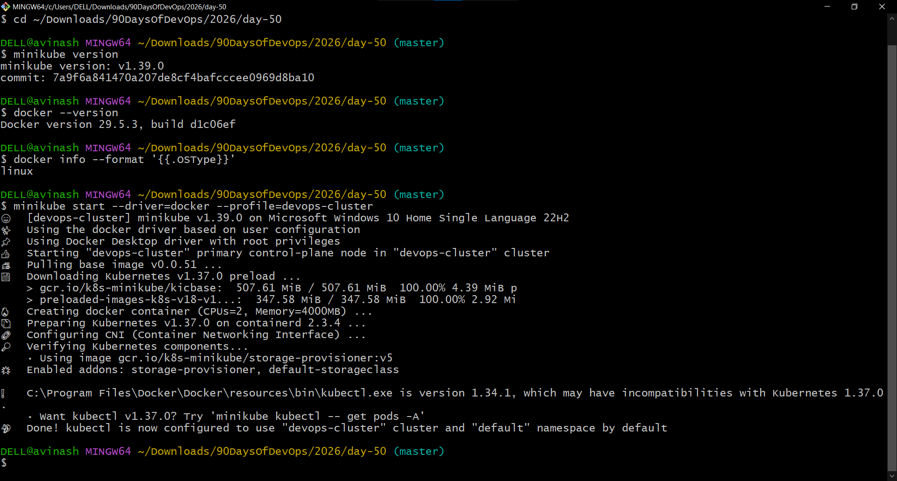
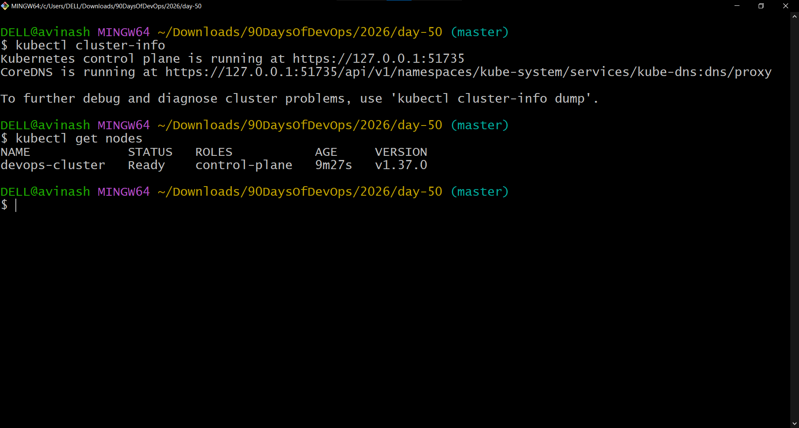
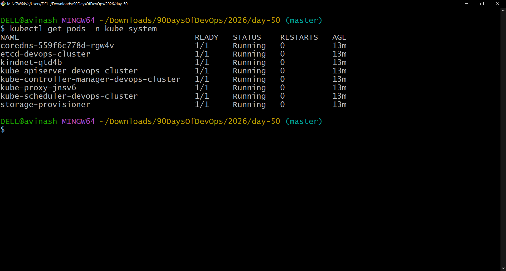
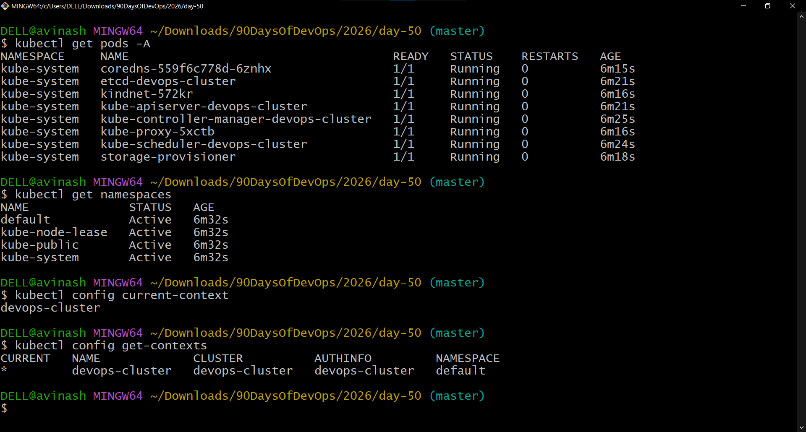
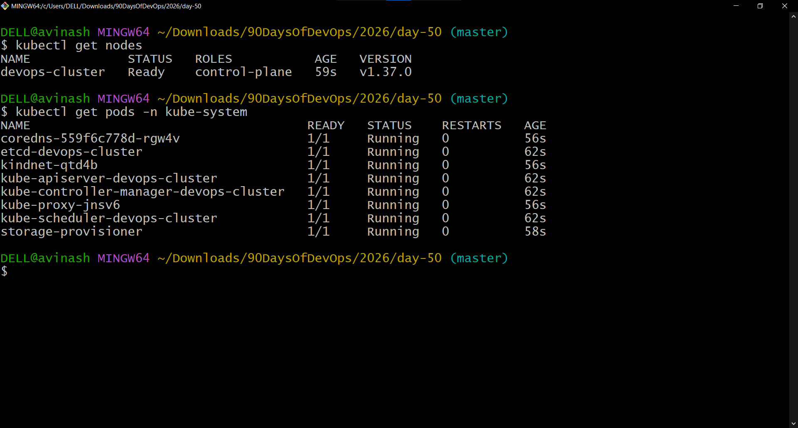

# Day 50 — Kubernetes Architecture and Cluster Setup

## 90 Days of DevOps

Day 50 focuses on understanding Kubernetes architecture and setting up a local Kubernetes cluster using Minikube.

In this exercise, I explored the Kubernetes control plane and node components, installed and configured `kubectl`, created a local Kubernetes cluster using Minikube with the Docker driver, inspected the cluster components, explored namespaces and kubeconfig, and tested the cluster lifecycle by deleting and recreating the cluster.

---

# Task 1 — Kubernetes Story

## What is Kubernetes?

Kubernetes is an open-source container orchestration platform used to automate the deployment, scaling, networking, and management of containerized applications.

Docker is useful for building and running individual containers, but managing many containers across multiple machines introduces additional challenges.

Kubernetes provides capabilities such as:

- Container scheduling
- Service discovery
- Scaling
- Self-healing
- Rolling updates
- Rollbacks
- Configuration management
- Secret management
- Networking
- Workload management

Kubernetes was originally developed at Google and was open-sourced in 2014.

The name Kubernetes comes from the Greek word for "helmsman" or "pilot" — the person who steers a ship.

The abbreviation `K8s` represents the eight letters between `K` and `s`.

---

# Task 2 — Kubernetes Architecture

A Kubernetes cluster consists mainly of:

1. Control Plane
2. Worker Nodes

The control plane manages the desired state of the cluster, while worker nodes run application workloads.

For this local Minikube environment, the cluster uses a single node with the `control-plane` role. Therefore, control-plane components and node functionality are hosted within the same Minikube node.

## Kubernetes Architecture

```text
                         ┌───────────────────────────────┐
                         │         CONTROL PLANE         │
                         │                               │
                         │       kube-apiserver         │
                         │              │                │
                         │      ┌───────┼────────┐       │
                         │      │       │        │       │
                         │     etcd  Scheduler  Controller│
                         │              │        Manager  │
                         │              │                │
                         └──────────────┼────────────────┘
                                        │
                                  Kubernetes API
                                        │
                                        ▼
                         ┌───────────────────────────────┐
                         │            NODE               │
                         │                               │
                         │            kubelet            │
                         │               │               │
                         │               ▼               │
                         │       Container Runtime       │
                         │          containerd           │
                         │               │               │
                         │               ▼               │
                         │             Pods              │
                         │                               │
                         │          kube-proxy           │
                         │                               │
                         │       CNI / Networking        │
                         └───────────────────────────────┘
```

## Control Plane Components

### 1. kube-apiserver

The Kubernetes API server is the front end of the Kubernetes control plane.

`kubectl` communicates with the Kubernetes API through the API server.

Responsibilities include:

- Receiving API requests
- Authenticating and authorizing requests
- Validating Kubernetes objects
- Exposing the Kubernetes API
- Coordinating communication between Kubernetes components

### 2. etcd

`etcd` is the consistent key-value store used by Kubernetes to store cluster state.

It stores information such as:

- Kubernetes objects
- Cluster configuration
- Desired state
- Metadata
- Resource information

The API server interacts with etcd to persist Kubernetes cluster state.

### 3. kube-scheduler

The scheduler is responsible for selecting a suitable node for Pods that do not yet have a node assigned.

It considers factors such as:

- CPU and memory requirements
- Resource availability
- Node constraints
- Affinity and anti-affinity
- Other scheduling policies

### 4. kube-controller-manager

The controller manager runs Kubernetes controllers.

Controllers continuously compare:

```text
Desired State
     ↓
Current State
     ↓
Take Action
     ↓
Desired State Restored
```

Examples include controllers responsible for:

- Nodes
- Replication
- Deployments
- Jobs
- Endpoints

# Worker Node Components

Worker nodes are responsible for running application workloads.

## 1. kubelet

The kubelet runs on each node and ensures that Pods and their containers are running according to their specifications.

It communicates with the Kubernetes API server and works with the container runtime.

## 2. Container Runtime

The container runtime is responsible for running containers.

My Minikube cluster is using:

```text
containerd
```

The runtime receives instructions from kubelet and manages the actual containers.

## 3. kube-proxy

`kube-proxy` maintains networking rules that help implement Kubernetes Services.

It can provide the networking behavior required for Service traffic to reach the appropriate Pods.

In modern Kubernetes environments, kube-proxy can be replaced by networking implementations that provide their own proxying behavior.

My Minikube cluster contains a `kube-proxy` Pod.

---

# Task 3 — What Happens When I Run kubectl apply?

Consider the following command:

```bash
kubectl apply -f pod.yaml
```

The simplified request flow is:

```text
kubectl
   │
   ▼
kube-apiserver
   │
   ▼
Validation / Authentication / Authorization
   │
   ▼
etcd
   │
   ▼
kube-scheduler
   │
   ▼
Selected Node
   │
   ▼
kubelet
   │
   ▼
Container Runtime
   │
   ▼
Pod / Container
```

## Step-by-step flow

1. `kubectl` reads the manifest and sends the request to the API server.
2. The API server receives and validates the request.
3. The desired state is persisted in etcd.
4. If the Pod has no node assigned, the scheduler selects an appropriate node.
5. The kubelet on the selected node observes the Pod specification.
6. The container runtime starts the required containers.
7. The Pod becomes part of the running workload.

# What Happens If the API Server Goes Down?

The API server is the main entry point to the Kubernetes control plane.

If the API server becomes unavailable:

- New `kubectl` operations cannot be processed.
- Kubernetes API requests fail.
- New scheduling and control-plane operations are affected.
- Controllers cannot normally interact with the API server.
- Cluster administration is disrupted.

Existing containers may continue running for some time because the kubelet and container runtime operate locally on nodes.

However, Kubernetes loses the normal control-plane communication required to manage the cluster.

In a production environment, multiple API server instances are commonly used to improve availability.

# What Happens If a Worker Node Goes Down?

If a worker node fails:

```text
Worker Node
     X
     │
     ▼
Node becomes unhealthy / NotReady
     │
     ▼
Control plane detects the failure
     │
     ▼
Controllers respond
     │
     ▼
Workloads may be recreated on healthy nodes
```

The exact behavior depends on the workload and its configuration.

For example, a Deployment with multiple replicas can recreate Pods on other available nodes when the failed node's workloads are no longer available.

A single standalone Pod without a higher-level controller does not automatically provide the same rescheduling behavior.

This is one reason Kubernetes workloads are commonly managed through controllers such as Deployments.

---

# Task 4 — Installing kubectl

## Initial kubectl Version

Docker Desktop provided a bundled version of `kubectl`.

The initial version was:

```text
Client Version: v1.34.1
Kustomize Version: v5.7.1
```

My Kubernetes cluster was running:

```text
Kubernetes v1.37.0
```

I therefore installed a newer compatible `kubectl` version.

## Install kubectl using winget

```bash
winget install -e --id Kubernetes.kubectl
```

After installation, Windows had two `kubectl` binaries:

```text
C:\Program Files\Docker\Docker\resources\bin\kubectl.exe

C:\Users\DELL\AppData\Local\Microsoft\WinGet\Packages\
Kubernetes.kubectl_Microsoft.winget.Source_8wekyb3d8bbwe\
kubectl.exe
```

Docker Desktop's version appeared first in PATH.

I therefore temporarily placed the winget installation directory before the Docker Desktop path:

```bash
export PATH="/c/Users/DELL/AppData/Local/Microsoft/WinGet/Packages/kubernetes.kubectl_Microsoft.winget.Source_8wekyb3d8bbwe:$PATH"
```

Then verified:

```bash
kubectl version --client
```

Result:

```text
Client Version: v1.37.0
Kustomize Version: v5.8.1
```

The client version now matches the Kubernetes cluster version.

---

# Task 5 — Setting Up a Local Kubernetes Cluster

## Why I Chose Minikube

I chose Minikube because:

- Docker Desktop was already installed.
- Docker was already configured to use Linux containers.
- Minikube supports the Docker driver.
- It provides a practical local Kubernetes learning environment.
- It allows Kubernetes components to be explored without requiring a cloud Kubernetes service.

## Check Docker

```bash
docker --version
```

Docker version used:

```text
Docker version 29.5.3
```

Check Docker OS type:

```bash
docker info --format '{{.OSType}}'
```

Result:

```text
linux
```

## Check Minikube

```bash
minikube version
```

Result:

```text
minikube version: v1.39.0
```

## Create the Minikube Cluster

I created a cluster named:

```text
devops-cluster
```

using the Docker driver:

```bash
minikube start --driver=docker --profile=devops-cluster
```

Cluster details:

```text
Minikube:          v1.39.0
Driver:            Docker Desktop
Kubernetes:        v1.37.0
Profile:           devops-cluster
Container Runtime: containerd
Operating System:  Debian GNU/Linux 12
```



---

# Task 6 — Exploring the Kubernetes Cluster

## Check Cluster Information

```bash
kubectl cluster-info
```

Output confirmed:

```text
Kubernetes control plane is running at:
https://127.0.0.1:51735

CoreDNS is running at:
https://127.0.0.1:51735/api/v1/namespaces/kube-system/services/kube-dns:dns/proxy
```

This confirmed that the Kubernetes control plane and CoreDNS were running.

## Check Nodes

```bash
kubectl get nodes
```

Result:

```text
NAME              STATUS   ROLES           VERSION
devops-cluster    Ready    control-plane   v1.37.0
```

The node was in the `Ready` state.



This is a single-node Minikube cluster where the node has the `control-plane` role.

## Check Detailed Node Information

```bash
kubectl describe node devops-cluster
```

This command provides detailed information about the node, including:

- Node conditions
- CPU capacity
- Memory capacity
- Allocatable resources
- Labels
- Taints
- Kubernetes version
- Container runtime
- Pods running on the node

The node was running:

```text
Kubernetes: v1.37.0
Container Runtime: containerd
Operating System: Debian GNU/Linux 12
```

## Check Namespaces

```bash
kubectl get namespaces
```

The cluster contained namespaces including:

```text
default
kube-node-lease
kube-public
kube-system
```

Namespaces provide logical separation of Kubernetes resources.

## Check All Pods

```bash
kubectl get pods -A
```

The command displayed Pods across all namespaces.

Most of the system-level Pods in this local cluster were running in `kube-system`.

## Check Kubernetes System Pods

```bash
kubectl get pods -n kube-system
```

The cluster showed the following system components:

```text
coredns
etcd-devops-cluster
kindnet
kube-apiserver-devops-cluster
kube-controller-manager-devops-cluster
kube-proxy
kube-scheduler-devops-cluster
storage-provisioner
```

All displayed:

```text
READY    1/1
STATUS   Running
RESTARTS 0
```



# Understanding the kube-system Pods

| Pod | Purpose |
|---|---|
| `coredns` | Provides DNS-based service discovery inside the cluster. |
| `etcd-devops-cluster` | Stores Kubernetes cluster state. |
| `kindnet` | Provides networking configuration in this Minikube environment. |
| `kube-apiserver-devops-cluster` | Provides the Kubernetes API endpoint. |
| `kube-controller-manager-devops-cluster` | Runs Kubernetes controllers. |
| `kube-proxy` | Provides node-level networking functionality associated with Services. |
| `kube-scheduler-devops-cluster` | Assigns unscheduled Pods to suitable nodes. |
| `storage-provisioner` | Supports local storage provisioning in the Minikube environment. |

The presence of a Pod named `kindnet` does not mean that the cluster was created using the `kind` Kubernetes tool. The cluster itself was created using Minikube.

---

# Task 7 — Kubernetes Context and kubeconfig

## Check Current Context

```bash
kubectl config current-context
```

Result:

```text
devops-cluster
```

This means `kubectl` is currently configured to communicate with the `devops-cluster` context.

## List Available Contexts

```bash
kubectl config get-contexts
```

The current context was:

```text
* devops-cluster
```

The context points to the `devops-cluster` cluster and the default namespace.

## View kubeconfig

```bash
kubectl config view
```

The configuration contained information about:

- Cluster
- Server endpoint
- User
- Context
- Current context
- Namespace
- Authentication configuration

I also checked:

```bash
echo $HOME
```

Result:

```text
/c/Users/DELL
```

And:

```bash
ls -la ~/.kube/
```

The directory contained:

```text
cache/
config
```

The default kubeconfig location is:

```text
~/.kube/config
```

On this Windows Git Bash environment, this corresponds to:

```text
C:\Users\DELL\.kube\config
```

The kubeconfig should not be committed to Git because it can contain authentication-related configuration and credentials.



## How kubeconfig Works

The kubeconfig contains information that `kubectl` uses to connect to Kubernetes clusters.

It can contain:

```text
Clusters
Users
Contexts
Namespaces
Authentication information
```

A context connects:

```text
Cluster + User + Namespace
```

The current context determines which cluster and user configuration `kubectl` uses by default.

The default kubeconfig location is:

```text
$HOME/.kube/config
```

Alternative kubeconfig files can be selected using:

```bash
--kubeconfig
```

or the:

```text
KUBECONFIG
```

environment variable.

---

# Task 8 — Kubernetes Cluster Lifecycle

To understand the cluster lifecycle, I tested deleting and recreating the Minikube cluster.

## Delete the Cluster

```bash
minikube delete --profile=devops-cluster
```

This removes the local Minikube cluster.

## Recreate the Cluster

```bash
minikube start --driver=docker --profile=devops-cluster
```

Minikube recreated the cluster using:

```text
Profile: devops-cluster
Driver: Docker
Kubernetes: v1.37.0
```

## Verify the Recreated Cluster

```bash
kubectl get nodes
```

Result:

```text
NAME              STATUS   ROLES           VERSION
devops-cluster    Ready    control-plane   v1.37.0
```

Then:

```bash
kubectl get pods -n kube-system
```

The Kubernetes system Pods were running successfully again.



---

# Task 9 — Final Cluster Verification

The final cluster verification confirmed:

```text
kubectl client       v1.37.0
Kubernetes cluster   v1.37.0
Minikube             v1.39.0
Docker               29.5.3
Driver               Docker
Container runtime    containerd
Node                 devops-cluster
Node status          Ready
```

Final verification commands:

```bash
kubectl cluster-info
kubectl get nodes
kubectl get namespaces
kubectl get pods -A
kubectl get pods -n kube-system
kubectl config current-context
kubectl config get-contexts
```

---

# Screenshots

## 1. Minikube Cluster Creation


## 2. Kubernetes Node Ready


## 3. Kubernetes System Pods


## 4. Cluster Exploration


## 5. Cluster Recreated Successfully


---

# Key Takeaways

## Kubernetes Architecture

I learned that Kubernetes separates responsibilities between the control plane and nodes.

### Control Plane

```text
kube-apiserver
etcd
kube-scheduler
kube-controller-manager
```

### Node

```text
kubelet
kube-proxy
Container Runtime
```

## Important Concepts Learned

### API Server

The API server is the main entry point into Kubernetes.

### etcd

etcd stores the Kubernetes cluster state.

### Scheduler

The scheduler assigns unscheduled Pods to suitable nodes.

### Controller Manager

Controllers continuously work to maintain the desired state.

### kubelet

The kubelet ensures that Pods and containers are running on the node.

### Container Runtime

The container runtime actually runs the containers.

### kube-proxy

kube-proxy provides node-level networking functionality associated with Services.

### kubeconfig

kubeconfig allows `kubectl` to know which cluster, user, namespace, and authentication configuration to use.

---

# What I Implemented

```text
✅ Installed kubectl
✅ Updated kubectl to v1.37.0
✅ Configured kubectl PATH
✅ Installed Minikube
✅ Created a local Kubernetes cluster
✅ Used Docker as the Minikube driver
✅ Created devops-cluster
✅ Verified Kubernetes control plane
✅ Verified node status
✅ Inspected kube-system Pods
✅ Explored Kubernetes namespaces
✅ Explored Kubernetes contexts
✅ Inspected kubeconfig
✅ Deleted and recreated the cluster
✅ Verified the recreated cluster
```

---

# Learn in Public

Started my Kubernetes journey today.

Set up a local cluster, explored the architecture, and saw the control plane components running as actual Pods.

The orchestration chapter begins.

---

# Official Documentation

The Kubernetes documentation used for verification covered:

- Kubernetes Components
- Kubernetes Cluster Architecture
- Installing kubectl on Windows
- Organizing Cluster Access Using kubeconfig
- kubectl cluster access and configuration

---

# Summary

Day 50 provided a hands-on introduction to Kubernetes architecture and cluster administration.

I moved from understanding Kubernetes components conceptually to actually running a Kubernetes cluster locally.

The most important part was seeing the architecture represented by real Kubernetes resources:

```text
Control Plane
     │
     ├── kube-apiserver
     ├── etcd
     ├── kube-scheduler
     └── kube-controller-manager
              │
              ▼
          Kubernetes Node
              │
              ├── kubelet
              ├── kube-proxy
              ├── containerd
              └── Pods
```

This gives me the foundation required for the next Kubernetes topics, including Pods, Deployments, Services, ConfigMaps, Secrets, Volumes, networking, and eventually Kubernetes deployments on AWS.

---

# Repository

GitHub Repository:

```text
https://github.com/ask-vs9/90DaysOfDevOps
```

Day 50:

```text
2026/day-50/day-50-k8s-setup.md
```

---

# Hashtags

#90DaysOfDevOps #DevOpsKaJosh #TrainWithShubham #Kubernetes #K8s #DevOps #Docker #Minikube #CloudEngineering #ContainerOrchestration
