# Day 51 – Kubernetes Manifests and Your First Pods

## Overview

Day 51 focused on Kubernetes Pods and YAML manifests.

The goal was to understand how Kubernetes resources are defined declaratively, create Pods from handwritten manifests, use imperative commands, validate manifests, work with labels, and understand what happens when standalone Pods are deleted.

### Objectives Completed

- Created Kubernetes Pod manifests from scratch
- Deployed an Nginx Pod
- Deployed a BusyBox Pod
- Created a Redis Pod using `kubectl run`
- Generated YAML using `--dry-run=client`
- Compared imperative and declarative approaches
- Validated manifests using client-side and server-side dry runs
- Tested an invalid manifest
- Practiced Pod labels and label selectors
- Created a third Pod with three labels
- Verified multiple Pods running
- Deleted standalone Pods and confirmed they were not recreated

---

# 1. Anatomy of a Kubernetes Manifest

A Kubernetes resource is commonly defined using a YAML manifest.

| Field | Purpose |
|---|---|
| `apiVersion` | Defines the Kubernetes API version used by the resource |
| `kind` | Defines the resource type, such as `Pod` |
| `metadata` | Provides the resource identity, including name and labels |
| `spec` | Defines the desired state and configuration of the resource |

Example:

```yaml
apiVersion: v1
kind: Pod
metadata:
  name: my-pod
  labels:
    app: my-app
spec:
  containers:
  - name: my-container
    image: nginx:latest
    ports:
    - containerPort: 80
```

---

# 2. Task 1 – Create the First Pod

## Nginx Pod

The first Pod was created using a handwritten YAML manifest.

### `nginx-pod.yaml`

```yaml
apiVersion: v1
kind: Pod
metadata:
  name: nginx-pod
  labels:
    app: nginx
spec:
  containers:
  - name: nginx
    image: nginx:latest
    ports:
    - containerPort: 80
```

The manifest was applied using:

```bash
kubectl apply -f nginx-pod.yaml
```

### Verify Pod Status

```bash
kubectl get pods
```

The Nginx Pod reached the `Running` state.

### Screenshot

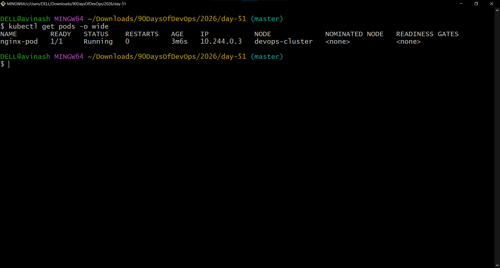

---

# 3. Detailed Pod Information

```bash
kubectl describe pod nginx-pod
```

This provided information such as Pod metadata, namespace, node assignment, Pod IP, container image, container state, readiness, volumes, conditions, scheduling information, and Kubernetes events.

### Screenshot

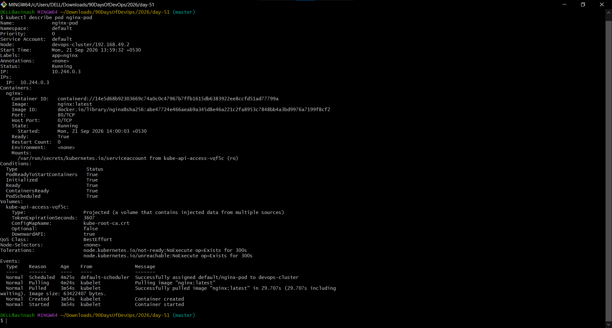

---

# 4. Read Nginx Logs and Test HTTP

The Nginx container logs were inspected using:

```bash
kubectl logs nginx-pod
```

An interactive container shell was also used to test the web server:

```bash
curl localhost:80
```

The response returned the Nginx HTML welcome page, confirming that Nginx was serving HTTP traffic inside the Pod.

### Screenshot

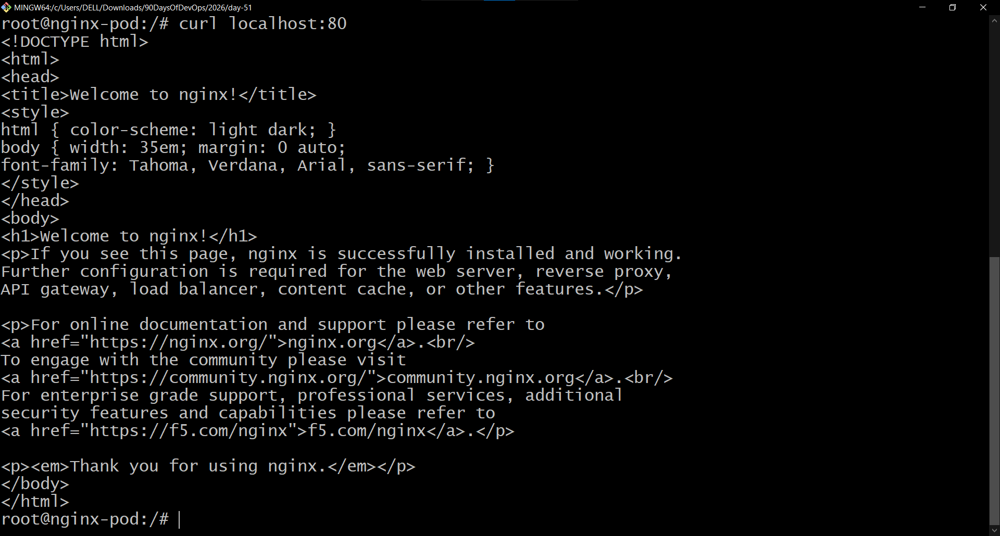

---

# 5. Task 2 – Custom BusyBox Pod

### `busybox-pod.yaml`

```yaml
apiVersion: v1
kind: Pod
metadata:
  name: busybox-pod
  labels:
    app: busybox
    environment: dev
spec:
  containers:
  - name: busybox
    image: busybox:latest
    command: ["sh", "-c", "echo Hello from BusyBox && sleep 3600"]
```

Create the Pod:

```bash
kubectl apply -f busybox-pod.yaml
```

Verify the logs:

```bash
kubectl logs busybox-pod
```

Output:

```text
Hello from BusyBox
```

### Screenshot

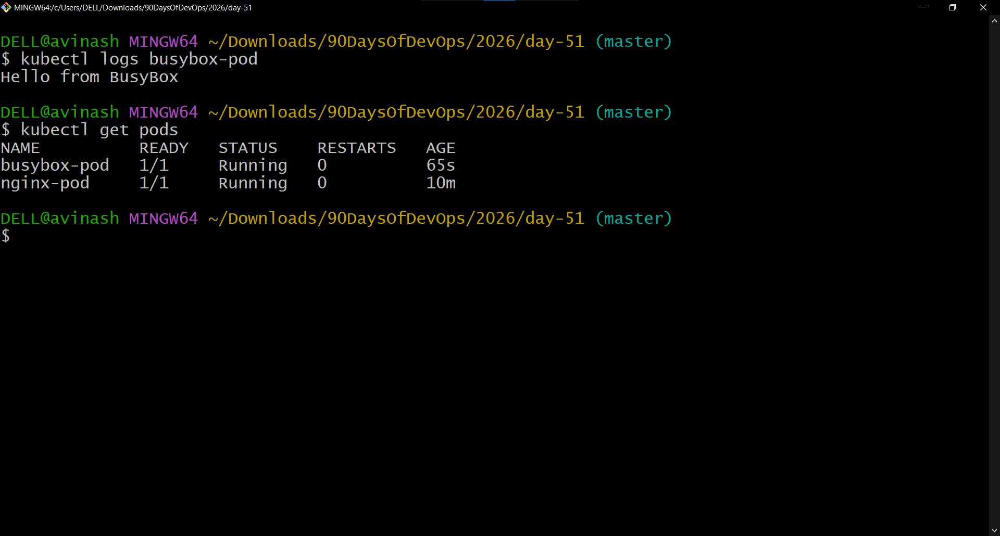

---

# 6. Task 3 – Imperative vs Declarative Kubernetes

## Imperative Approach

A Pod can be created directly from the command line:

```bash
kubectl run redis-pod --image=redis:latest
```

Verify:

```bash
kubectl get pods
```

### Screenshot

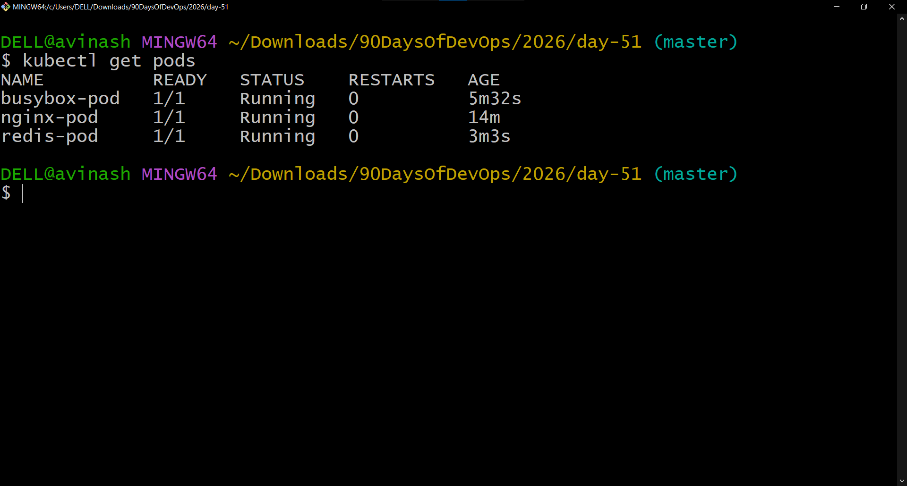

## Generate YAML from an Imperative Command

```bash
kubectl get pod redis-pod -o yaml
```

Kubernetes adds metadata and runtime information such as UID, resource version, creation timestamp, and status.

### Screenshot

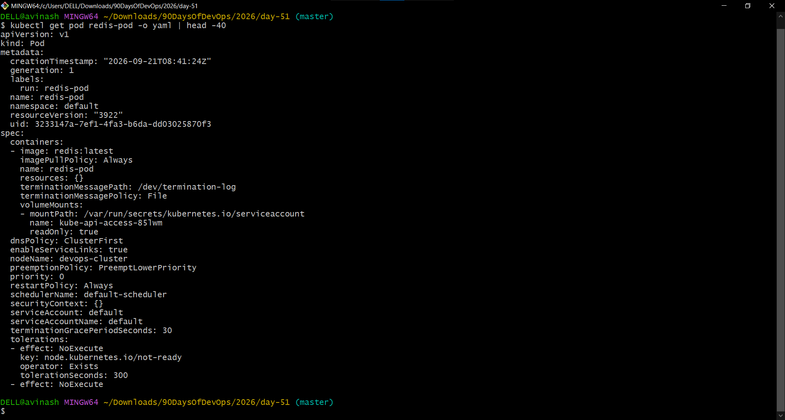

---

# 7. Generate a Manifest Using Dry Run

Generate YAML without creating the resource:

```bash
kubectl run test-pod --image=nginx --dry-run=client -o yaml
```

Save it to a file:

```bash
kubectl run test-pod --image=nginx --dry-run=client -o yaml > test-pod.yaml
```

Example generated manifest:

```yaml
apiVersion: v1
kind: Pod
metadata:
  labels:
    run: test-pod
  name: test-pod
spec:
  containers:
  - image: nginx
    name: test-pod
    resources: {}
  dnsPolicy: ClusterFirst
  restartPolicy: Always
status: {}
```

### Screenshot

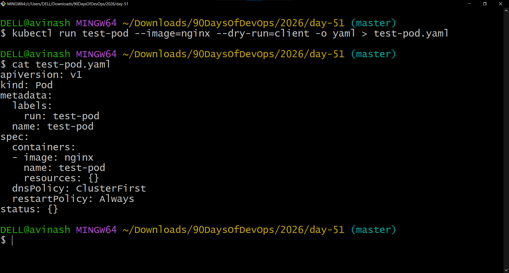

---

# 8. Imperative vs Declarative Comparison

| Imperative | Declarative |
|---|---|
| Uses commands such as `kubectl run` | Uses YAML manifests |
| Describes an immediate action | Describes desired state |
| Useful for quick operations and testing | Useful for repeatable configuration |
| Less suitable for version-controlled infrastructure | Well suited to Git-based workflows |
| Example: `kubectl run redis-pod --image=redis:latest` | Example: `kubectl apply -f nginx-pod.yaml` |

---

# 9. Task 4 – Validate Before Applying

## Client-Side Dry Run

```bash
kubectl apply -f nginx-pod.yaml --dry-run=client
```

Result:

```text
pod/nginx-pod configured (dry run)
```

## Server-Side Dry Run

```bash
kubectl apply -f nginx-pod.yaml --dry-run=server
```

Result:

```text
pod/nginx-pod unchanged (server dry run)
```

Server-side dry run validates the resource against the Kubernetes API without changing the cluster.

### Screenshot

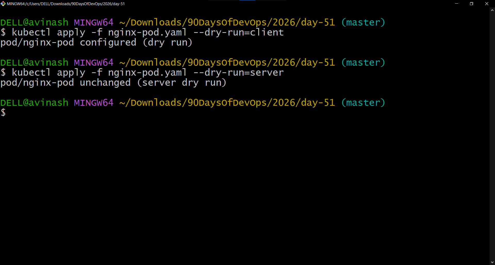

---

# 10. Invalid Manifest Validation

An intentionally invalid Pod manifest was tested with the image field missing:

```bash
kubectl apply -f invalid-pod.yaml --dry-run=server
```

Kubernetes returned:

```text
The Pod "invalid-pod" is invalid:
spec.containers[0].image: Required value
```

### Screenshot

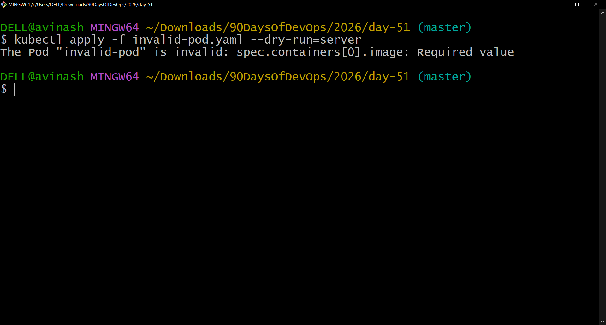

---

# 11. Task 5 – Pod Labels

Labels are key-value pairs attached to Kubernetes resources.

Inspect labels:

```bash
kubectl get pods --show-labels
```

Filter by label:

```bash
kubectl get pods -l app=nginx
kubectl get pods -l environment=dev
```

Add a temporary label:

```bash
kubectl label pod nginx-pod environment=production
```

Verify:

```bash
kubectl get pods --show-labels
```

Remove the temporary label:

```bash
kubectl label pod nginx-pod environment-
```

### Screenshot

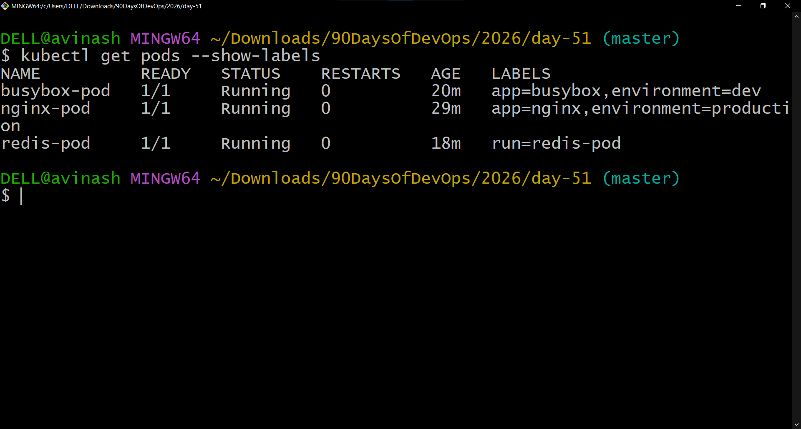

---

# 12. Third Pod with Three Labels

### `third-pod.yaml`

```yaml
apiVersion: v1
kind: Pod
metadata:
  name: third-pod
  labels:
    app: demo
    environment: dev
    team: devops
spec:
  containers:
  - name: nginx
    image: nginx:latest
    ports:
    - containerPort: 80
```

Create it:

```bash
kubectl apply -f third-pod.yaml
```

This demonstrated how multiple labels can be attached to one Kubernetes resource.

---

# 13. All Pods Running

After creating the required Pods:

```bash
kubectl get pods
```

The Pods were verified in the `Running` state.

### Screenshot

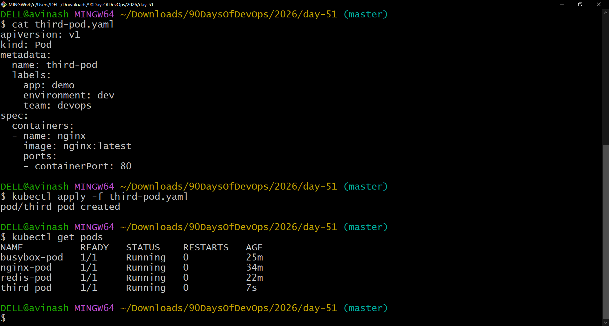

---

# 14. Task 6 – Clean Up

Standalone Pods were deleted individually:

```bash
kubectl delete pod nginx-pod
kubectl delete pod busybox-pod
kubectl delete pod redis-pod
kubectl delete pod third-pod
```

Then:

```bash
kubectl get pods
```

Result:

```text
No resources found in default namespace.
```

### Screenshot

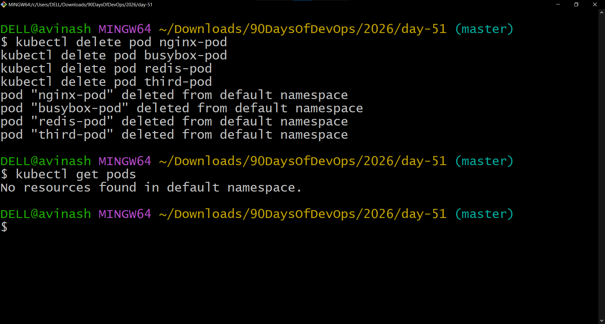

---

# 15. What Happens When a Standalone Pod Is Deleted?

A standalone Pod does not have a controller such as a Deployment managing it.

When a standalone Pod is deleted:

1. Kubernetes removes the Pod.
2. No controller recreates it.
3. The Pod does not automatically return.
4. A new Pod must be created manually.

This is why applications are commonly managed using higher-level controllers such as Deployments rather than standalone Pods.

---

# 16. Files Created

### Kubernetes manifests

```text
nginx-pod.yaml
busybox-pod.yaml
third-pod.yaml
test-pod.yaml
invalid-pod.yaml
```

### Supporting screenshots

```text
day51-nginx-pod-running.png
day51-nginx-pod-describe.png
day51-nginx-curl.png
day51-busybox.png
day51-imperative-pods.png
day51-redis-generated-yaml.png
day51-dry-run-yaml.png
day51-validation-success.png
day51-validation-error.png
day51-pod-labels.png
day51-all-pods-running.png
day51-cleanup.png
```

---

# 17. Key Takeaways

- Kubernetes resources can be defined using YAML manifests.
- A Pod is the smallest deployable unit in Kubernetes.
- `apiVersion`, `kind`, `metadata`, and `spec` form the core structure of a Kubernetes manifest.
- `kubectl apply -f` provides a declarative workflow.
- `kubectl run` provides an imperative workflow.
- `--dry-run=client -o yaml` can quickly generate manifest templates.
- Server-side dry runs validate resources against the Kubernetes API without applying them.
- Labels allow resources to be organized and selected.
- Standalone Pods are not automatically recreated after deletion.
- Controllers such as Deployments are used to manage application Pods in production environments.

---

# 18. Day 51 Summary

Day 51 provided hands-on experience with Kubernetes Pod manifests and the Kubernetes resource lifecycle.

I created multiple Pods, inspected their configuration and logs, tested Nginx from inside the container, generated YAML from imperative commands, validated manifests, worked with labels and selectors, and finally cleaned up the standalone Pods.

This established the foundation for the next Kubernetes topic: **Deployments and workload management**.

---

## Learn in Public

> Wrote my first Kubernetes Pod manifests from scratch today. Created Pods, got a shell inside them, and learned the difference between imperative and declarative approaches.

#90DaysOfDevOps #DevOpsKaJosh #TrainWithShubham
