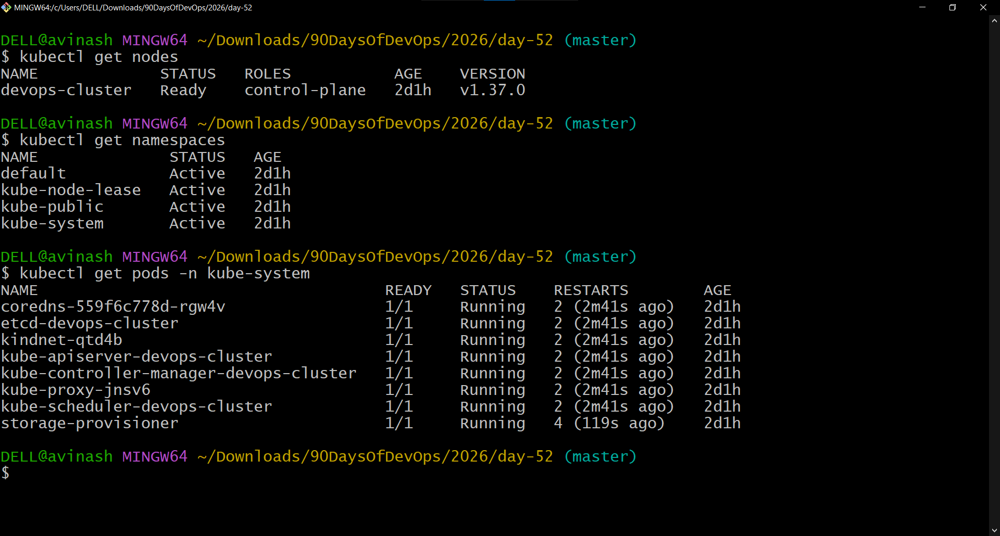
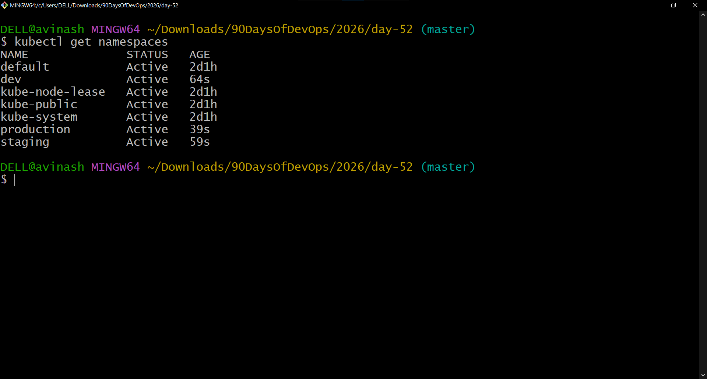
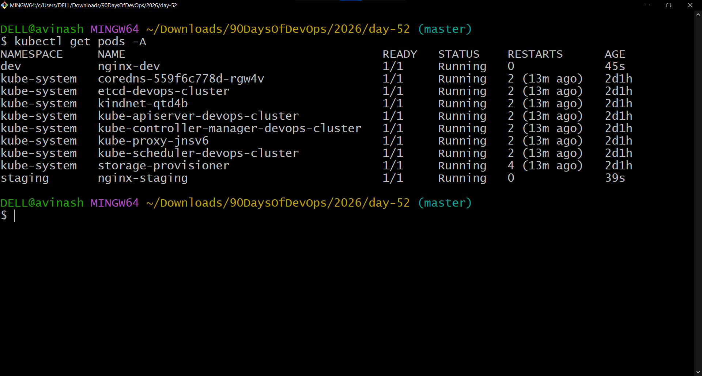
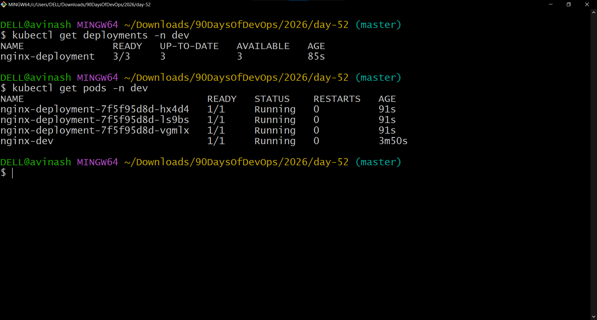
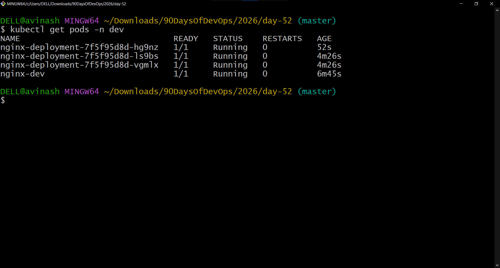
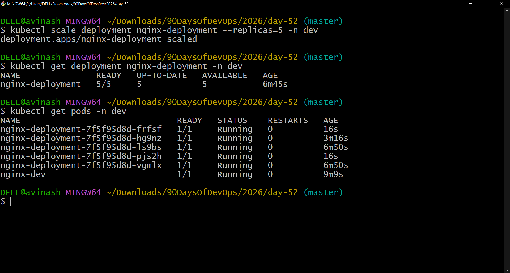
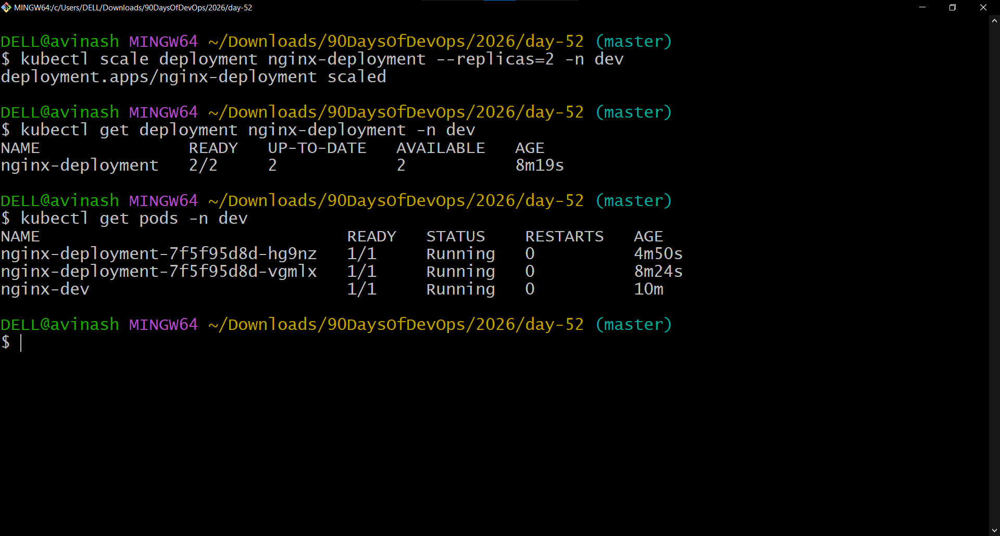
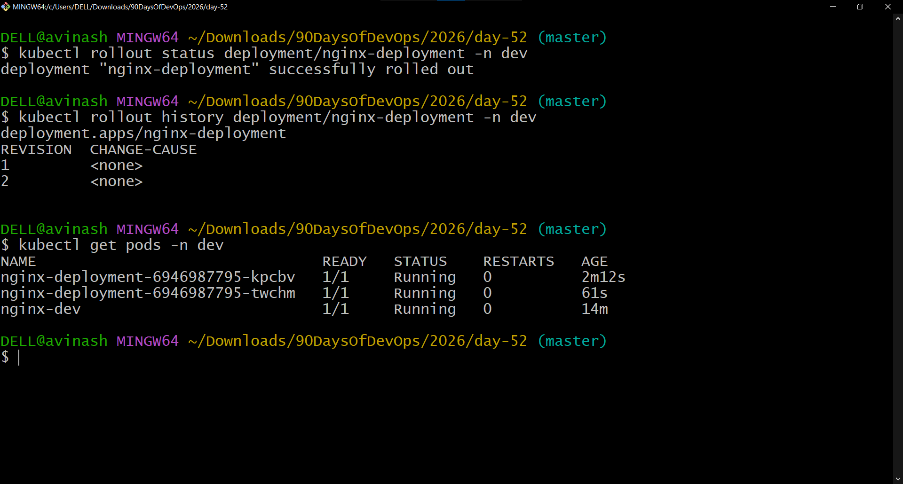
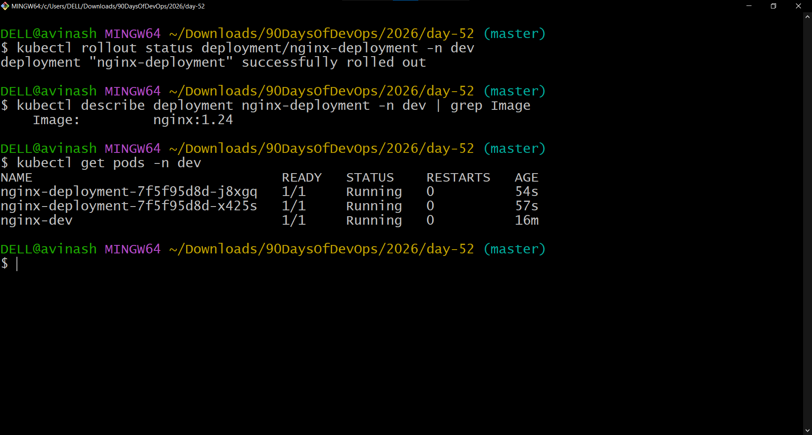
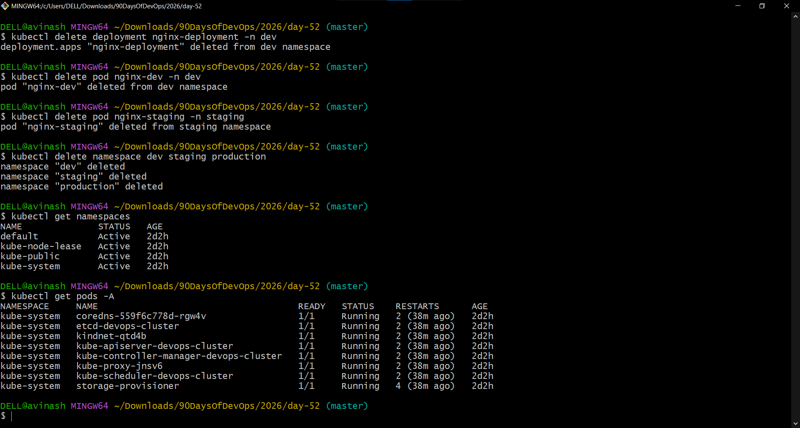

# Day 52 – Kubernetes Namespaces and Deployments

## Overview

Today I moved from standalone Kubernetes Pods to **Namespaces and Deployments**.

Standalone Pods are not self-healing. If a standalone Pod is deleted, Kubernetes does not recreate it automatically.

A Deployment solves this problem by maintaining the desired number of Pod replicas and recreating Pods when they are deleted or fail.

I also worked with Kubernetes Namespaces to organize and isolate resources inside the cluster.

---

## Objectives

- Explore Kubernetes default namespaces
- Create and use custom namespaces
- Run Pods in different namespaces
- Create a Deployment with multiple replicas
- Demonstrate Deployment self-healing
- Scale a Deployment up and down
- Perform a rolling update
- Roll back a Deployment to the previous version
- Understand how Deployments and ReplicaSets work together

---

# 1. Explore Default Namespaces

First, I verified the Kubernetes node:

```bash
kubectl get nodes
```

The cluster node was:

```text
devops-cluster   Ready   control-plane   v1.37.0
```

Then I listed the Kubernetes namespaces:

```bash
kubectl get namespaces
```

The cluster contained the built-in namespaces:

- `default` – default namespace for resources when no namespace is specified
- `kube-system` – Kubernetes system components
- `kube-public` – publicly readable resources
- `kube-node-lease` – node heartbeat tracking

I also checked the Pods running in `kube-system`:

```bash
kubectl get pods -n kube-system
```

There were **8 Pods**, all in `Running` state.

### Screenshot



---

# 2. Create Custom Namespaces

I created two custom namespaces for development and staging:

```bash
kubectl create namespace dev
kubectl create namespace staging
```

I also created a production namespace using a YAML manifest.

## namespace.yaml

```yaml
apiVersion: v1
kind: Namespace
metadata:
  name: production
```

Applied with:

```bash
kubectl apply -f namespace.yaml
```

The namespaces were verified with:

```bash
kubectl get namespaces
```

The custom namespaces created were:

- `dev`
- `staging`
- `production`

### Screenshot



---

# 3. Run Pods Across Namespaces

I created an Nginx Pod in the development namespace:

```bash
kubectl run nginx-dev --image=nginx:latest -n dev
```

I created another Nginx Pod in the staging namespace:

```bash
kubectl run nginx-staging --image=nginx:latest -n staging
```

To view Pods across the entire cluster:

```bash
kubectl get pods -A
```

This demonstrated that:

```bash
kubectl get pods
```

only displays resources from the current namespace, while:

```bash
kubectl get pods -A
```

displays Pods across all namespaces.

Both custom Nginx Pods were running successfully.

### Screenshot



---

# 4. Create the First Deployment

A Deployment maintains the desired number of Pod replicas.

Unlike a standalone Pod, a Deployment controller automatically creates replacement Pods when managed Pods are deleted.

## nginx-deployment.yaml

```yaml
apiVersion: apps/v1
kind: Deployment
metadata:
  name: nginx-deployment
  namespace: dev
  labels:
    app: nginx
spec:
  replicas: 3
  selector:
    matchLabels:
      app: nginx
  template:
    metadata:
      labels:
        app: nginx
    spec:
      containers:
      - name: nginx
        image: nginx:1.24
        ports:
        - containerPort: 80
```

## Manifest Explanation

- `apiVersion: apps/v1` – API version used by the Deployment.
- `kind: Deployment` – identifies the resource as a Deployment.
- `metadata.name` – names the Deployment `nginx-deployment`.
- `metadata.namespace` – places the Deployment in the `dev` namespace.
- `replicas: 3` – tells Kubernetes to maintain three Pods.
- `selector.matchLabels` – identifies the Pods managed by the Deployment.
- `template` – defines the Pod blueprint used to create replicas.
- `image: nginx:1.24` – defines the Nginx container image.
- `containerPort: 80` – documents the container port.

The Deployment was applied using:

```bash
kubectl apply -f nginx-deployment.yaml
```

I verified it with:

```bash
kubectl get deployments -n dev
kubectl get pods -n dev
```

The Deployment showed:

```text
READY        UP-TO-DATE        AVAILABLE
3/3          3                  3
```

Three Deployment Pods were running successfully.

### Screenshot



---

# 5. Deployment Self-Healing

One of the most important differences between a standalone Pod and a Deployment is self-healing.

I first listed the Pods:

```bash
kubectl get pods -n dev
```

Then I deleted one of the Deployment-managed Pods.

The Deployment controller detected that only two desired replicas remained and automatically created a replacement Pod.

The replacement Pod received a different name.

After the replacement was created:

```bash
kubectl get pods -n dev
```

showed three Deployment Pods again, all in `Running` state.

### Screenshot



---

# 6. Scale the Deployment

The Deployment was initially configured with three replicas.

## Scale Up

I scaled the Deployment from 3 replicas to 5:

```bash
kubectl scale deployment nginx-deployment --replicas=5 -n dev
```

Then verified:

```bash
kubectl get deployment nginx-deployment -n dev
kubectl get pods -n dev
```

The Deployment showed:

```text
READY        UP-TO-DATE        AVAILABLE
5/5          5                  5
```

Five Deployment Pods were running.

### Screenshot



---

## Scale Down

I then reduced the Deployment from 5 replicas to 2:

```bash
kubectl scale deployment nginx-deployment --replicas=2 -n dev
```

After Kubernetes reconciled the desired state:

```bash
kubectl get deployment nginx-deployment -n dev
kubectl get pods -n dev
```

The Deployment showed:

```text
READY        UP-TO-DATE        AVAILABLE
2/2          2                  2
```

The extra Pods were terminated so that the actual replica count matched the desired count.

### Screenshot



---

# 7. Rolling Update

The Deployment was originally running:

```text
nginx:1.24
```

I updated the container image to:

```text
nginx:1.25
```

using:

```bash
kubectl set image deployment/nginx-deployment nginx=nginx:1.25 -n dev
```

I monitored the rollout:

```bash
kubectl rollout status deployment/nginx-deployment -n dev
```

The rollout completed successfully:

```text
deployment "nginx-deployment" successfully rolled out
```

I also checked the rollout history:

```bash
kubectl rollout history deployment/nginx-deployment -n dev
```

The Deployment showed two revisions.

### Screenshot



---

# 8. Rollback

After testing the updated image, I rolled the Deployment back to the previous revision:

```bash
kubectl rollout undo deployment/nginx-deployment -n dev
```

I verified the rollback:

```bash
kubectl rollout status deployment/nginx-deployment -n dev
```

The rollback completed successfully.

I then checked the image:

```bash
kubectl describe deployment nginx-deployment -n dev | grep Image
```

The Deployment was back to:

```text
Image: nginx:1.24
```

### Screenshot



---

# 9. Deployment vs Standalone Pod

| Feature | Standalone Pod | Deployment |
|---|---|---|
| Desired replica count | No | Yes |
| Self-healing | No | Yes |
| Automatic replacement | No | Yes |
| Scaling | Manual recreation | Supported |
| Rolling updates | No | Yes |
| Rollback | No Deployment history | Yes |
| ReplicaSet management | No | Yes |

A standalone Pod represents a single workload instance.

A Deployment provides a higher-level mechanism for maintaining and updating multiple Pod replicas.

---

# 10. How Scaling Works

Scaling can be performed imperatively:

```bash
kubectl scale deployment nginx-deployment --replicas=5 -n dev
```

or:

```bash
kubectl scale deployment nginx-deployment --replicas=2 -n dev
```

Scaling can also be performed declaratively by changing the `replicas` value in the YAML manifest:

```yaml
spec:
  replicas: 4
```

and applying the manifest:

```bash
kubectl apply -f nginx-deployment.yaml
```

Kubernetes then reconciles the actual state with the desired state.

---

# 11. Rolling Updates and Rollbacks

A rolling update gradually replaces old Pods with new Pods when the Deployment configuration changes.

In this exercise:

```text
nginx:1.24
     ↓
nginx:1.25
```

The rollout was monitored using:

```bash
kubectl rollout status deployment/nginx-deployment -n dev
```

The rollout history was inspected using:

```bash
kubectl rollout history deployment/nginx-deployment -n dev
```

The previous revision was restored using:

```bash
kubectl rollout undo deployment/nginx-deployment -n dev
```

The image was verified after rollback:

```text
nginx:1.24
```

---

# 12. Deployment Architecture

The relationship between the resources used today can be represented as:

```text
Deployment
    |
    v
ReplicaSet
    |
    +------------------+
    |        |         |
    v        v         v
  Pod      Pod       Pod
```

The Deployment manages the desired application state.

The ReplicaSet maintains the required number of Pods.

The Pods run the actual application containers.

---

# 13. Namespaces

Namespaces provide logical separation of Kubernetes resources within a cluster.

In this exercise:

```text
Cluster
│
├── default
├── kube-system
├── kube-public
├── kube-node-lease
├── dev
│   ├── nginx-dev
│   └── nginx-deployment Pods
├── staging
│   └── nginx-staging
└── production
```

Namespaces are useful for organizing resources by environments, teams, or applications.

---

# 14. Commands Practiced

```bash
kubectl get nodes
kubectl get namespaces
kubectl get pods -n kube-system
kubectl create namespace dev
kubectl create namespace staging
kubectl apply -f namespace.yaml
kubectl get pods -A
kubectl run nginx-dev --image=nginx:latest -n dev
kubectl run nginx-staging --image=nginx:latest -n staging
kubectl apply -f nginx-deployment.yaml
kubectl get deployments -n dev
kubectl get pods -n dev
kubectl delete pod <pod-name> -n dev
kubectl scale deployment nginx-deployment --replicas=5 -n dev
kubectl scale deployment nginx-deployment --replicas=2 -n dev
kubectl set image deployment/nginx-deployment nginx=nginx:1.25 -n dev
kubectl rollout status deployment/nginx-deployment -n dev
kubectl rollout history deployment/nginx-deployment -n dev
kubectl rollout undo deployment/nginx-deployment -n dev
kubectl describe deployment nginx-deployment -n dev | grep Image
kubectl delete deployment nginx-deployment -n dev
kubectl delete pod nginx-dev -n dev
kubectl delete pod nginx-staging -n staging
kubectl delete namespace dev staging production
kubectl get namespaces
kubectl get pods -A
```

---

# 15. Cleanup

After completing the exercises, I removed the resources created during Day 52.

The Deployment was deleted:

```bash
kubectl delete deployment nginx-deployment -n dev
```

The standalone Pods were deleted:

```bash
kubectl delete pod nginx-dev -n dev
kubectl delete pod nginx-staging -n staging
```

The custom namespaces were deleted:

```bash
kubectl delete namespace dev staging production
```

I verified the remaining namespaces:

```bash
kubectl get namespaces
```

The custom namespaces were no longer present.

I also verified all Pods across the cluster:

```bash
kubectl get pods -A
```

Only the Kubernetes system Pods in `kube-system` remained.

### Screenshot



---

# 16. Key Takeaways

- Namespaces organize and isolate Kubernetes resources.
- `kubectl get pods` displays Pods from the current namespace.
- `kubectl get pods -A` displays Pods across all namespaces.
- Deployments maintain the desired number of Pod replicas.
- Deployments automatically replace deleted Pods.
- ReplicaSets are created and managed by Deployments.
- Deployments can be scaled up and down.
- Rolling updates allow application versions to be changed gradually.
- Rollout history provides revision information.
- `kubectl rollout undo` can restore a previous Deployment revision.
- Labels and selectors connect Deployments to their managed Pods.
- Kubernetes continuously reconciles actual state with desired state.
- Resources created for the exercise were cleaned up after completion.

---

# 17. Screenshots

## Screenshot 1 — Default Namespaces


## Screenshot 2 — Custom Namespaces


## Screenshot 3 — Pods Across Namespaces


## Screenshot 4 — Deployment and Pods


## Screenshot 5 — Deployment Self-Healing


## Screenshot 6 — Deployment Scaled to 5


## Screenshot 7 — Deployment Scaled to 2


## Screenshot 8 — Rolling Update


## Screenshot 9 — Rollback


## Screenshot 10 — Final Cleanup


---

# 18. Files Created

```text
namespace.yaml
nginx-deployment.yaml
day-52-namespaces-deployments.md
```

---

# 19. Summary

Day 52 focused on moving from standalone Pods to Kubernetes Deployments and Namespaces.

I created multiple namespaces, deployed Pods into different namespaces, created a three-replica Nginx Deployment, demonstrated automatic Pod replacement, scaled the Deployment from 3 to 5 and then down to 2 replicas, performed a rolling update from Nginx 1.24 to 1.25, and successfully rolled back to Nginx 1.24.

Finally, I cleaned up the Deployment, standalone Pods, and custom namespaces and verified that only the Kubernetes system resources remained.

This provided hands-on experience with core mechanisms used to run reliable workloads in Kubernetes.

---

## Learn in Public

> Learned Kubernetes Namespaces and Deployments today. Created self-healing deployments, scaled them up and down, and performed a rolling update with rollback.

#90DaysOfDevOps #DevOpsKaJosh #TrainWithShubham
