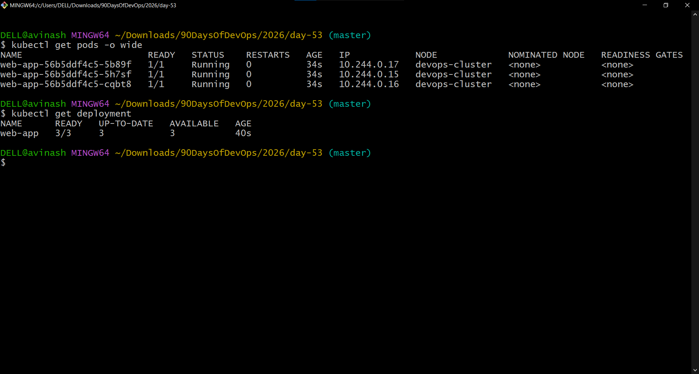
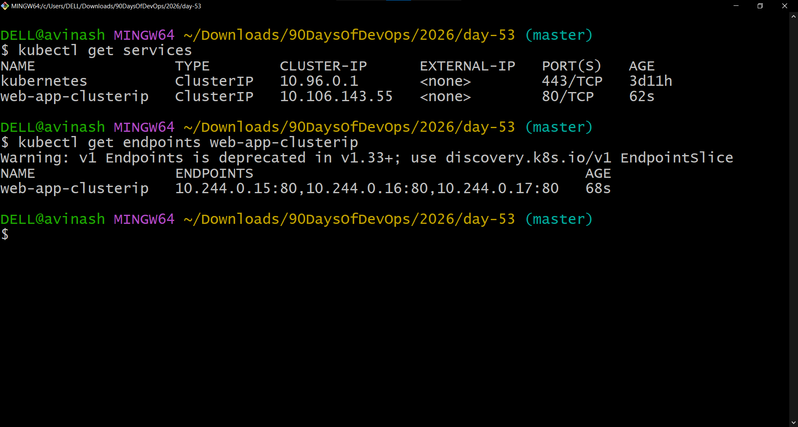
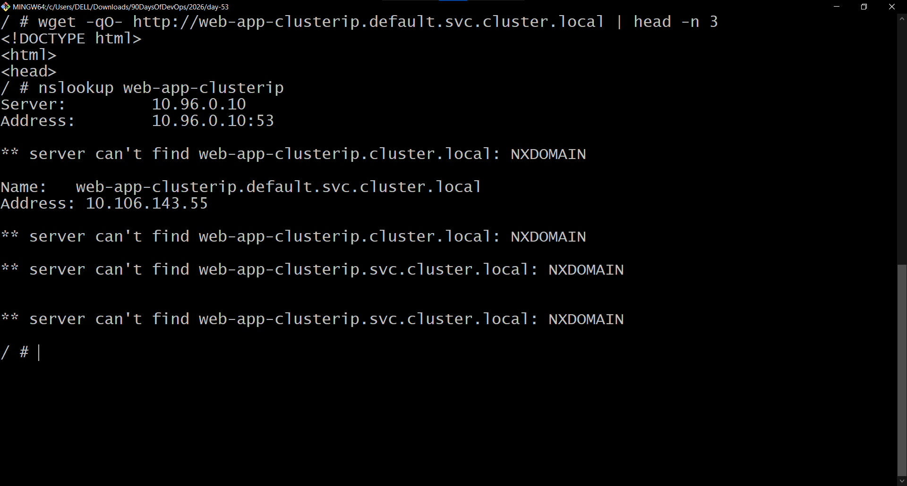
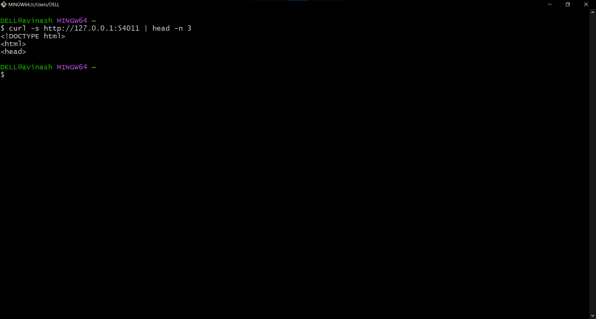
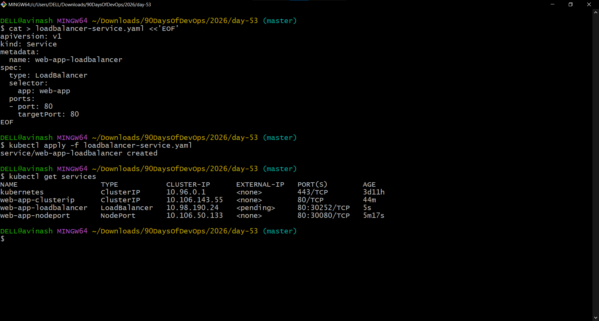
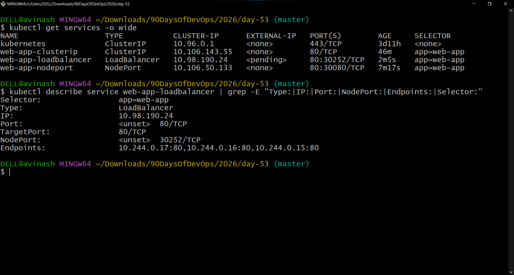
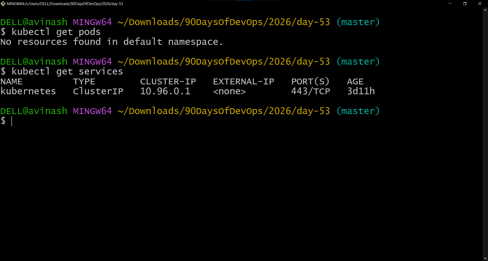

# Day 53 – Kubernetes Services

## Overview

Today I learned how Kubernetes Services provide a stable network endpoint for Pods.

Pods receive individual IP addresses, but Pod IPs are not stable because Pods can be replaced or restarted. A Deployment can also run multiple replicas, making direct Pod-to-Pod addressing unreliable.

A Kubernetes Service solves this by providing a stable ClusterIP and DNS name and routing traffic to Pods that match its selector.

```text
[Client]
    |
    v
[Service - Stable IP / DNS]
    |
    +----------------+
    |       |        |
    v       v        v
  [Pod 1] [Pod 2]  [Pod 3]
```

---

## Objectives

- Create a Deployment with multiple Pods
- Expose the Deployment using ClusterIP
- Test Pod-to-Service communication
- Understand Kubernetes Service DNS
- Expose the application using NodePort
- Test NodePort access through Minikube
- Create a LoadBalancer Service
- Compare ClusterIP, NodePort, and LoadBalancer
- Inspect Service endpoints
- Clean up all resources

---

# 1. Deploy the Application

I created a three-replica Nginx Deployment using `nginx:1.25`.

## `app-deployment.yaml`

```yaml
apiVersion: apps/v1
kind: Deployment
metadata:
  name: web-app
  labels:
    app: web-app
spec:
  replicas: 3
  selector:
    matchLabels:
      app: web-app
  template:
    metadata:
      labels:
        app: web-app
    spec:
      containers:
      - name: nginx
        image: nginx:1.25
        ports:
        - containerPort: 80
```

Applied with:

```bash
kubectl apply -f app-deployment.yaml
```

Verified with:

```bash
kubectl get pods -o wide
kubectl get deployment
```

The Deployment successfully created three running Pods.

The Pod IPs observed during the exercise were:

```text
10.244.0.17
10.244.0.15
10.244.0.16
```

### Screenshot



---

# 2. ClusterIP Service

ClusterIP is the default Kubernetes Service type. It provides an internal stable IP that can be accessed from within the cluster.

## `clusterip-service.yaml`

```yaml
apiVersion: v1
kind: Service
metadata:
  name: web-app-clusterip
spec:
  type: ClusterIP
  selector:
    app: web-app
  ports:
  - port: 80
    targetPort: 80
```

Applied with:

```bash
kubectl apply -f clusterip-service.yaml
```

Verified with:

```bash
kubectl get services
```

The Service received:

```text
Name:      web-app-clusterip
Type:      ClusterIP
ClusterIP: 10.106.143.55
Port:      80/TCP
```

I also inspected the Service endpoints:

```bash
kubectl get endpoints web-app-clusterip
```

The Service routed traffic to all three Pods:

```text
10.244.0.15:80
10.244.0.16:80
10.244.0.17:80
```

### Screenshot



---

# 3. Pod-to-Service Communication

To test the ClusterIP Service from inside the cluster, I created a temporary BusyBox Pod:

```bash
kubectl run test-client --image=busybox:latest --rm -it --restart=Never -- sh
```

Inside the test Pod:

```bash
wget -qO- http://web-app-clusterip
```

The command returned the Nginx welcome page.

This verified:

```text
BusyBox Test Pod
       |
       v
web-app-clusterip
       |
       +------> Nginx Pod
       +------> Nginx Pod
       +------> Nginx Pod
```

---

# 4. Kubernetes DNS Service Discovery

Kubernetes automatically creates DNS records for Services.

The full Service DNS format is:

```text
<service-name>.<namespace>.svc.cluster.local
```

For this exercise:

```text
web-app-clusterip.default.svc.cluster.local
```

I tested the full DNS name:

```bash
wget -qO- http://web-app-clusterip.default.svc.cluster.local | head -n 3
```

The request successfully returned the Nginx HTML response.

I also checked DNS resolution:

```bash
nslookup web-app-clusterip
```

The Service resolved to:

```text
Name:    web-app-clusterip.default.svc.cluster.local
Address: 10.106.143.55
```

The resolved address matched the ClusterIP.

### Screenshot



---

# 5. NodePort Service

A NodePort Service exposes the application on a port on every Kubernetes node.

## `nodeport-service.yaml`

```yaml
apiVersion: v1
kind: Service
metadata:
  name: web-app-nodeport
spec:
  type: NodePort
  selector:
    app: web-app
  ports:
  - port: 80
    targetPort: 80
    nodePort: 30080
```

Applied with:

```bash
kubectl apply -f nodeport-service.yaml
```

The Service showed:

```text
Type:      NodePort
ClusterIP: 10.106.50.133
Port:      80
NodePort:  30080
```

Because I was using Minikube with the Docker driver on Windows, I used:

```bash
minikube service web-app-nodeport --url -p devops-cluster
```

Minikube provided:

```text
http://127.0.0.1:54011
```

I tested access using:

```bash
curl -s http://127.0.0.1:54011 | head -n 3
```

The response returned the Nginx HTML page.

### Screenshot



---

# 6. LoadBalancer Service

A LoadBalancer Service is intended to expose an application externally through a cloud-provider load balancer.

## `loadbalancer-service.yaml`

```yaml
apiVersion: v1
kind: Service
metadata:
  name: web-app-loadbalancer
spec:
  type: LoadBalancer
  selector:
    app: web-app
  ports:
  - port: 80
    targetPort: 80
```

Applied with:

```bash
kubectl apply -f loadbalancer-service.yaml
```

On the local Minikube cluster, the result was:

```text
web-app-loadbalancer
Type:        LoadBalancer
ClusterIP:   10.98.190.24
External-IP: <pending>
Port:        80
NodePort:    30252
```

The `<pending>` External-IP was expected because this was a local Minikube cluster rather than a cloud Kubernetes cluster with cloud load-balancer integration.

### Screenshot



---

# 7. Compare Service Types

I compared the three Service types using:

```bash
kubectl get services -o wide
```

| Service | Type | ClusterIP | NodePort |
|---|---|---|---|
| `web-app-clusterip` | ClusterIP | `10.106.143.55` | — |
| `web-app-nodeport` | NodePort | `10.106.50.133` | `30080` |
| `web-app-loadbalancer` | LoadBalancer | `10.98.190.24` | `30252` |

| Type | Accessibility | Typical Use |
|---|---|---|
| ClusterIP | Internal cluster access | Communication between services |
| NodePort | External access through a node port | Development and testing |
| LoadBalancer | External load balancer | External traffic in cloud environments |

All three Services used:

```text
selector:
  app: web-app
```

### Screenshot



---

# 8. LoadBalancer Service Details

I inspected the LoadBalancer configuration with:

```bash
kubectl describe service web-app-loadbalancer
```

The important values were:

```text
Selector:   app=web-app
Type:       LoadBalancer
IP:         10.98.190.24
Port:       80/TCP
TargetPort: 80/TCP
NodePort:   30252/TCP
Endpoints:
10.244.0.17:80
10.244.0.16:80
10.244.0.15:80
```

This confirmed that the LoadBalancer Service had a ClusterIP, a NodePort, and endpoints pointing to all three application Pods.

---

# 9. Service Selectors and Endpoints

A Service uses a selector to determine which Pods receive traffic.

The Deployment Pods were labeled:

```yaml
labels:
  app: web-app
```

The Services used:

```yaml
selector:
  app: web-app
```

Therefore, the Services selected the three Nginx Pods.

The endpoints observed were:

```text
10.244.0.17:80
10.244.0.16:80
10.244.0.15:80
```

Relationship:

```text
Service Selector
       |
       v
   Pod Labels
       |
       v
   Endpoints
       |
       v
Application Pods
```

---

# 10. Service Communication Flow

## ClusterIP

```text
Client inside cluster
        |
        v
ClusterIP Service
        |
        +----> Pod 1
        +----> Pod 2
        +----> Pod 3
```

## NodePort

```text
External Client
        |
        v
NodeIP:30080
        |
        v
NodePort Service
        |
        +----> Pod 1
        +----> Pod 2
        +----> Pod 3
```

## LoadBalancer

```text
External Client
        |
        v
Cloud Load Balancer
        |
        v
LoadBalancer Service
        |
        v
NodePort
        |
        v
Application Pods
```

On the local Minikube environment, there was no cloud load balancer, so the External-IP remained `<pending>`.

---

# 11. Commands Practiced

```bash
kubectl apply -f app-deployment.yaml
kubectl get pods -o wide
kubectl get deployment

kubectl apply -f clusterip-service.yaml
kubectl get services
kubectl get endpoints web-app-clusterip

kubectl run test-client --image=busybox:latest --rm -it --restart=Never -- sh
wget -qO- http://web-app-clusterip

kubectl run dns-test --image=busybox:latest --rm -it --restart=Never -- sh
wget -qO- http://web-app-clusterip.default.svc.cluster.local
nslookup web-app-clusterip

kubectl apply -f nodeport-service.yaml
kubectl get services
kubectl get service web-app-nodeport
minikube service web-app-nodeport --url -p devops-cluster

kubectl apply -f loadbalancer-service.yaml
kubectl get services

kubectl get services -o wide
kubectl describe service web-app-loadbalancer

kubectl delete -f app-deployment.yaml
kubectl delete -f clusterip-service.yaml
kubectl delete -f nodeport-service.yaml
kubectl delete -f loadbalancer-service.yaml

kubectl get pods
kubectl get services
```

---

# 12. Cleanup

After completing the Service exercises, I removed all resources created for Day 53.

```bash
kubectl delete -f app-deployment.yaml
kubectl delete -f clusterip-service.yaml
kubectl delete -f nodeport-service.yaml
kubectl delete -f loadbalancer-service.yaml
```

Final verification:

```bash
kubectl get pods
```

Result:

```text
No resources found in default namespace.
```

Then:

```bash
kubectl get services
```

Only the built-in Kubernetes Service remained:

```text
kubernetes   ClusterIP   10.96.0.1   <none>   443/TCP
```

### Screenshot



---

# 13. Key Takeaways

- Services provide stable network endpoints for Pods.
- Pod IP addresses can change when Pods are replaced.
- A Service uses selectors to identify backend Pods.
- ClusterIP provides internal cluster access.
- NodePort exposes a Service through a port on the node.
- LoadBalancer is designed for external access through a cloud load balancer.
- Kubernetes automatically creates DNS records for Services.
- A Service can route traffic to multiple Pods.
- Endpoints show the Pod IPs currently receiving Service traffic.
- `port` is the Service port.
- `targetPort` is the application Pod port.
- NodePort uses the `30000-32767` range when manually specified.
- A LoadBalancer Service also receives a ClusterIP and NodePort.
- Local Minikube does not automatically provide a cloud external load balancer, so the LoadBalancer External-IP remained `<pending>` during this exercise.

---

# 14. Screenshots

## Screenshot 1 — Deployment and Pods


## Screenshot 2 — ClusterIP Service


## Screenshot 3 — DNS Service Discovery


## Screenshot 4 — NodePort


## Screenshot 5 — LoadBalancer


## Screenshot 6 — Service Comparison


## Screenshot 7 — Final Cleanup


---

# 15. Files Created

```text
app-deployment.yaml
clusterip-service.yaml
nodeport-service.yaml
loadbalancer-service.yaml
day-53-services.md
```

---

# 16. Summary

Day 53 focused on Kubernetes Services and how they provide stable access to application Pods.

I created a three-replica Nginx Deployment and exposed it using ClusterIP, NodePort, and LoadBalancer Services.

I verified internal Service communication, Kubernetes DNS-based service discovery, NodePort access through Minikube, Service endpoints, and the relationship between ClusterIP, NodePort, and LoadBalancer.

Finally, I removed all resources created during the exercise and verified that only the built-in Kubernetes Service remained.

This provided hands-on experience with Kubernetes networking, service discovery, traffic routing, and different Service exposure models.

---

## Learn in Public

> Learned Kubernetes Services today — ClusterIP for internal traffic, NodePort for node-level access, and LoadBalancer for external traffic. Services provide Pods with a stable network endpoint and route traffic to matching application Pods.

#90DaysOfDevOps #DevOpsKaJosh #TrainWithShubham
