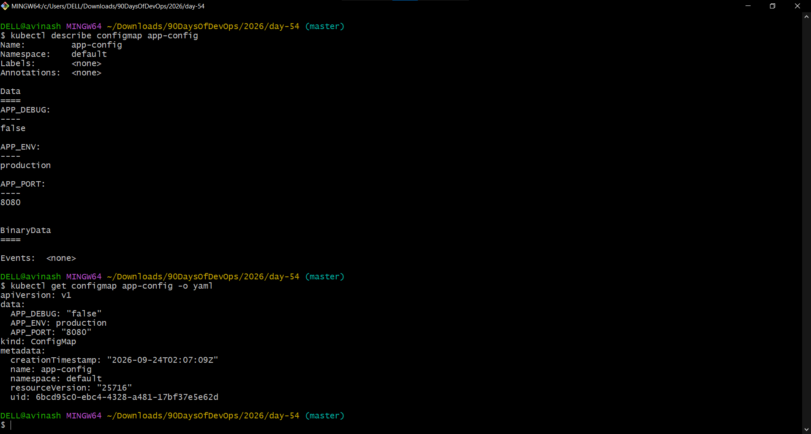
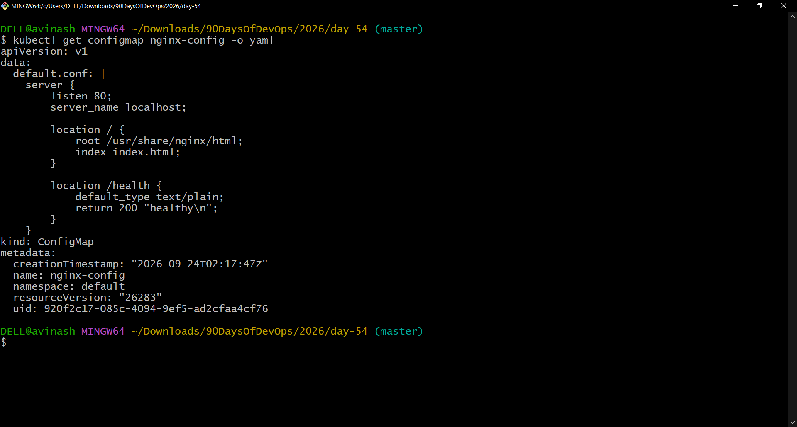
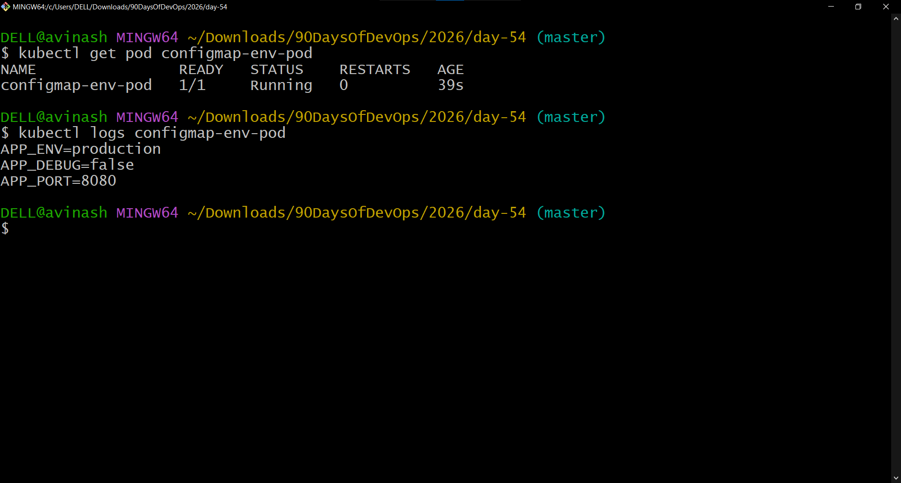
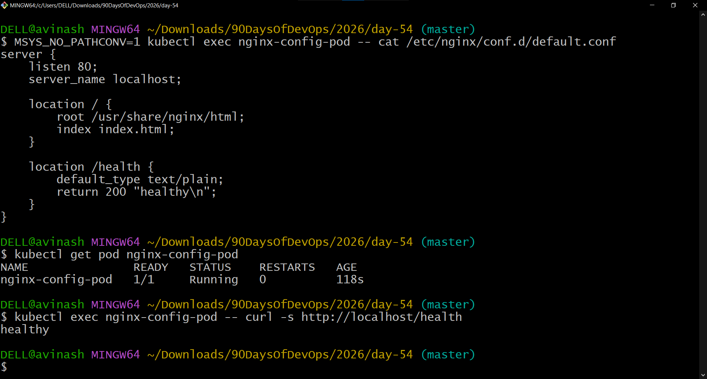
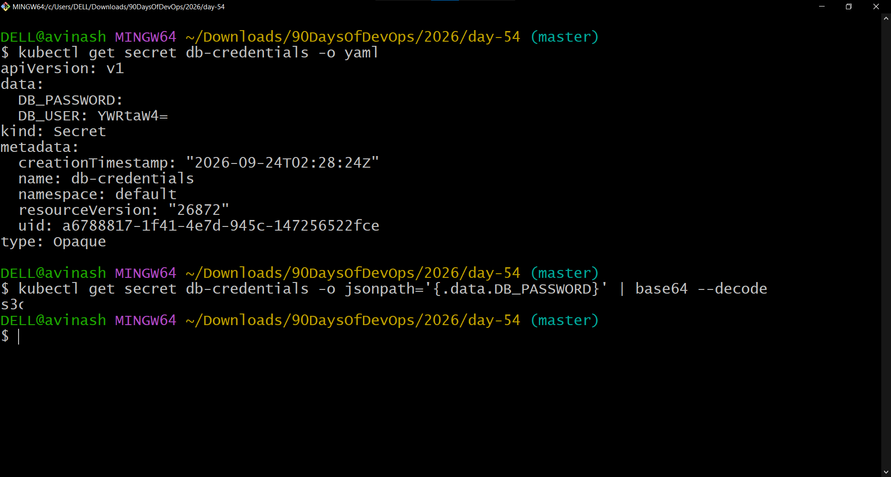
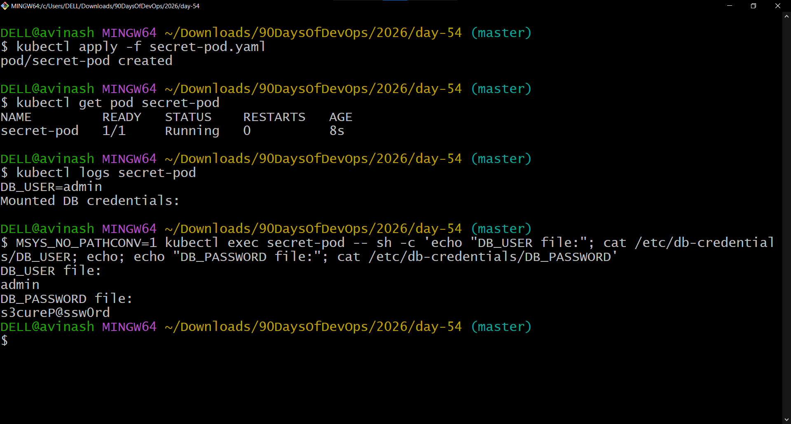
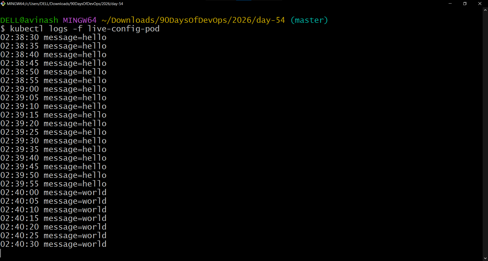
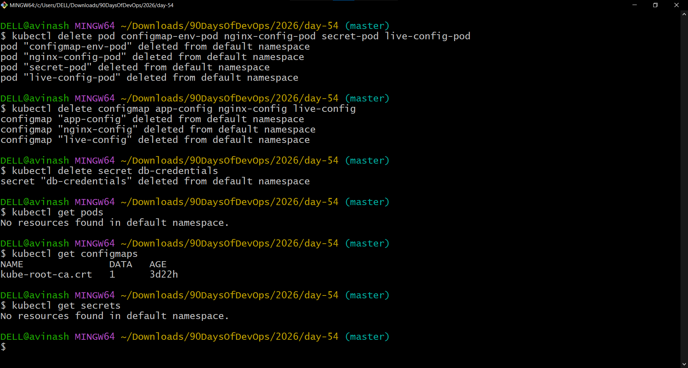

# Day 54 – Kubernetes ConfigMaps and Secrets

## Overview

Kubernetes applications often need configuration such as database URLs, feature flags, ports, API settings, and credentials. Hardcoding these values into container images makes configuration changes unnecessarily difficult because the image would need to be rebuilt.

Kubernetes provides:

- **ConfigMaps** for non-sensitive configuration.
- **Secrets** for sensitive values such as credentials.

In this hands-on exercise, I created ConfigMaps from literals and files, consumed ConfigMaps through environment variables and volume mounts, created and consumed a Secret, verified Base64 encoding and decoding, tested ConfigMap update propagation, and cleaned up the resources.

---

# 1. Environment

| Component | Details |
|---|---|
| OS | Windows |
| Terminal | Git Bash |
| Kubernetes | v1.37.0 |
| Cluster | `devops-cluster` |
| Runtime | containerd |
| Cluster Tool | Minikube |
| Namespace | `default` |
| Application | Nginx / BusyBox |

Before starting the tasks, the Minikube cluster was started and verified successfully.

```bash
kubectl get nodes
```

The cluster node was:

```text
devops-cluster   Ready   control-plane   v1.37.0
```

---

# 2. ConfigMaps vs Secrets

## ConfigMap

A ConfigMap stores non-confidential configuration data as key-value pairs or configuration files.

Examples:

- Application environment
- Feature flags
- Port numbers
- Nginx configuration
- Application settings

## Secret

A Kubernetes Secret is designed for sensitive data such as:

- Database usernames
- Database passwords
- API credentials
- Tokens
- Certificates

A Secret's values are represented as Base64-encoded data in the Kubernetes API representation.

**Important:** Base64 is encoding, not encryption.

---

# 3. Task 1 – Create a ConfigMap from Literals

The first task was to create a ConfigMap named `app-config` with three configuration values.

```bash
kubectl create configmap app-config \
  --from-literal=APP_ENV=production \
  --from-literal=APP_DEBUG=false \
  --from-literal=APP_PORT=8080
```

The ConfigMap was successfully created.

## Inspect the ConfigMap

```bash
kubectl describe configmap app-config
```

```bash
kubectl get configmap app-config -o yaml
```

The ConfigMap contained:

```text
APP_ENV=production
APP_DEBUG=false
APP_PORT=8080
```

The YAML representation showed the values under the `data` field as plain text.

### Screenshot



---

# 4. Task 2 – Create a ConfigMap from a File

A custom Nginx configuration file was created with a `/health` endpoint.

## Nginx configuration

```nginx
server {
    listen 80;
    server_name localhost;

    location / {
        root /usr/share/nginx/html;
        index index.html;
    }

    location /health {
        default_type text/plain;
        return 200 "healthy\n";
    }
}
```

The file was saved as:

```text
default.conf
```

The ConfigMap was then created using:

```bash
kubectl create configmap nginx-config \
  --from-file=default.conf=default.conf
```

The resulting ConfigMap used `default.conf` as the key.

## Verify

```bash
kubectl get configmap nginx-config -o yaml
```

The output showed the complete Nginx configuration under:

```text
data:
  default.conf:
```

### Screenshot



---

# 5. Task 3 – Use ConfigMap as Environment Variables

A BusyBox Pod was created using `envFrom` and `configMapRef`.

## Manifest

```yaml
apiVersion: v1
kind: Pod
metadata:
  name: configmap-env-pod
spec:
  containers:
    - name: config-reader
      image: busybox:latest
      command:
        - sh
        - -c
        - |
          echo "APP_ENV=$APP_ENV"
          echo "APP_DEBUG=$APP_DEBUG"
          echo "APP_PORT=$APP_PORT"
          sleep 3600
      envFrom:
        - configMapRef:
            name: app-config
```

The Pod was created with:

```bash
kubectl apply -f configmap-env-pod.yaml
```

The Pod status was:

```text
configmap-env-pod   1/1   Running
```

The injected environment variables were verified with:

```bash
kubectl logs configmap-env-pod
```

Output:

```text
APP_ENV=production
APP_DEBUG=false
APP_PORT=8080
```

### Screenshot



---

# 6. Task 3 – Mount ConfigMap as a Volume

A second Pod was created using the Nginx image. The `nginx-config` ConfigMap was mounted at:

```text
/etc/nginx/conf.d
```

## Manifest

```yaml
apiVersion: v1
kind: Pod
metadata:
  name: nginx-config-pod
spec:
  containers:
    - name: nginx
      image: nginx:1.25
      ports:
        - containerPort: 80
      volumeMounts:
        - name: nginx-config-volume
          mountPath: /etc/nginx/conf.d
  volumes:
    - name: nginx-config-volume
      configMap:
        name: nginx-config
```

The Pod was created with:

```bash
kubectl apply -f nginx-config-pod.yaml
```

The Pod reached:

```text
nginx-config-pod   1/1   Running
```

## Test the `/health` endpoint

```bash
kubectl exec nginx-config-pod -- curl -s http://localhost/health
```

Result:

```text
healthy
```

The mounted configuration was also verified:

```bash
MSYS_NO_PATHCONV=1 kubectl exec nginx-config-pod -- cat /etc/nginx/conf.d/default.conf
```

The mounted file contained the `/health` configuration.

### Windows Git Bash Note

When using Git Bash, paths beginning with `/` can be converted to Windows paths by MSYS. The following prefix prevents that conversion:

```bash
MSYS_NO_PATHCONV=1
```

### Screenshot



---

# 7. Task 4 – Create a Secret

A Secret named `db-credentials` was created with a database username and password.

```bash
kubectl create secret generic db-credentials \
  --from-literal=DB_USER=admin \
  --from-literal=DB_PASSWORD='s3cureP@ssw0rd'
```

The Secret was inspected with:

```bash
kubectl get secret db-credentials -o yaml
```

The output contained Base64-encoded values under the `data` field.

## Decode the password

```bash
kubectl get secret db-credentials -o jsonpath='{.data.DB_PASSWORD}' | base64 --decode
```

The decoded result was the original plaintext value.

## Base64 Is Not Encryption

Base64 provides encoding, not confidentiality.

Anyone who has sufficient access to read a Kubernetes Secret can retrieve the encoded value and decode it.

Kubernetes Secret security relies on controls such as:

- RBAC permissions
- Restricting access to Secret objects
- Encryption at rest where configured
- Appropriate cluster security controls

### Screenshot



---

# 8. Task 5 – Use Secret in a Pod

The Secret was consumed in two ways:

1. `secretKeyRef` for an environment variable.
2. A Secret volume mounted as files.

## Manifest

```yaml
apiVersion: v1
kind: Pod
metadata:
  name: secret-pod
spec:
  containers:
    - name: secret-reader
      image: busybox:latest
      command:
        - sh
        - -c
        - |
          echo "DB_USER=$DB_USER"
          echo "Mounted DB credentials:"
          cat /etc/db-credentials/DB_USER
          cat /etc/db-credentials/DB_PASSWORD
          sleep 3600
      env:
        - name: DB_USER
          valueFrom:
            secretKeyRef:
              name: db-credentials
              key: DB_USER
      volumeMounts:
        - name: db-credentials-volume
          mountPath: /etc/db-credentials
          readOnly: true
  volumes:
    - name: db-credentials-volume
      secret:
        secretName: db-credentials
```

The Pod was created with:

```bash
kubectl apply -f secret-pod.yaml
```

The Pod reached:

```text
secret-pod   1/1   Running
```

The environment variable was verified:

```bash
kubectl logs secret-pod
```

The mounted Secret files were verified with:

```bash
MSYS_NO_PATHCONV=1 kubectl exec secret-pod -- sh -c 'echo "DB_USER file:"; cat /etc/db-credentials/DB_USER; echo; echo "DB_PASSWORD file:"; cat /etc/db-credentials/DB_PASSWORD'
```

The mounted files contained the decoded plaintext values.

Therefore:

```text
Kubernetes API representation → Base64 encoded
Secret volume inside container → decoded plaintext
```

### Screenshot



---

# 9. Environment Variables vs Volume Mounts

| Method | Use Case | Update Behavior |
|---|---|---|
| Environment variable | Simple application settings | Value is set when the Pod starts |
| ConfigMap volume | Configuration files or values that may change | Mounted data can be updated automatically |
| Secret volume | Sensitive configuration files | Mounted data can be updated automatically |

For this exercise:

```text
envFrom / secretKeyRef
        ↓
Environment variables
        ↓
Set when container starts
```

and:

```text
ConfigMap / Secret
        ↓
Volume mount
        ↓
File inside container
        ↓
Mounted data can update
```

---

# 10. Task 6 – Update ConfigMap and Observe Propagation

A ConfigMap named `live-config` was created:

```bash
kubectl create configmap live-config \
  --from-literal=message=hello
```

A Pod was created that mounted the ConfigMap as a volume and read the value every five seconds.

## Manifest

```yaml
apiVersion: v1
kind: Pod
metadata:
  name: live-config-pod
spec:
  containers:
    - name: config-watcher
      image: busybox:latest
      command:
        - sh
        - -c
        - |
          while true; do
            echo "$(date '+%H:%M:%S') message=$(cat /etc/live-config/message)"
            sleep 5
          done
      volumeMounts:
        - name: live-config-volume
          mountPath: /etc/live-config
  volumes:
    - name: live-config-volume
      configMap:
        name: live-config
```

The Pod initially reported:

```text
message=hello
```

The ConfigMap was then updated:

```bash
kubectl patch configmap live-config --type merge -p '{"data":{"message":"world"}}'
```

After waiting for the mounted configuration to propagate, the Pod reported:

```text
message=world
```

The Pod did not need to be restarted.

## Observed Result

The screenshot shows the transition:

```text
02:39:55 message=hello
02:40:00 message=world
02:40:05 message=world
02:40:10 message=world
```

### Screenshot



---

# 11. Environment Variables Do Not Automatically Update

The earlier `configmap-env-pod` consumed configuration through environment variables.

Those environment variables were established when the container started.

Changing the source ConfigMap does not dynamically replace the already-established environment variables inside a running container.

For applications that need configuration files to reflect ConfigMap updates, volume mounts are an appropriate mechanism.

---

# 12. Task 7 – Cleanup

All resources created during the exercise were removed.

## Delete Pods

```bash
kubectl delete pod configmap-env-pod nginx-config-pod secret-pod live-config-pod
```

## Delete ConfigMaps

```bash
kubectl delete configmap app-config nginx-config live-config
```

## Delete Secret

```bash
kubectl delete secret db-credentials
```

## Verify

```bash
kubectl get pods
```

Result:

```text
No resources found in default namespace.
```

The automatically created Kubernetes ConfigMap:

```text
kube-root-ca.crt
```

remained in the namespace and was not part of the Day 54 resources.

Secrets returned:

```text
No resources found in default namespace.
```

### Screenshot



---

# 13. Files Created

The following Day 54 files were created during the hands-on exercise:

```text
default.conf
configmap-env-pod.yaml
nginx-config-pod.yaml
secret-pod.yaml
live-config-pod.yaml
```

Screenshots:

```text
day54-configmap-literals.png
day54-configmap-file.png
day54-configmap-env-pod.png
day54-configmap-volume.png
day54-secret-created.png
day54-secret-pod.png
day54-configmap-update.png
day54-cleanup.png
```

---

# 14. Key Takeaways

### ConfigMaps

- Store non-sensitive configuration.
- Can be created from literals or files.
- Can be consumed as environment variables.
- Can be mounted as files.

### Secrets

- Store sensitive configuration such as credentials.
- Secret data appears Base64-encoded in the Kubernetes API representation.
- Base64 is **not encryption**.
- Secrets can be injected into environment variables.
- Secrets can be mounted as files.

### Environment Variables

- Useful for simple key-value configuration.
- Values are established when the container starts.
- Updating the source ConfigMap or Secret does not dynamically change the existing environment variable inside a running container.

### Volume Mounts

- Useful for configuration files.
- ConfigMap-mounted values can update without restarting the Pod.
- Secret-mounted values are presented to the container as decoded file contents.

### Security

Never treat Base64 as a security mechanism. Proper RBAC, restricted Secret access, and encryption-at-rest configuration are important parts of protecting sensitive Kubernetes data.

---

# 15. Day 54 Summary

Today I practiced:

```text
ConfigMap
   ├── Literal values
   ├── File-based configuration
   ├── Environment variables
   └── Volume mounts

Secret
   ├── Base64 representation
   ├── Base64 decoding
   ├── Environment variables
   └── Volume mounts

ConfigMap Updates
   └── Volume-mounted configuration propagation
```

The hands-on exercise demonstrated how Kubernetes separates application configuration from container images and how ConfigMaps and Secrets can be consumed by Pods using different mechanisms.

---

# 16. Commands Reference

## ConfigMap from literals

```bash
kubectl create configmap app-config \
  --from-literal=APP_ENV=production \
  --from-literal=APP_DEBUG=false \
  --from-literal=APP_PORT=8080
```

## ConfigMap from file

```bash
kubectl create configmap nginx-config \
  --from-file=default.conf=default.conf
```

## Inspect ConfigMap

```bash
kubectl describe configmap app-config
kubectl get configmap app-config -o yaml
kubectl get configmap nginx-config -o yaml
```

## Create Secret

```bash
kubectl create secret generic db-credentials \
  --from-literal=DB_USER=admin \
  --from-literal=DB_PASSWORD='s3cureP@ssw0rd'
```

## Inspect Secret

```bash
kubectl get secret db-credentials -o yaml
```

## Decode Secret

```bash
kubectl get secret db-credentials -o jsonpath='{.data.DB_PASSWORD}' | base64 --decode
```

## Update ConfigMap

```bash
kubectl patch configmap live-config --type merge -p '{"data":{"message":"world"}}'
```

## Cleanup

```bash
kubectl delete pod configmap-env-pod nginx-config-pod secret-pod live-config-pod
kubectl delete configmap app-config nginx-config live-config
kubectl delete secret db-credentials
```

---

# 17. Day 54 Completion

**Status: Completed**

The Day 54 challenge was completed with hands-on implementation of Kubernetes ConfigMaps and Secrets, including environment-variable injection, volume mounts, Secret decoding, configuration update propagation, verification, and cleanup.

#90DaysOfDevOps #DevOpsKaJosh #TrainWithShubham
