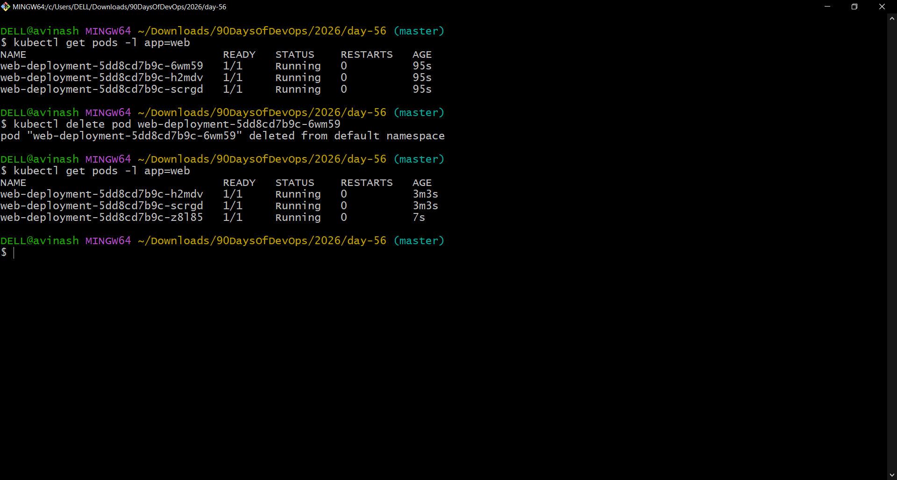
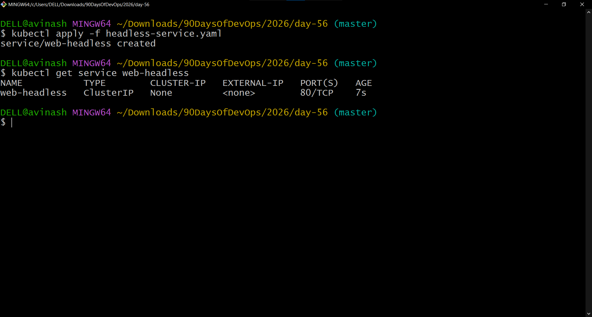
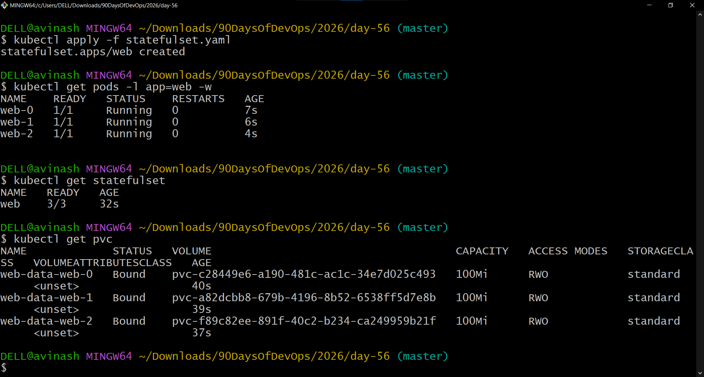
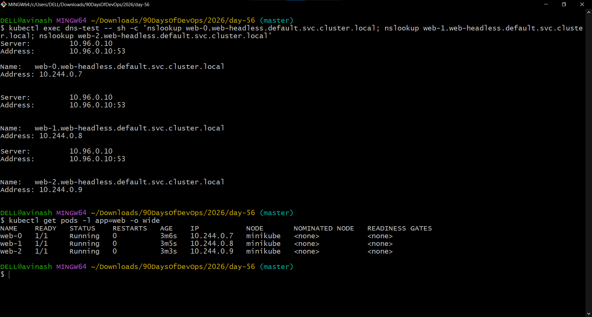
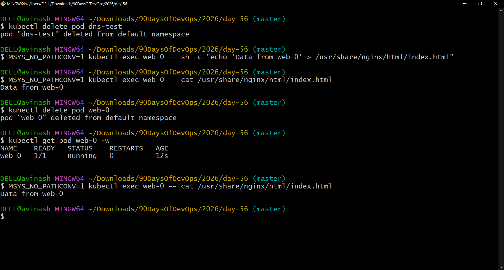
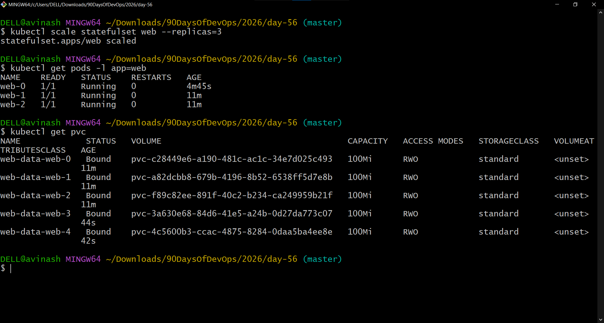
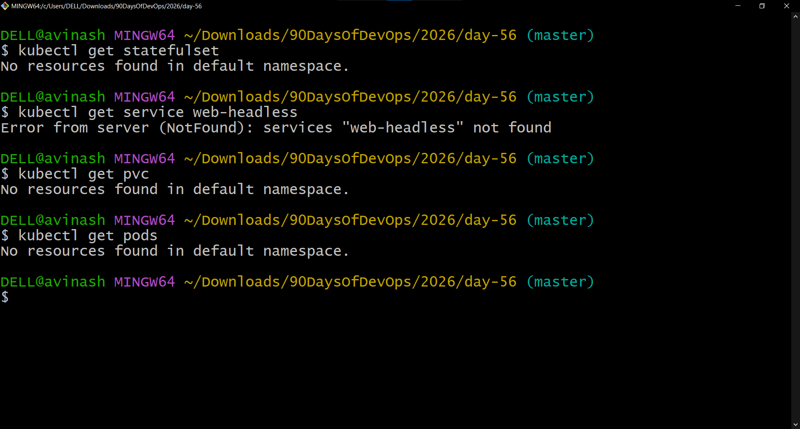

# Day 56 – Kubernetes StatefulSets

## Overview

StatefulSets are designed for stateful applications that need stable Pod identity, ordered deployment and scaling, stable network identities, and persistent storage for each replica.

In this hands-on exercise, I compared a Deployment with a StatefulSet, created a Headless Service, deployed a 3-replica StatefulSet with per-Pod PVCs, tested stable Pod DNS, verified storage persistence after Pod deletion, scaled the StatefulSet, and cleaned up the resources.

---

# Task 1: Understand the Problem – Deployment

A Deployment was created with 3 replicas using Nginx.

The Deployment created Pods with generated/random names such as:

```text
web-deployment-5dd8cd7b9c-6wm59
web-deployment-5dd8cd7b9c-h2mdv
web-deployment-5dd8cd7b9c-scrgd
```

After deleting one Pod, Kubernetes created a replacement with a different generated name.

### Key Observation

Deployment Pods do not have stable identities. This is suitable for stateless workloads, but database clusters often need predictable identities so members can discover and communicate with specific instances.

### Evidence



---

# Deployment vs StatefulSet

| Feature | Deployment | StatefulSet |
|---|---|---|
| Pod names | Random/generated | Stable and ordered |
| Example names | `app-xyz-abc` | `app-0`, `app-1`, `app-2` |
| Startup order | Pods can start independently | Ordered startup |
| Storage | Typically shared/application-defined | Each replica can receive its own PVC |
| Network identity | No stable Pod identity | Stable Pod DNS identity |
| Typical use | Stateless applications | Databases and other stateful workloads |

---

# Task 2: Create a Headless Service

A Headless Service was created with:

```yaml
clusterIP: None
```

The Service used the selector:

```yaml
selector:
  app: web
```

The Service was verified using:

```bash
kubectl get service web-headless
```

The output showed:

```text
CLUSTER-IP: None
```

A Headless Service provides the DNS foundation for stable per-Pod network identities.

### Evidence



---

# Task 3: Create a StatefulSet

A StatefulSet named `web` was created with:

- 3 replicas
- Nginx `1.25`
- `serviceName: web-headless`
- `volumeClaimTemplates`
- `ReadWriteOnce` access mode
- `100Mi` requested storage per replica

The StatefulSet created Pods in stable ordinal order:

```text
web-0
web-1
web-2
```

All three Pods reached `Running` and the StatefulSet showed:

```text
web   3/3
```

The StatefulSet also created one PVC for each replica:

```text
web-data-web-0
web-data-web-1
web-data-web-2
```

Each PVC was `Bound` and requested `100Mi` with `ReadWriteOnce` access.

### Evidence



---

# Task 4: Stable Network Identity

A temporary BusyBox Pod was used to test DNS resolution for all three StatefulSet Pods.

The following DNS names were tested:

```text
web-0.web-headless.default.svc.cluster.local
web-1.web-headless.default.svc.cluster.local
web-2.web-headless.default.svc.cluster.local
```

The DNS results returned:

```text
web-0 → 10.244.0.7
web-1 → 10.244.0.8
web-2 → 10.244.0.9
```

`kubectl get pods -l app=web -o wide` showed the same Pod IPs.

### Result

The DNS-resolved addresses matched the actual Pod IPs.

### Evidence



---

# Task 5: Stable Storage – Data Survives Pod Deletion

A unique message was written to the storage mounted by `web-0`:

```text
Data from web-0
```

The `web-0` Pod was then deleted.

StatefulSet recreated `web-0` and the new Pod returned to the `Running` state.

The same data was read again:

```text
Data from web-0
```

### Result

The data remained intact after Pod deletion and recreation because `web-0` reconnected to its existing PVC.

### Evidence



---

# Task 6: Ordered Scaling

The StatefulSet was scaled from 3 replicas to 5 replicas.

The additional Pods were created using ordered identities:

```text
web-3
web-4
```

The StatefulSet was then scaled back to 3 replicas.

The remaining Pods were:

```text
web-0
web-1
web-2
```

The PVCs were checked after scaling down and all five remained:

```text
web-data-web-0
web-data-web-1
web-data-web-2
web-data-web-3
web-data-web-4
```

### Result

Scaling down removed the higher-ordinal Pods but did not remove their PVCs.

### Evidence



---

# Task 7: Clean Up

The StatefulSet and Headless Service were deleted.

The PVCs were checked and then manually deleted.

Final verification confirmed that the Day 56 StatefulSet, Service, Pods, and PVCs were no longer present.

### Key Observation

Deleting a StatefulSet does not automatically delete the PVCs created by its `volumeClaimTemplates`.

### Evidence



---

# StatefulSet Storage Flow

```text
StatefulSet
     |
     +---- web-0 ---- web-data-web-0
     |
     +---- web-1 ---- web-data-web-1
     |
     +---- web-2 ---- web-data-web-2
```

Each StatefulSet replica receives a stable identity and its own PVC.

---

# StatefulSet Network Identity

```text
web-0.web-headless.default.svc.cluster.local
web-1.web-headless.default.svc.cluster.local
web-2.web-headless.default.svc.cluster.local
```

---

# Why StatefulSets Are Useful

StatefulSets are useful for workloads that need:

- Stable, predictable Pod names
- Ordered startup and termination
- Stable network identity
- Individual persistent storage per replica
- Predictable scaling behavior

Typical examples include databases, distributed databases, message brokers, and other stateful distributed systems.

---

# Important Commands Used

## Deployment

```bash
kubectl apply -f deployment.yaml
kubectl get pods -l app=web
kubectl delete pod <pod-name>
kubectl delete deployment web-deployment
```

## Headless Service

```bash
kubectl apply -f headless-service.yaml
kubectl get service web-headless
```

## StatefulSet

```bash
kubectl apply -f statefulset.yaml
kubectl get pods -l app=web
kubectl get statefulset
kubectl get pvc
```

## DNS Testing

```bash
kubectl run dns-test --image=busybox:1.36 --restart=Never --command -- sleep 3600
```

```bash
kubectl exec dns-test -- sh -c 'nslookup web-0.web-headless.default.svc.cluster.local; nslookup web-1.web-headless.default.svc.cluster.local; nslookup web-2.web-headless.default.svc.cluster.local'
```

```bash
kubectl get pods -l app=web -o wide
```

## Persistent Storage Test

```bash
MSYS_NO_PATHCONV=1 kubectl exec web-0 -- sh -c "echo 'Data from web-0' > /usr/share/nginx/html/index.html"
```

```bash
kubectl delete pod web-0
```

```bash
kubectl get pod web-0 -w
```

```bash
MSYS_NO_PATHCONV=1 kubectl exec web-0 -- cat /usr/share/nginx/html/index.html
```

## Scaling

```bash
kubectl scale statefulset web --replicas=5
kubectl get pods -l app=web
kubectl get pvc
```

```bash
kubectl scale statefulset web --replicas=3
kubectl get pods -l app=web
kubectl get pvc
```

## Cleanup

```bash
kubectl delete statefulset web
kubectl delete service web-headless
kubectl get pvc
kubectl delete pvc web-data-web-0 web-data-web-1 web-data-web-2 web-data-web-3 web-data-web-4
```

---

# Day 56 Completion

- [x] Task 1 – Compared Deployment Pod identity with StatefulSet identity
- [x] Task 2 – Created a Headless Service
- [x] Task 3 – Created a 3-replica StatefulSet with per-Pod PVCs
- [x] Task 4 – Tested stable Pod DNS
- [x] Task 5 – Verified storage persistence after Pod deletion
- [x] Task 6 – Tested ordered scaling and PVC retention
- [x] Task 7 – Cleaned up StatefulSet, Service, Pods, and PVCs
- [x] Collected 7 focused screenshots
- [x] Prepared Day 56 documentation

## Files

```text
deployment.yaml
headless-service.yaml
statefulset.yaml
day-56-statefulsets.md
```

## Learn in Public

> Learned Kubernetes StatefulSets today. Stable Pod names, per-Pod DNS, and persistent storage that survives deletion — now I understand why databases need StatefulSets.

`#90DaysOfDevOps` `#DevOpsKaJosh` `#TrainWithShubham`
