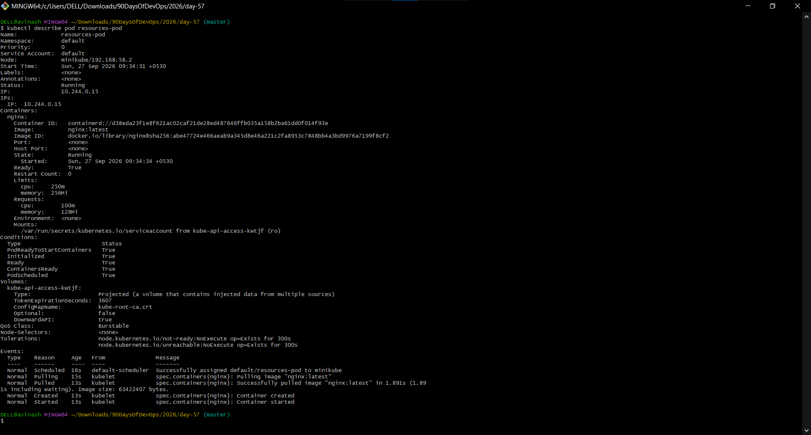
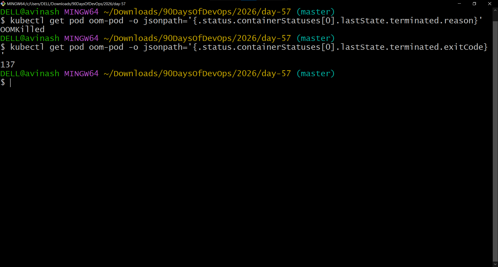
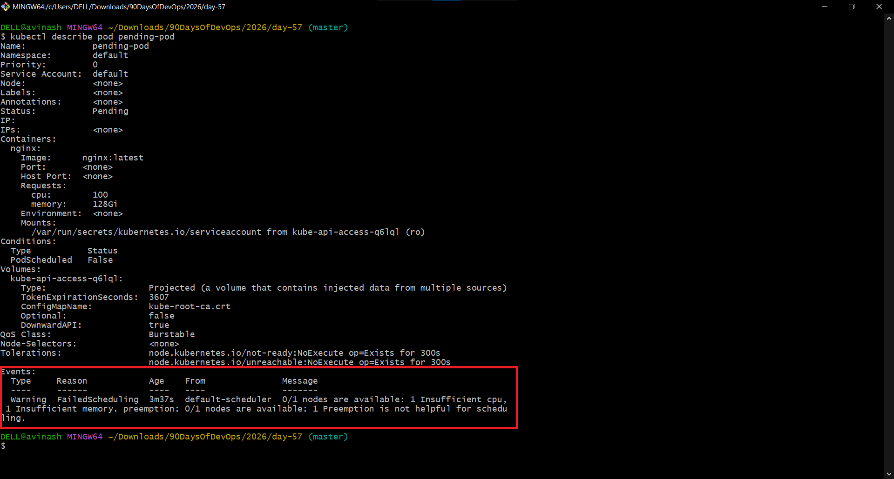
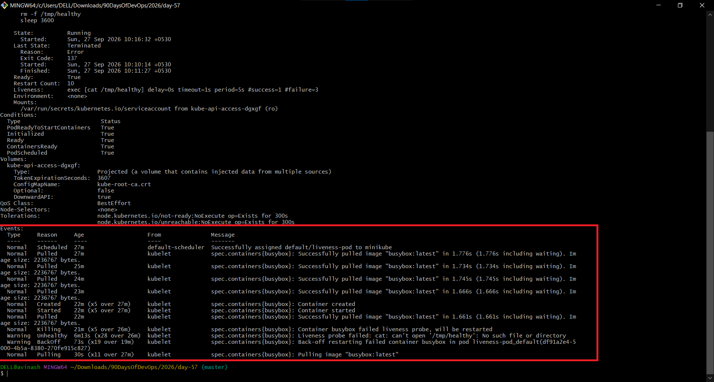
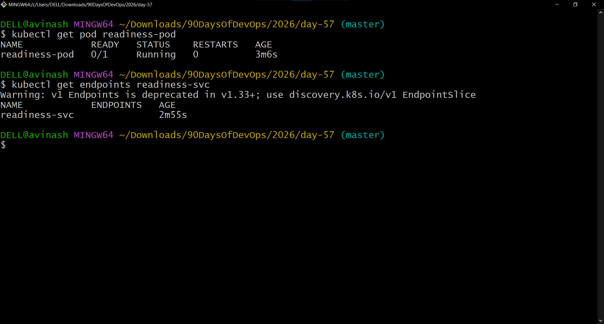
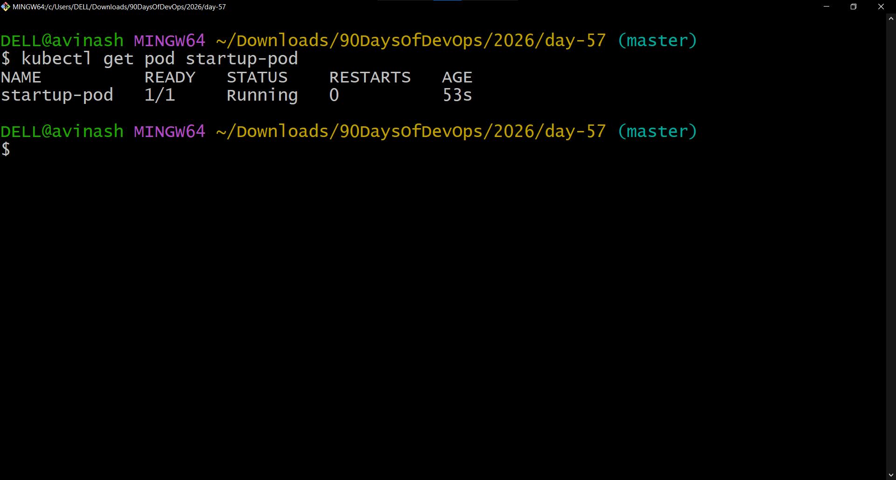

# Day 57 – Resource Requests, Limits, and Probes

## Overview

This document covers Kubernetes resource management and container health probes:

- Resource requests and limits
- OOMKilled caused by exceeding a memory limit
- Pending Pods caused by excessive resource requests
- Liveness probes and automatic restarts
- Readiness probes and Service endpoint removal
- Startup probes for slow-starting containers

---

## Task 1 – Resource Requests and Limits

### Objective
Create a Pod with CPU and memory requests and limits.

- CPU request: `100m`
- Memory request: `128Mi`
- CPU limit: `250m`
- Memory limit: `256Mi`

### Commands

```bash
kubectl apply -f resources-pod.yaml
kubectl get pod resources-pod
kubectl describe pod resources-pod
```

### Result

Because the requests and limits are different, the Pod has **QoS Class: Burstable**.

### Screenshot



---

## Task 2 – OOMKilled – Exceeding Memory Limits

### Objective
Run `polinux/stress` with a `100Mi` memory limit while attempting to allocate `200M`.

Stress command:

```text
stress --vm 1 --vm-bytes 200M --vm-hang 1
```

### Commands

```bash
kubectl apply -f oom-pod.yaml
kubectl get pod oom-pod
kubectl describe pod oom-pod
```

### Result

The container exceeds its memory limit and is terminated.

- Reason: `OOMKilled`
- Exit Code: `137`

### Screenshot



---

## Task 3 – Pending Pod – Requesting Too Much

### Objective
Create a Pod requesting more CPU and memory than the available node can provide.

- CPU request: `100`
- Memory request: `128Gi`

### Commands

```bash
kubectl apply -f pending-pod.yaml
kubectl get pod pending-pod
kubectl describe pod pending-pod
```

### Result

The Pod remains **Pending**. The scheduler Events section explains that the Pod cannot be scheduled because of insufficient resources.

### Screenshot



---

## Task 4 – Liveness Probe

### Objective
Use a liveness probe to detect a failed container and restart it automatically.

The container creates `/tmp/healthy` and deletes it after 30 seconds. The probe checks:

```bash
cat /tmp/healthy
```

Probe settings:

- `periodSeconds: 5`
- `failureThreshold: 3`

### Commands

```bash
kubectl apply -f liveness-pod.yaml
kubectl get pod liveness-pod
kubectl describe pod liveness-pod
```

### Result

After `/tmp/healthy` is deleted, the liveness probe fails three consecutive times and Kubernetes restarts the container. The restart count increases.

### Screenshot



---

## Task 5 – Readiness Probe

### Objective
Use a readiness probe to control whether a Pod receives Service traffic.

The nginx container uses an HTTP readiness probe:

- Path: `/`
- Port: `80`

### Commands

```bash
kubectl apply -f readiness-pod.yaml
kubectl expose pod readiness-pod --port=80 --name=readiness-svc
kubectl get pod readiness-pod
kubectl get endpoints readiness-svc
kubectl exec readiness-pod -- rm /usr/share/nginx/html/index.html
kubectl get pod readiness-pod
kubectl get endpoints readiness-svc
```

### Result

When the readiness probe fails:

- The Pod becomes `0/1` Ready.
- The Pod is removed from Service endpoints.
- The container is **not restarted**.

### Screenshot



---

## Task 6 – Startup Probe

### Objective
Use a startup probe to give a slow-starting container enough time to initialize.

The container takes approximately 20 seconds:

```text
sleep 20 && touch /tmp/started
```

Startup probe:

- `periodSeconds: 5`
- `failureThreshold: 12`
- Approximately 60-second startup budget

The liveness probe checks `/tmp/started` after startup succeeds.

### Commands

```bash
kubectl apply -f startup-pod.yaml
kubectl get pod startup-pod
```

### Result

The startup probe allows the container time to initialize. Once startup succeeds, the liveness probe becomes active.

If `failureThreshold` were `2` instead of `12`, only two failed startup checks would be allowed before Kubernetes considered startup unsuccessful and terminated/restarted the container.

### Screenshot



---

## Task 7 – Clean Up

```bash
kubectl delete pod readiness-pod startup-pod liveness-pod
kubectl delete service readiness-svc
kubectl get pods
```

---

## Key Learnings

### Requests vs Limits

| Resource | Request | Limit |
|---|---|---|
| CPU | Scheduler uses it for placement | CPU is throttled when the limit is exceeded |
| Memory | Scheduler uses it for placement | Container can be terminated with `OOMKilled` |

### QoS Classes

- **Guaranteed** – requests equal limits
- **Burstable** – requests and limits are set but differ
- **BestEffort** – no requests or limits are configured

### Probe Behavior

| Probe | Purpose | Failure Behavior |
|---|---|---|
| Liveness | Detect unhealthy/stuck containers | Container is restarted |
| Readiness | Determine whether Pod can receive traffic | Pod is removed from Service endpoints |
| Startup | Allow slow containers to initialize | Container is terminated/restarted if startup repeatedly fails |

### Important Values

- `100m` CPU = `0.1` CPU
- `1000m` CPU = `1` CPU core
- `128Mi` = 128 MiB
- OOMKilled commonly results in exit code `137`

---

## Screenshots Included

1. `day57-task1-resources-qos.png`
2. `day57-task2-oomkilled.png`
3. `day57-task3-pending-resources.png`
4. `day57-task4-liveness-restart.png`
5. `day57-task5-readiness-probe-failure.png`
6. `day57-task6-startup-probe.png`
