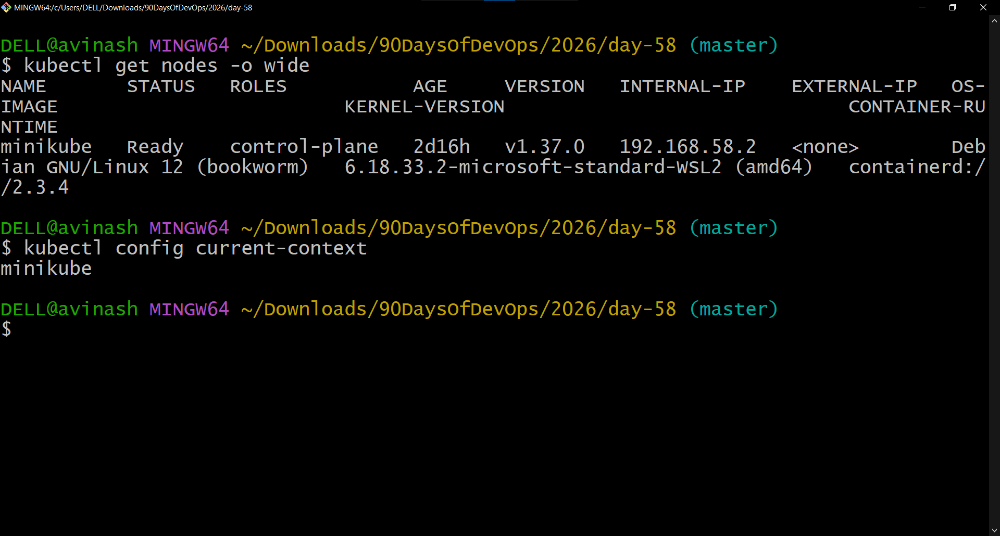
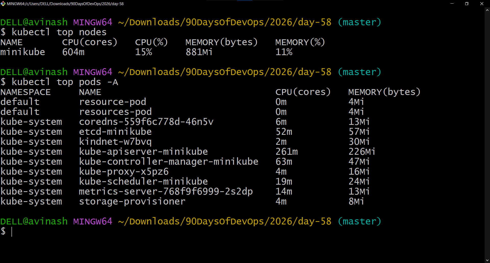
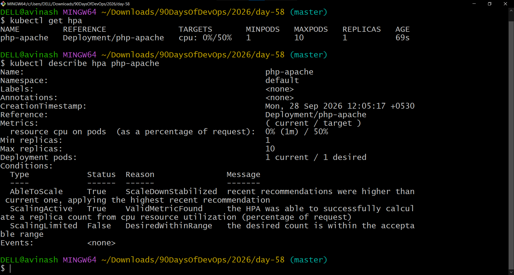
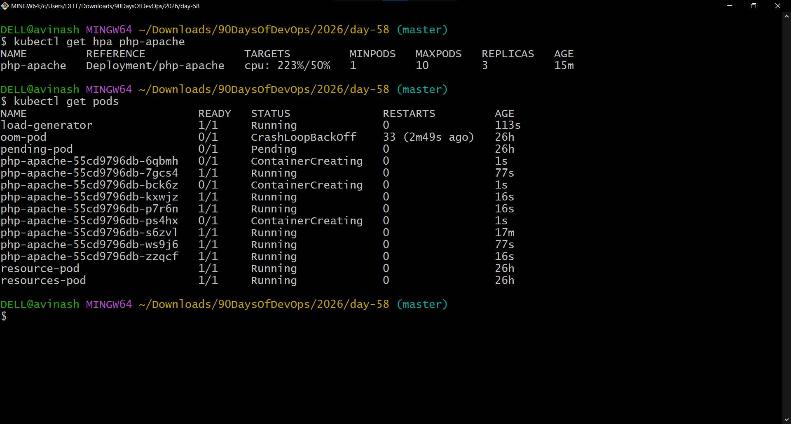
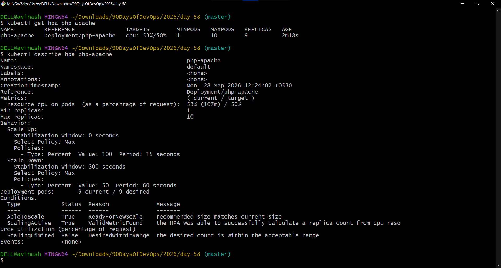

# Day 58 – Metrics Server and Horizontal Pod Autoscaler (HPA)

## Overview

Today I worked with Kubernetes Metrics Server and Horizontal Pod Autoscaler (HPA).

The goal was to:
- Install and verify Metrics Server.
- Use `kubectl top` to view actual CPU and memory usage.
- Deploy a CPU-based PHP Apache application with CPU requests.
- Create an HPA targeting 50% CPU utilization.
- Generate load and observe automatic pod scaling.
- Configure HPA declaratively using `autoscaling/v2`.
- Configure scale-up and scale-down behavior.
- Clean up the temporary HPA workload resources.

> **Note:** Metrics Server was intentionally left installed as required by the task.

---

# Task 1 – Install and Verify Metrics Server

## Objective

Metrics Server collects resource usage information from Kubernetes nodes and pods. HPA uses this metrics data to make scaling decisions.

### Commands

```bash
kubectl get pods -n kube-system | grep metrics-server
kubectl top nodes
kubectl top pods -A
```

### Verification

Metrics Server was available and resource metrics could be queried using `kubectl top`.

### Screenshot





---

# Task 2 – Explore `kubectl top`

## Objective

`kubectl top` displays the current resource usage reported by Metrics Server.

### Commands

```bash
kubectl top nodes
kubectl top pods -A
kubectl top pods -A --sort-by=cpu
```

### Important Difference

| Kubernetes concept | Meaning |
|---|---|
| `kubectl top` | Current/observed CPU and memory usage |
| CPU request | Amount of CPU requested by a container |
| CPU limit | Maximum CPU a container can use |
| HPA target | Utilization percentage calculated against resource requests |

The HPA in this exercise uses CPU utilization relative to the configured CPU request.

---

# Task 3 – Create a Deployment with CPU Requests

## Objective

Create a PHP Apache Deployment with a CPU request so that HPA can calculate CPU utilization.

### Manifest

File:

```text
php-apache.yaml
```

The Deployment uses:

```text
registry.k8s.io/hpa-example
```

and configures:

```yaml
resources:
  requests:
    cpu: 200m
```

The application was exposed through a Kubernetes Service named:

```text
php-apache
```

### Commands

```bash
kubectl apply -f php-apache.yaml
kubectl expose deployment php-apache --port=80
kubectl get deployment php-apache
kubectl get pods
```

### Verification

The `php-apache` Deployment was running successfully before HPA testing.

---

# Task 4 – Create an HPA

## Objective

Create an HPA that maintains average CPU utilization around 50%.

### Command

```bash
kubectl autoscale deployment php-apache --cpu-percent=50 --min=1 --max=10
```

### Verification

```bash
kubectl get hpa php-apache
kubectl describe hpa php-apache
```

The HPA initially showed:

```text
cpu: 0%/50%
```

and one replica.

### Screenshot



---

# Task 5 – Generate Load and Observe Autoscaling

## Objective

Generate continuous HTTP requests against the `php-apache` Service and observe HPA scaling.

### Load Generator

The following command was used:

```bash
kubectl run load-generator \
  --image=busybox:1.36 \
  --restart=Never \
  -- /bin/sh -c "while true; do wget -q -O- http://php-apache; done"
```

### Initial Issue

The first load-generator attempt entered `StartError` because the container runtime on the local environment attempted to execute `/bin/sh` using an incompatible Windows/Git path.

The load generator was subsequently recreated using:

```bash
kubectl run load-generator --image=busybox:1.36 --restart=Never --command -- /bin/sh -c "while true; do wget -q -O- http://php-apache; done"
```

After the load generator was running, the HPA responded to the increased CPU utilization.

### HPA Result

The HPA scaled the Deployment from **1 replica to 9 replicas**.

Observed HPA output:

```text
NAME         REFERENCE                TARGETS    MINPODS   MAXPODS   REPLICAS
php-apache   Deployment/php-apache    cpu: 53%/50%   1        10        9
```

This demonstrates that the HPA detected CPU utilization above the 50% target and increased the number of replicas.

### Screenshot



### Stop Load Generation

```bash
kubectl delete pod load-generator
```

Scale-down can take longer because HPA uses a stabilization period for scale-down.

---

# Task 6 – Create HPA Declaratively Using YAML

## Objective

Replace the imperative HPA with an `autoscaling/v2` manifest.

### Manifest

File:

```text
php-apache-hpa.yaml
```

The HPA targets:

```text
50% CPU utilization
```

with:

```text
minimum replicas: 1
maximum replicas: 10
```

The manifest also defines HPA behavior.

### Behavior Configuration

The HPA was configured with:

```yaml
behavior:
  scaleUp:
    stabilizationWindowSeconds: 0
  scaleDown:
    stabilizationWindowSeconds: 300
```

### Meaning

- **Scale-up stabilization window: 0 seconds** — allows scaling up without an additional stabilization delay.
- **Scale-down stabilization window: 300 seconds** — keeps the HPA from immediately scaling down when load decreases.

The HPA also uses scaling policies to control how quickly replicas can change.

### Verification

```bash
kubectl get hpa
kubectl describe hpa php-apache
```

The HPA successfully reported:

```text
AbleToScale: True
ScalingActive: True
ScalingLimited: False
```

The observed configuration included:

```text
Current CPU: 53%
Target CPU: 50%
Minimum replicas: 1
Maximum replicas: 10
Current desired replicas: 9
Scale-up stabilization: 0 seconds
Scale-down stabilization: 300 seconds
```

### Screenshot



---

# HPA Scaling Formula

HPA determines the desired number of replicas using the relationship between current resource utilization and the configured target.

Conceptually:

```text
desiredReplicas =
ceil(currentReplicas × currentUsage / targetUsage)
```

For CPU utilization:

```text
desiredReplicas =
ceil(currentReplicas × currentCPUUtilization / targetCPUUtilization)
```

For example, if CPU utilization is above the configured target, HPA can increase the desired replica count.

---

# `autoscaling/v1` vs `autoscaling/v2`

| Feature | `autoscaling/v1` | `autoscaling/v2` |
|---|---|---|
| CPU utilization | Yes | Yes |
| Memory metrics | Limited | Yes |
| Multiple metrics | No | Yes |
| Advanced scaling behavior | Limited | Yes |
| Scale-up/scale-down behavior configuration | Limited | Yes |
| Custom/external metrics support | Limited | More flexible |

For this exercise, `autoscaling/v2` was used because it provides more detailed control over HPA behavior.

---

# Important Concepts Learned

## Metrics Server

Metrics Server provides resource usage metrics from Kubernetes nodes and pods.

## `kubectl top`

Shows observed resource usage.

```bash
kubectl top nodes
kubectl top pods -A
```

## Resource Requests

HPA CPU utilization is calculated relative to the CPU requests configured for containers.

Example:

```yaml
resources:
  requests:
    cpu: 200m
```

## HPA

Horizontal Pod Autoscaler automatically changes the number of replicas based on observed metrics.

Example:

```text
Minimum replicas: 1
Maximum replicas: 10
CPU target: 50%
```

## Scale-Up and Scale-Down

Scaling behavior can be controlled using the `behavior` section in `autoscaling/v2`.

---

# Task 7 – Cleanup

Temporary application resources can be removed with:

```bash
kubectl delete hpa php-apache
kubectl delete service php-apache
kubectl delete deployment php-apache
kubectl delete pod load-generator --ignore-not-found
```

Metrics Server should remain installed.

> If you are still collecting screenshots or verifying the exercise, perform cleanup only after all required evidence has been captured.

---

# Files in This Directory

```text
day-58/
├── README.md
├── day58-task1-cluster-info.png
├── day58-task1-metrics-server.png
├── php-apache.yaml
├── day58-task4-hpa.png
├── day58-task5-hpa-scaling.png
├── php-apache-hpa.yaml
├── day58-task6-hpa-yaml-behavior.png
└── day-58-metrics-hpa.md
```

---

# Screenshots

The screenshots included in this documentation are referenced using relative paths so that GitHub can render them correctly.

1. Metrics Server / cluster verification
2. HPA configuration and status
3. HPA scaling under load
4. Declarative HPA behavior

---

# Key Takeaways

- Metrics Server provides the resource metrics used by HPA.
- `kubectl top` displays current resource usage.
- HPA needs CPU requests to calculate CPU utilization percentages.
- HPA can automatically increase replicas when CPU utilization exceeds the configured target.
- HPA can reduce replicas when demand decreases.
- `autoscaling/v2` provides more control over metrics and scaling behavior.
- Stabilization windows help prevent rapid scaling fluctuations.

---

# Day 58 Completed

**Topic:** Kubernetes Metrics Server and Horizontal Pod Autoscaler

**Result:** Successfully configured Metrics Server, CPU-based HPA, load generation, automatic scaling, and declarative HPA behavior.

**Maximum replicas configured:** 10

**Observed replicas under load:** 9

**CPU target:** 50%

**Observed CPU utilization:** 53%

---

## Repository

[90DaysOfDevOps – Day 58](https://github.com/ask-vs9/90DaysOfDevOps/tree/master/2026/day-58)

