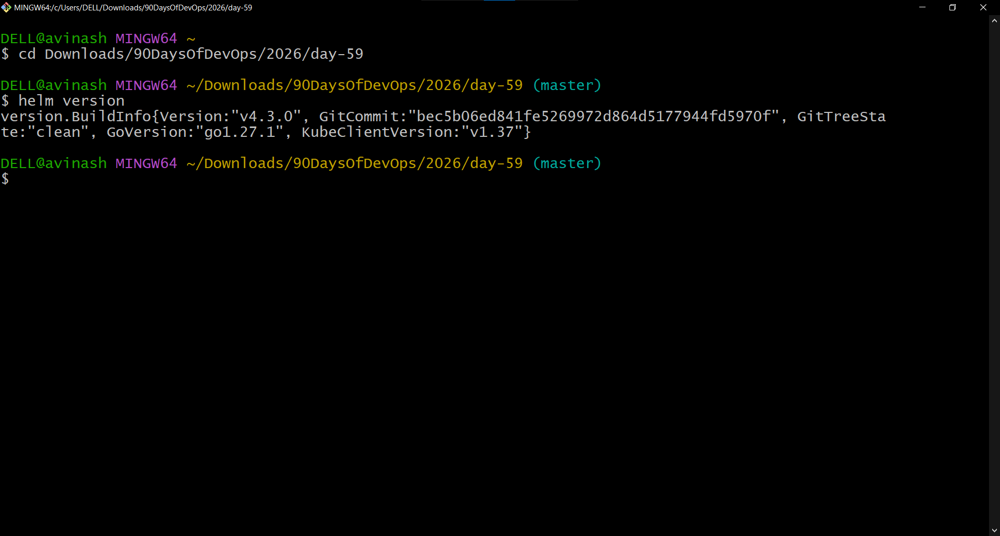
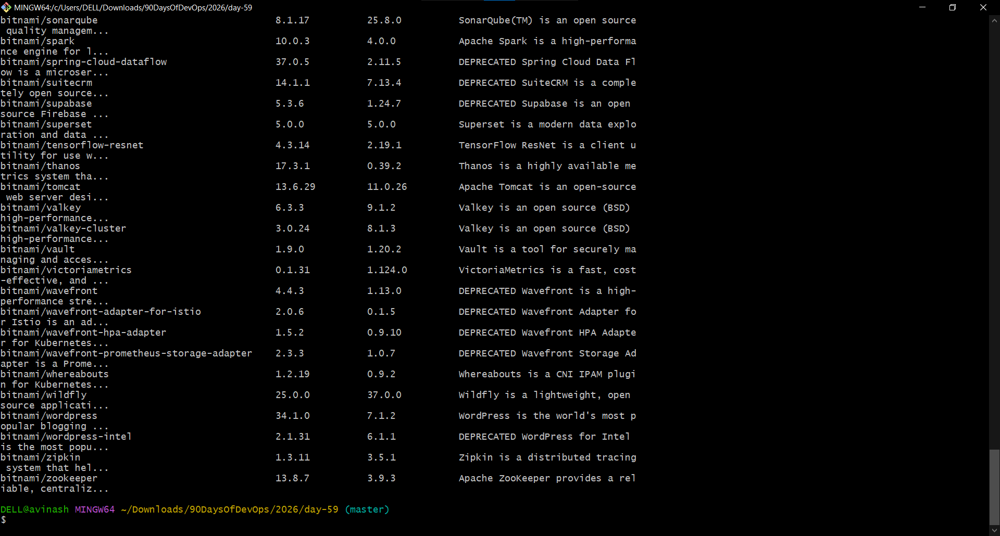
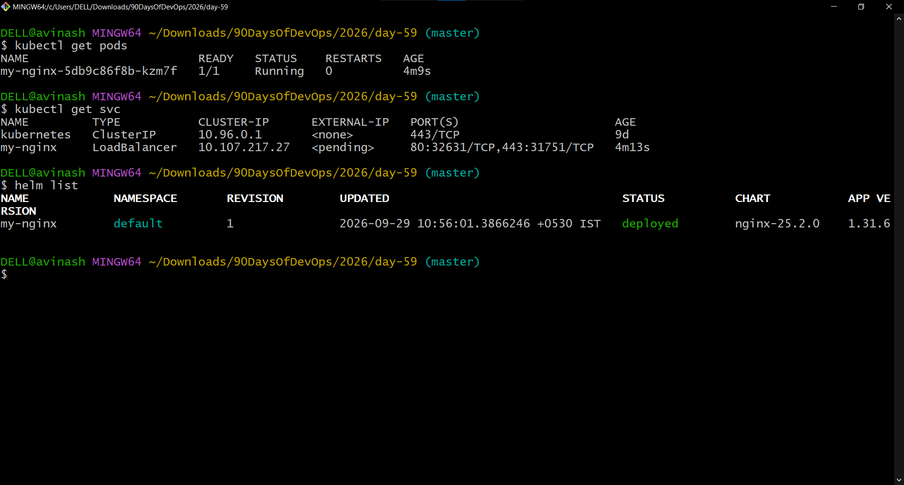
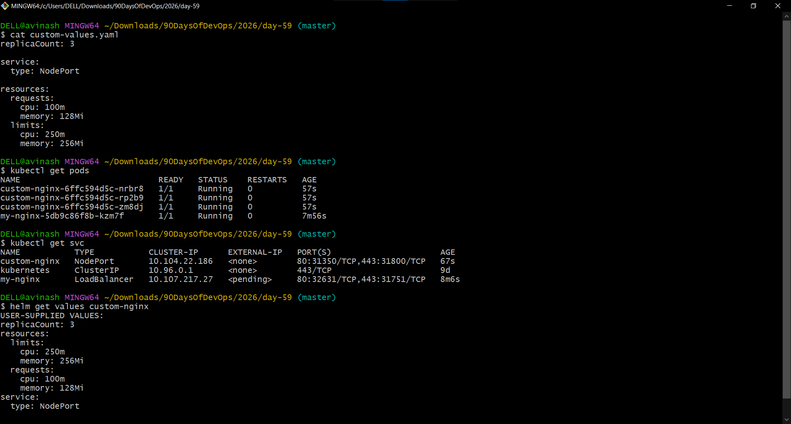
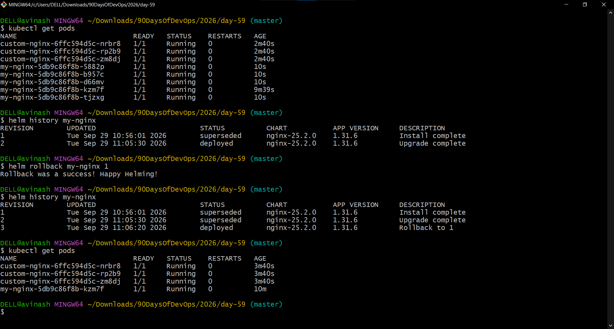
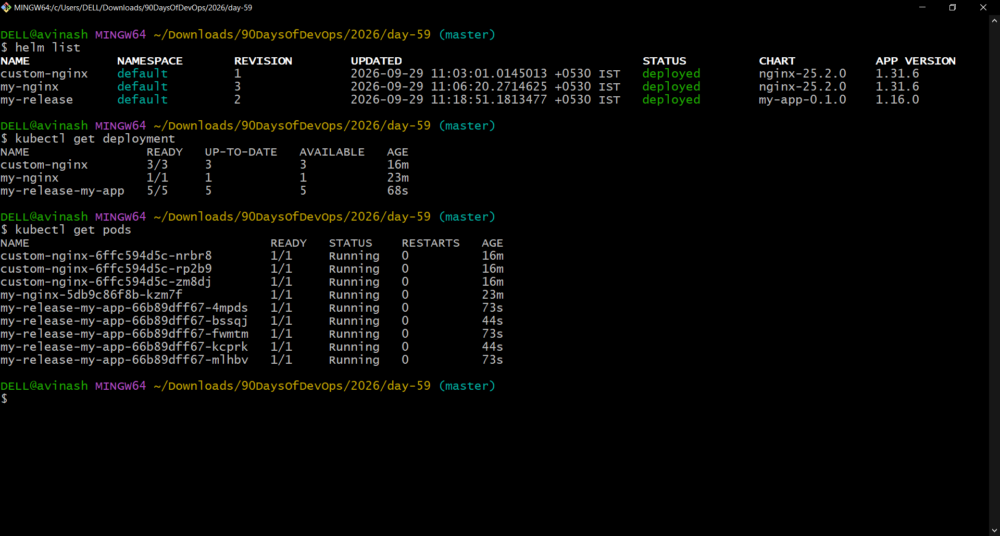

# Day 59 – Helm — Kubernetes Package Manager

## Overview
Helm is the package manager for Kubernetes. It packages Kubernetes manifests into reusable charts and manages installed releases.

### Environment
- OS: Windows 10
- Terminal: Git Bash
- Kubernetes: v1.37.0
- Minikube: v1.39.0
- Context: `devops-cluster`
- Helm: v4.3.0

## Task 1 – Install Helm
Verified Helm with:
```bash
helm version
```
Result: Helm `v4.3.0`, Kubernetes client `v1.37`.



## Task 2 – Add Bitnami Repository
```bash
helm repo add bitnami https://charts.bitnami.com/bitnami
helm repo update
helm search repo nginx
helm search repo bitnami
```
The Bitnami repository was successfully added and searched.



## Task 3 – Install NGINX from Bitnami
The Minikube cluster was started with:
```bash
minikube start -p devops-cluster
kubectl get nodes
kubectl config current-context
```
The node was `Ready` and the context was `devops-cluster`.

Installed the chart:
```bash
helm install my-nginx bitnami/nginx
```

Verified with:
```bash
kubectl get pods
kubectl get svc
helm list
```



## Task 4 – Customize a Helm Release
Created `custom-values.yaml`:
```yaml
replicaCount: 3

service:
  type: NodePort

resources:
  requests:
    cpu: 100m
    memory: 128Mi
  limits:
    cpu: 250m
    memory: 256Mi
```

Installed:
```bash
helm install custom-nginx bitnami/nginx -f custom-values.yaml
```

Verified:
```bash
kubectl get pods
kubectl get svc
helm get values custom-nginx
```

Result:
- 3 `custom-nginx` pods Running
- Service type: NodePort
- CPU request: 100m
- Memory request: 128Mi
- CPU limit: 250m
- Memory limit: 256Mi



## Task 5 – Upgrade and Rollback
Upgraded the original release to 5 replicas:
```bash
helm upgrade my-nginx bitnami/nginx --set replicaCount=5
```

Checked history:
```bash
helm history my-nginx
```

Rolled back:
```bash
helm rollback my-nginx 1
```

Final history showed:
- Revision 1: superseded
- Revision 2: superseded
- Revision 3: deployed, `Rollback to 1`

The rollback returned `my-nginx` to 1 replica.



## Task 6 – Create a Custom Helm Chart
Created the chart:
```bash
helm create my-app
```

The chart contained `Chart.yaml`, `values.yaml`, `templates/`, and `charts/`.

Configured `values.yaml` for:
```yaml
replicaCount: 3

image:
  repository: nginx
  pullPolicy: IfNotPresent
  tag: "1.25"
```

The Deployment template used Helm Go template expressions including:
```text
.Values.replicaCount
.Values.image.repository
.Values.image.tag
```

Validated:
```bash
helm lint my-app
helm template my-release ./my-app
```

The rendered manifest showed `replicas: 3` and image `nginx:1.25`.

Installed:
```bash
helm install my-release ./my-app
```

Upgraded to 5 replicas:
```bash
helm upgrade my-release ./my-app --set replicaCount=5
```

Verified:
```bash
kubectl get deployment
kubectl get pods
```

Final result: `my-release-my-app` was `5/5` and all five pods were Running.



## Task 7 – Cleanup
Removed all Helm releases:
```bash
helm uninstall my-nginx
helm uninstall custom-nginx
helm uninstall my-release
```

Verified:
```bash
helm list
kubectl get pods
```

Result:
```text
No resources found in default namespace.
```

Removed temporary local files:
```bash
rm -rf my-app custom-values.yaml
```

## Helm Commands Learned
| Command | Purpose |
|---|---|
| `helm version` | Check Helm version |
| `helm env` | Show Helm environment |
| `helm repo add` | Add a chart repository |
| `helm repo update` | Update repository indexes |
| `helm search repo` | Search charts |
| `helm install` | Install a chart |
| `helm list` | List releases |
| `helm show values` | Display chart values |
| `helm get values` | Show release values |
| `helm get manifest` | Show rendered manifests |
| `helm upgrade` | Upgrade a release |
| `helm history` | View release revisions |
| `helm rollback` | Roll back to an earlier revision |
| `helm create` | Create a chart |
| `helm lint` | Validate a chart |
| `helm template` | Render templates locally |
| `helm uninstall` | Remove a release |

## Key Takeaways
- Charts package reusable Kubernetes templates.
- Releases are installed instances of charts.
- Values customize charts without rewriting templates.
- Helm maintains revision history.
- Upgrades and rollbacks create revisions.
- `helm lint` validates charts.
- `helm template` previews rendered Kubernetes manifests.
- Go templates such as `.Values` make charts reusable.

## Day 59 Checklist
- [x] Helm installed and verified
- [x] Bitnami repository added
- [x] Bitnami NGINX installed
- [x] Release customized
- [x] Upgrade completed
- [x] Rollback completed
- [x] Custom chart created
- [x] Go templates verified
- [x] Chart linted
- [x] Template rendered
- [x] Custom chart installed and upgraded
- [x] Resources cleaned up

## Repository
https://github.com/ask-vs9/90DaysOfDevOps

Day 59 path:
`2026/day-59/day-59-helm.md`

## Screenshots
- `day59-helm-version.png`
- `day59-helm-repository.png`
- `day59-helm-install.png`
- `day59-helm-values.png`
- `day59-helm-upgrade-rollback.png`
- `day59-custom-chart.png`

## Hashtags
#90DaysOfDevOps #Day59 #Helm #Kubernetes #DevOps #CloudComputing #CNCF #KubernetesHelm #AWS #Linux #DevOpsEngineer
