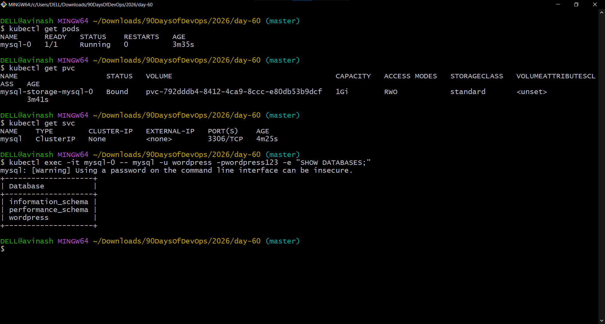
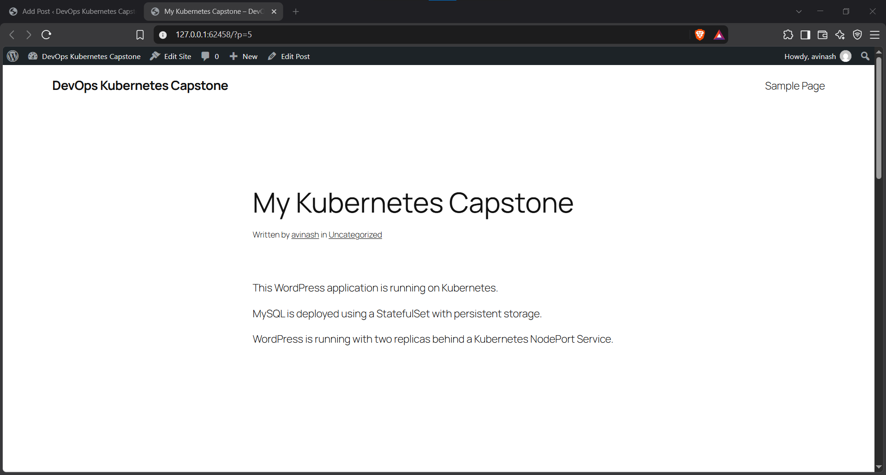
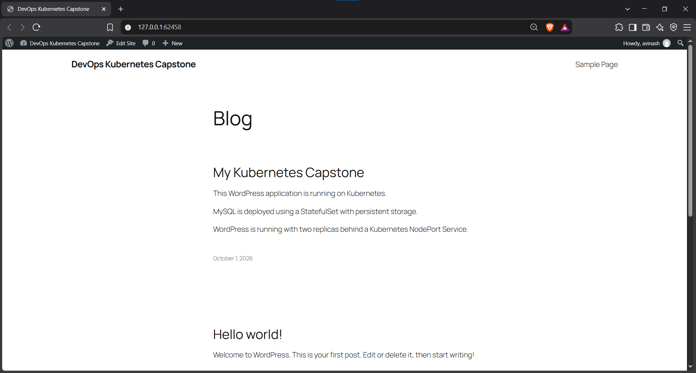
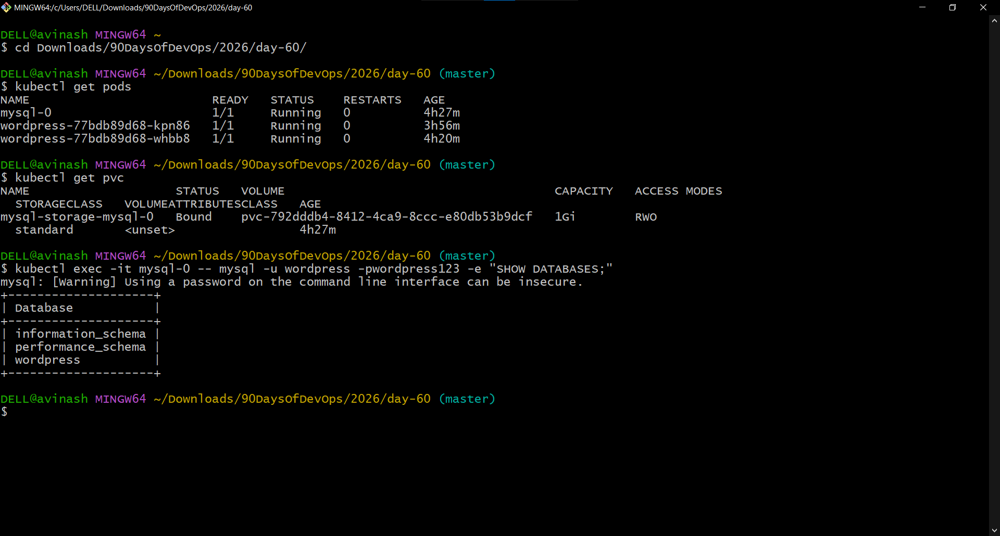
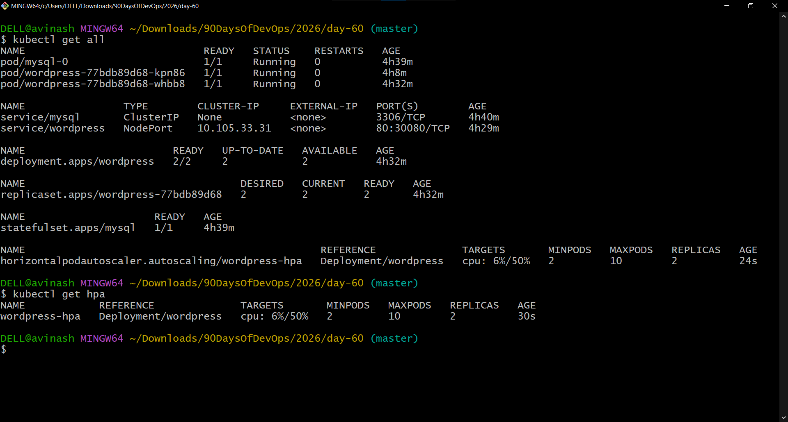
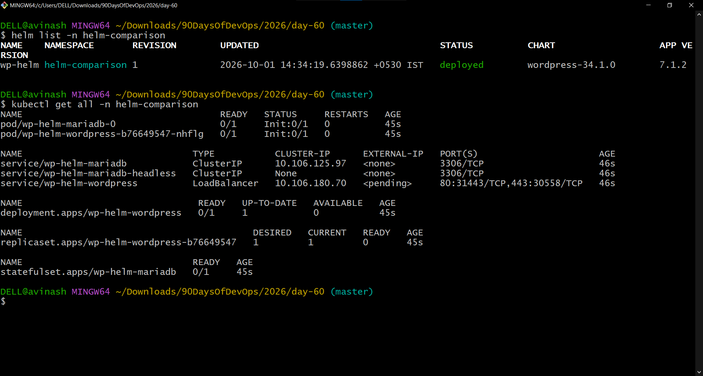
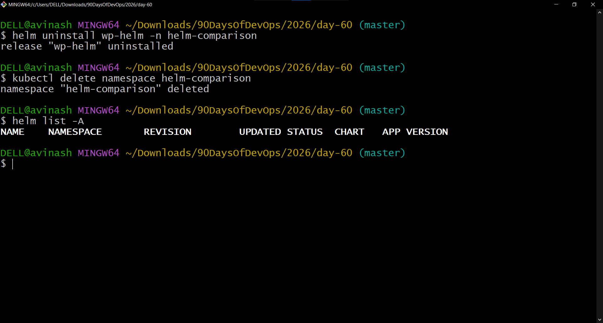
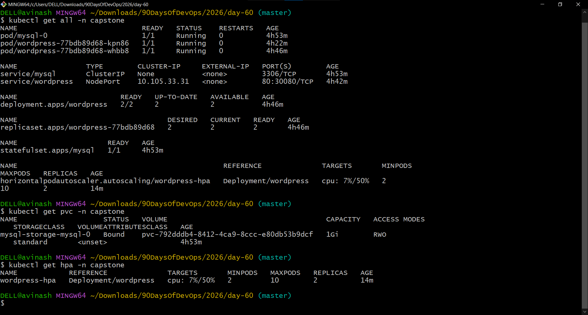

# Day 60 – Capstone: Deploy WordPress + MySQL on Kubernetes

## Overview

Day 60 brings the Kubernetes concepts from the previous days together into one working application stack.

The capstone deployed WordPress and MySQL in Kubernetes and combined:

- Namespace
- Secret
- ConfigMap
- StatefulSet
- PersistentVolumeClaim
- Headless Service
- Deployment
- NodePort Service
- Resource requests and limits
- Liveness and readiness probes
- Horizontal Pod Autoscaler (HPA)
- Helm

## Environment

| Component | Configuration |
|---|---|
| OS | Windows 10 Home |
| Terminal | Git Bash |
| Kubernetes | v1.37.0 |
| Minikube | v1.39.0 |
| Driver | Docker |
| Cluster | `devops-cluster` |
| Main namespace | `capstone` |
| MySQL | `mysql:8.0` |
| WordPress | `wordpress:latest` |

## Architecture

```text
Browser
   |
   v
WordPress NodePort Service
   |
   v
WordPress Deployment (2 replicas)
   |
   +---- ConfigMap
   |
   +---- Secret
   |
   +---- Liveness / Readiness Probes
   |
   +---- HPA (2-10 replicas, CPU 50%)
   |
   v
MySQL Headless Service
   |
   v
MySQL StatefulSet
   |
   v
mysql-0
   |
   v
PVC (1Gi)
   |
   v
Persistent Storage
```

# Task 1 – Namespace

The `capstone` namespace was used as the isolated environment for the application.

```bash
kubectl create namespace capstone
kubectl config set-context --current --namespace=capstone
```

The namespace already existed during the final execution, so Kubernetes reported `AlreadyExists`; it was then selected successfully.

Verification:

```bash
kubectl config view --minify --output 'jsonpath={..namespace}'; echo
```

Result:

```text
capstone
```

# Task 2 – MySQL

MySQL was deployed as a StatefulSet because it is a stateful workload requiring stable identity and persistent storage.

## Secret

The MySQL Secret used `stringData` for:

- `MYSQL_ROOT_PASSWORD`
- `MYSQL_DATABASE`
- `MYSQL_USER`
- `MYSQL_PASSWORD`

The database created for WordPress was:

```text
wordpress
```

## Headless Service

The MySQL Service used:

```yaml
clusterIP: None
```

and exposed:

```text
3306/TCP
```

This provided stable DNS for the StatefulSet.

## StatefulSet

Configuration:

```text
Image: mysql:8.0
Replicas: 1
```

Resources:

```text
Requests:
  CPU: 250m
  Memory: 512Mi

Limits:
  CPU: 500m
  Memory: 1Gi
```

Persistent storage:

```text
PVC request: 1Gi
Mount: /var/lib/mysql
```

Verification showed:

```text
mysql-0   1/1   Running
```

The PVC was:

```text
mysql-storage-mysql-0   Bound   1Gi   RWO
```

The database was verified with:

```bash
kubectl exec -it mysql-0 -- mysql -u wordpress -pwordpress123 -e "SHOW DATABASES;"
```

The output included:

```text
information_schema
performance_schema
wordpress
```

### Screenshot



`day60-task2-mysql.png`

# Task 3 – WordPress

A ConfigMap supplied the WordPress database configuration.

The database host was:

```text
mysql-0.mysql.capstone.svc.cluster.local:3306
```

The WordPress Deployment used:

```text
Replicas: 2
Image: wordpress:latest
```

It also used:

- ConfigMap through `envFrom`
- Secret keys for database username/password
- CPU and memory requests/limits
- Liveness probe
- Readiness probe
- `/wp-login.php` on port 80 for the probes

Final verification:

```text
wordpress-...   1/1   Running
wordpress-...   1/1   Running
```

Deployment:

```text
wordpress   2/2   2   2
```

# Task 4 – Expose WordPress

WordPress was exposed with a NodePort Service:

```text
Type: NodePort
Port: 80
NodePort: 30080
```

Verification:

```bash
kubectl get svc
```

showed:

```text
wordpress   NodePort   10.105.33.31   80:30080/TCP
```

Because Minikube was using the Docker driver on Windows, `minikube service` created a local tunnel.

WordPress was successfully opened at:

```text
http://127.0.0.1:62458
```

The setup was completed and a blog post named:

```text
My Kubernetes Capstone
```

was created.

### Screenshot



`day60-task4-wordpress-running.png`

# Task 5 – Self-Healing and Persistence

## WordPress self-healing

A WordPress Pod was deleted. The Deployment recreated the replacement Pod automatically.

The final state showed both WordPress replicas running:

```text
wordpress-...   1/1   Running
wordpress-...   1/1   Running
```

## MySQL self-healing

The MySQL Pod was deleted:

```bash
kubectl delete pod mysql-0
```

The StatefulSet recreated `mysql-0`.

The recreated Pod returned to:

```text
1/1   Running
```

## Persistence

The MySQL PVC remained:

```text
mysql-storage-mysql-0   Bound   1Gi
```

The `wordpress` database was still present after MySQL Pod recreation.

The WordPress website was opened again and the previously created blog post was still visible.

This demonstrated that the database data was stored on persistent storage rather than only inside the Pod.

### Screenshots



`day60-task5-blog-persistence.png`



`day60-task5-self-healing-persistence.png`

# Task 6 – Horizontal Pod Autoscaler

Initially, the Metrics API was unavailable:

```text
error: Metrics API not available
```

Metrics Server was enabled:

```bash
minikube addons enable metrics-server -p devops-cluster
```

The API became available:

```text
v1beta1.metrics.k8s.io   True
```

The Metrics Server Pod was running and:

```bash
kubectl top pods
```

returned CPU and memory usage.

The HPA was configured for the WordPress Deployment:

```text
Target: Deployment/wordpress
CPU target: 50%
Minimum replicas: 2
Maximum replicas: 10
```

Final observed HPA:

```text
wordpress-hpa   Deployment/wordpress   cpu: 6%/50%   2   10   2
```

### Screenshot



`day60-task6-hpa.png`

# Task 7 – Helm Comparison

As a bonus, WordPress was installed with the Bitnami Helm chart in a separate namespace:

```text
helm-comparison
```

Release:

```text
wp-helm
```

The deployment was inspected using:

```bash
helm list -n helm-comparison
kubectl get all -n helm-comparison
```

The comparison demonstrated two approaches.

### Manual Kubernetes manifests

The capstone explicitly defined resources such as:

- Secret
- ConfigMap
- StatefulSet
- PVC
- Services
- Deployment
- HPA

This provides direct control over individual resource definitions.

### Helm

Helm packages Kubernetes resources into reusable charts and uses templates and values to generate manifests.

Cleanup:

```bash
helm uninstall wp-helm -n helm-comparison
kubectl delete namespace helm-comparison
helm list -A
```

The final Helm list was empty.

### Screenshots



`day60-task7-helm-comparison.png`



`day60-task7-helm-comparison-cleanup.png`

# Task 8 – Final Cleanup

The capstone namespace was deleted after the application tests were completed:

```bash
kubectl delete namespace capstone
```

After deletion:

```bash
kubectl get all -n capstone
kubectl get pvc -n capstone
kubectl get hpa -n capstone
```

returned:

```text
No resources found in capstone namespace.
```

The Kubernetes context was reset to the default namespace:

```bash
kubectl config set-context --current --namespace=default
```

## Concept-to-Day Mapping

| Concept | Learned |
|---|---|
| Namespace | Day 52 |
| Deployment | Day 52 |
| Service | Day 53 |
| ConfigMap | Day 54 |
| Secret | Day 54 |
| PersistentVolume / PVC | Day 55 |
| StatefulSet | Day 56 |
| Headless Service | Day 56 |
| Resource Requests/Limits | Day 57 |
| Liveness Probe | Day 57 |
| Readiness Probe | Day 57 |
| HPA | Day 58 |
| Helm | Day 59 |
| WordPress + MySQL Capstone | Day 60 |

# What I Learned

## Stateful workloads need persistent storage

The MySQL StatefulSet provided stable identity while the PVC provided persistent storage. Deleting the MySQL Pod did not delete the database data.

## Deployments provide self-healing

The WordPress Deployment maintained the desired number of replicas and recreated a replacement when a Pod was deleted.

## Services provide stable connectivity

WordPress connected to MySQL through the stable StatefulSet DNS name:

```text
mysql-0.mysql.capstone.svc.cluster.local:3306
```

WordPress was exposed through a NodePort Service.

## Configuration and credentials should be separated

The ConfigMap stored application configuration while the Secret stored database credentials.

## Probes help manage application health

Liveness and readiness probes allowed Kubernetes to determine whether WordPress was healthy and ready for traffic.

## HPA depends on metrics

The HPA required Metrics Server. After it was enabled, `kubectl top pods` returned resource usage and the HPA reported the WordPress CPU target.

## Helm packages Kubernetes applications

The Helm comparison demonstrated how charts package and template multiple Kubernetes resources.

# What Was Hardest

The main troubleshooting points were:

1. Recovering the Minikube cluster when the Docker driver was stopped.
2. Getting WordPress accessible through the Minikube Docker-driver tunnel on Windows.
3. Understanding the WordPress redirect when using a different local port.
4. Enabling Metrics Server when the Metrics API was initially unavailable.
5. Verifying persistent data after deleting and recreating the MySQL Pod.

# What Clicked

The capstone connected the individual Kubernetes concepts into one application:

```text
ConfigMap + Secret
        |
        v
WordPress Deployment
        |
        v
WordPress Service
        |
        v
Browser

WordPress
    |
    v
MySQL Headless Service
    |
    v
MySQL StatefulSet
    |
    v
PVC
    |
    v
Persistent Storage

HPA
    |
    v
WordPress Deployment
```

The main lesson was that Kubernetes objects work together rather than operating as isolated concepts.

# Production Improvements

For a production implementation, I would consider:

- Managed MySQL instead of a single database Pod
- Automated database backups and tested restores
- HTTPS/TLS
- Ingress or cloud LoadBalancer
- NetworkPolicies
- PodDisruptionBudgets
- Multiple Kubernetes nodes
- Pod anti-affinity or topology spread constraints
- Production resource sizing
- Dedicated StorageClasses
- Monitoring and alerting
- Centralized logging
- External secrets management
- Pinned image versions instead of `latest`
- SecurityContext configuration
- CI/CD automation
- Separate development, staging and production environments

# Final Verification Summary

| Area | Result |
|---|---|
| Kubernetes cluster | Working |
| Capstone namespace | Created and cleaned up |
| MySQL StatefulSet | Successfully deployed |
| MySQL database | `wordpress` verified |
| MySQL PVC | 1Gi, Bound during deployment |
| WordPress Deployment | 2 replicas |
| WordPress Pods | 2/2 Ready |
| WordPress Service | NodePort 30080 |
| WordPress site | Successfully opened |
| Blog post | Created and persisted |
| WordPress self-healing | Verified |
| MySQL self-healing | Verified |
| Data persistence | Verified |
| Metrics Server | Enabled |
| HPA | 2–10 replicas, 50% CPU target |
| Helm comparison | Completed |
| Helm cleanup | Completed |
| Capstone cleanup | Completed |

# Screenshots

All screenshots are stored in the same `2026/day-60/` directory as this Markdown file, so the relative paths below work directly on GitHub.

- [MySQL StatefulSet, PVC and database verification](./day60-task2-mysql.png)
- [WordPress application running](./day60-task4-wordpress-running.png)
- [WordPress blog persistence verification](./day60-task5-blog-persistence.png)
- [Self-healing and persistent storage verification](./day60-task5-self-healing-persistence.png)
- [HPA verification](./day60-task6-hpa.png)
- [Helm comparison](./day60-task7-helm-comparison.png)
- [Helm cleanup verification](./day60-task7-helm-comparison-cleanup.png)
- [Final capstone verification](./day60-final-capstone.png)

### Final Capstone Screenshot



`day60-final-capstone.png`

# Files Created

```text
README.md
mysql-secret.yaml
mysql-service.yaml
mysql-statefulset.yaml
wordpress-configmap.yaml
wordpress-deployment.yaml
wordpress-service.yaml
wordpress-hpa.yaml
```

# Final Checklist

- [x] Namespace
- [x] MySQL Secret
- [x] MySQL Headless Service
- [x] MySQL StatefulSet
- [x] 1Gi PVC
- [x] WordPress ConfigMap
- [x] WordPress Deployment
- [x] Two WordPress replicas
- [x] Resource requests and limits
- [x] Liveness and readiness probes
- [x] NodePort Service
- [x] WordPress setup
- [x] Blog post creation
- [x] WordPress self-healing
- [x] MySQL self-healing
- [x] Persistent data verification
- [x] Metrics Server
- [x] HPA
- [x] Helm comparison
- [x] Helm cleanup
- [x] Capstone cleanup
- [x] Context reset to default

# Repository

Repository:

https://github.com/ask-vs9/90DaysOfDevOps

Day 60 directory:

```text
2026/day-60/
```

Documentation:

```text
2026/day-60/day-60-capstone.md
```

# Day 60 Summary

Ten days of Kubernetes learning came together in one capstone.

I deployed WordPress and MySQL on Kubernetes and combined Namespaces, Secrets, ConfigMaps, StatefulSets, PVCs, Services, Deployments, resource management, probes, HPA and Helm.

The key result was not only getting WordPress to run, but verifying self-healing and persistent database data after Pod recreation.

**Day 60 complete — Kubernetes capstone completed.**

#90DaysOfDevOps #DevOpsKaJosh #TrainWithShubham #Kubernetes #DevOps #DevOpsEngineer #AWS #Docker #CloudComputing #KubernetesAdministrator
