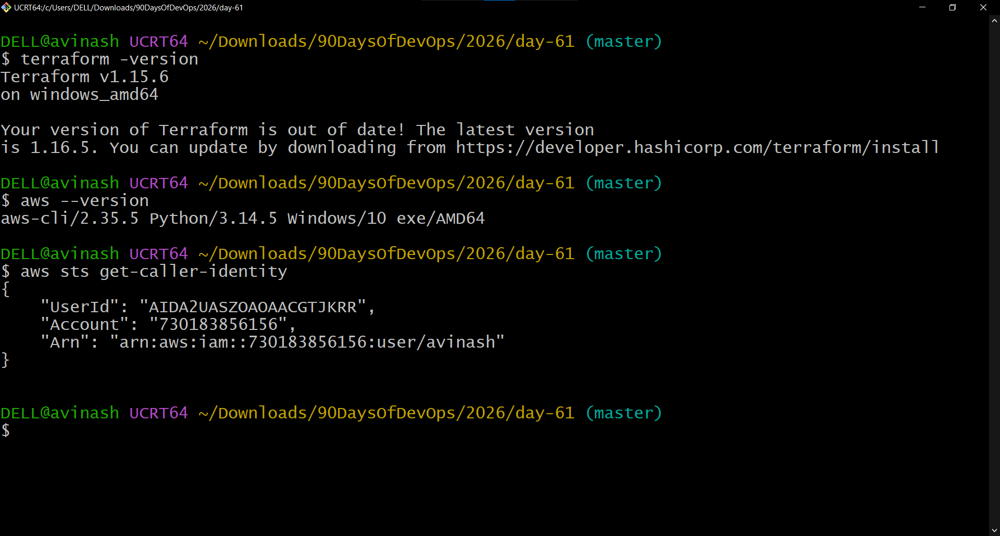
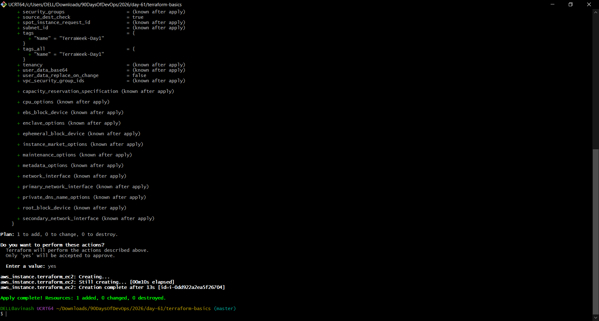
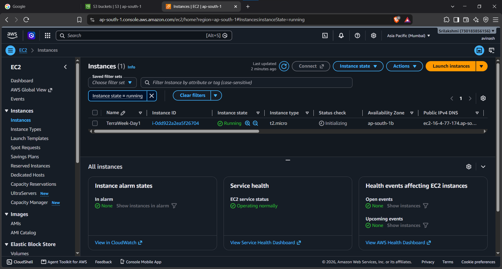
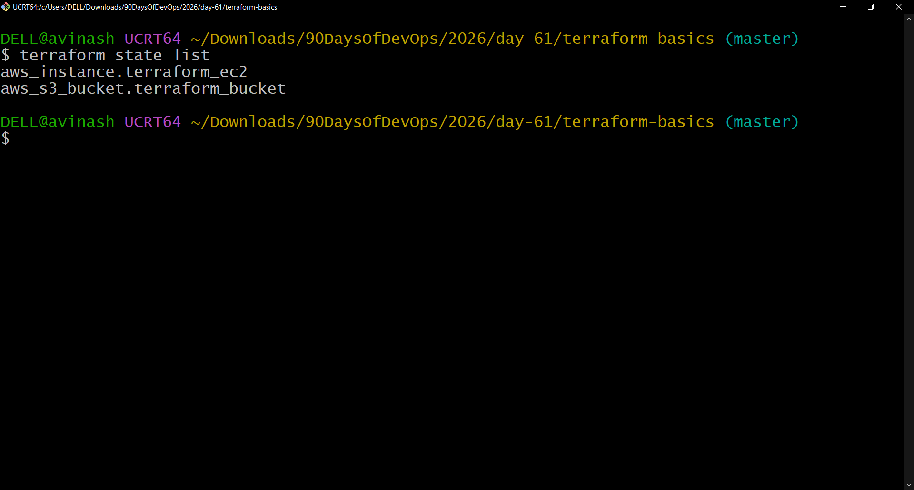
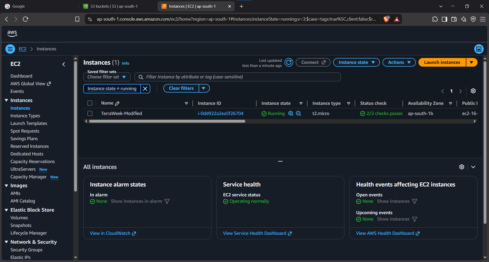
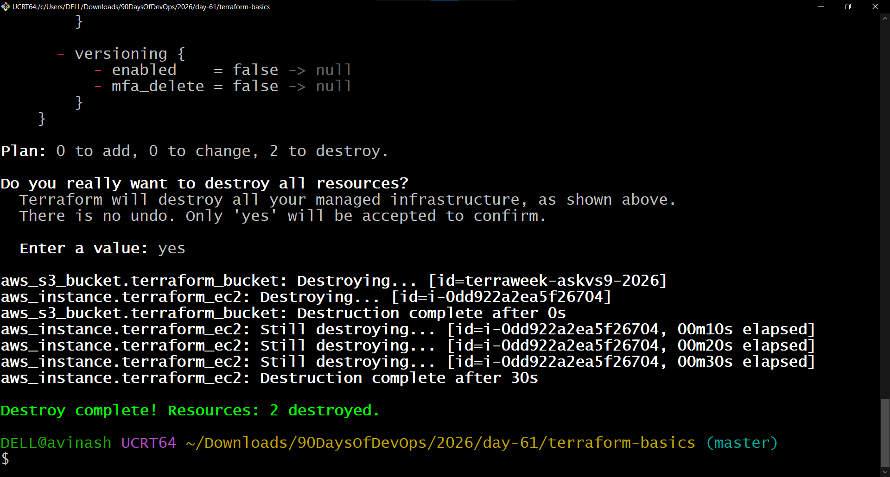

# Day 61 — Introduction to Terraform and Your First AWS Infrastructure

## Overview

Day 61 introduced Infrastructure as Code (IaC) with Terraform. I used Terraform to define, create, modify, inspect, and destroy AWS infrastructure from configuration files and the terminal.

During this exercise, I created an Amazon S3 bucket and an EC2 instance in the `ap-south-1` region, verified Terraform state management, changed the EC2 instance tag in place, and finally destroyed the resources with Terraform.

---

## Task 1 — Understand Infrastructure as Code

### What is Infrastructure as Code?

Infrastructure as Code (IaC) means creating and managing infrastructure such as servers, storage, networks, and databases using configuration files instead of creating everything manually through a cloud console. In DevOps, IaC makes infrastructure repeatable, consistent, and easier to manage. The same configuration can be used to recreate infrastructure when required. Terraform is one of the popular tools used for implementing IaC.

### What Problems Does IaC Solve?

When infrastructure is created manually, it is easy to make configuration mistakes and difficult to remember every setting. IaC allows infrastructure configurations to be stored as code, reviewed, version-controlled, and reused. It also makes it easier to create the same environment multiple times and reduces manual work.

### Terraform vs CloudFormation vs Ansible vs Pulumi

| Tool | Main Purpose | Important Point |
|---|---|---|
| Terraform | Infrastructure provisioning | Supports many cloud and infrastructure providers |
| AWS CloudFormation | Infrastructure provisioning | AWS-focused Infrastructure as Code service |
| Ansible | Configuration management and automation | Commonly used to configure existing servers and automate tasks |
| Pulumi | Infrastructure as Code | Allows infrastructure to be defined using programming languages |

Terraform and CloudFormation are mainly used to provision infrastructure. CloudFormation is designed specifically for AWS, while Terraform supports multiple infrastructure providers. Ansible is commonly used for configuration management and automation after infrastructure is available. Pulumi also provides Infrastructure as Code but allows developers to use programming languages such as Python, TypeScript, or Go.

### Declarative and Cloud-Agnostic

Terraform is **declarative** because I describe the desired final state of my infrastructure instead of writing every individual step needed to create it. Terraform compares the desired configuration with its tracked state and determines what changes are required.

Terraform is considered **cloud-agnostic** because it can manage resources from different infrastructure providers using providers. The same Terraform workflow can therefore be used with AWS, Azure, Google Cloud, and other supported platforms.

---

## Task 2 — Install Terraform and Configure AWS

### Terraform Verification

Terraform was already installed on the Windows machine.

```text
Terraform v1.15.6
on windows_amd64
```

### AWS CLI Verification

AWS CLI was also installed:

```text
aws-cli/2.35.5
```

### AWS Authentication

AWS access was verified successfully using:

```bash
aws sts get-caller-identity
```

The command returned the AWS identity information successfully.



> **Security note:** The screenshot contains AWS account information. It should not be shared publicly without masking sensitive account details.

---

## Task 3 — Create the First Terraform Configuration

A Terraform project directory was created:

```text
2026/day-61/terraform-basics/
```

The main Terraform configuration was stored in:

```text
main.tf
```

The configuration included:

- Terraform required provider configuration
- AWS provider
- AWS region `ap-south-1`
- S3 bucket resource

### Terraform Configuration

The initial configuration used an AWS S3 bucket:

```hcl
terraform {
  required_providers {
    aws = {
      source = "hashicorp/aws"
    }
  }
}

provider "aws" {
  region = "ap-south-1"
}

resource "aws_s3_bucket" "terraform_bucket" {
  bucket = "terraweek-askvs9-2026"
}
```

### Terraform Init

The following command initialized the working directory:

```bash
terraform init
```

Terraform downloaded the AWS provider and created the provider lock file:

```text
.terraform.lock.hcl
```

The AWS provider installed during this exercise was:

```text
hashicorp/aws v6.67.0
```

The `.terraform/` directory contains Terraform's local working files, including downloaded provider plugins.

### Terraform Validate

The configuration was validated successfully:

```bash
terraform validate
```

Result:

```text
Success! The configuration is valid.
```

### Terraform Plan

The first plan showed:

```text
Plan: 1 to add, 0 to change, 0 to destroy.
```

This meant Terraform planned to create one S3 bucket.

### Terraform Apply

The S3 bucket was created successfully:

```text
Apply complete! Resources: 1 added, 0 changed, 0 destroyed.
```

---

## Task 4 — Add an EC2 Instance

An EC2 resource was added to the same `main.tf` file.

```hcl
resource "aws_instance" "terraform_ec2" {
  ami           = "ami-0f5ee92e2d63afc18"
  instance_type = "t2.micro"

  tags = {
    Name = "TerraWeek-Day1"
  }
}
```

The configuration used:

- AMI: `ami-0f5ee92e2d63afc18`
- Instance type: `t2.micro`
- Region: `ap-south-1`
- Name tag: `TerraWeek-Day1`

### Terraform Plan

After the S3 bucket already existed in Terraform state, the plan showed:

```text
Plan: 1 to add, 0 to change, 0 to destroy.
```

Terraform recognized that the S3 bucket was already managed and only planned to create the EC2 instance.

### Terraform Apply

The EC2 instance was created successfully:

```text
aws_instance.terraform_ec2: Creation complete
Apply complete! Resources: 1 added, 0 changed, 0 destroyed.
```



### AWS Console Verification

The EC2 instance was verified in the AWS Console.

The instance had:

```text
Name: TerraWeek-Day1
Instance Type: t2.micro
State: Running
Region: ap-south-1
```



### How Terraform Knew the S3 Bucket Already Existed

Terraform stores information about resources it manages in its state. During the next plan, Terraform refreshes the state and compares the configuration with the resources it already tracks. Because the S3 bucket was already present in the state, Terraform planned only the new EC2 resource.

---

## Task 5 — Understand the Terraform State File

Terraform created and maintained a state file for the infrastructure:

```text
terraform.tfstate
```

The state file records information Terraform needs to track managed resources and compare the desired configuration with the current infrastructure.

### Terraform State List

The following command was used:

```bash
terraform state list
```

The result showed:

```text
aws_instance.terraform_ec2
aws_s3_bucket.terraform_bucket
```



This confirms that Terraform was managing both the EC2 instance and the S3 bucket.

### Terraform Show

The following command provides a human-readable representation of the current Terraform state:

```bash
terraform show
```

### Terraform State Show

Detailed information about an individual resource can be displayed with:

```bash
terraform state show aws_s3_bucket.terraform_bucket
```

and:

```bash
terraform state show aws_instance.terraform_ec2
```

The state information included resource identifiers and infrastructure attributes such as instance details, networking information, storage information, and tags.

### What Information Does the State File Store?

The Terraform state stores information about the resources managed by Terraform, including resource IDs, provider information, resource attributes, and other details Terraform uses to understand the current infrastructure.

### Why Should the State File Not Be Manually Edited?

The state file is managed by Terraform and contains information required for Terraform to track infrastructure. Manually changing it can make Terraform's state inconsistent with the actual infrastructure and can cause unexpected behavior.

### Why Should the State File Not Be Committed to Git?

Terraform state can contain sensitive infrastructure information and resource details. It should not normally be committed to a public Git repository. Team environments commonly use a secured remote backend for shared state.

---

## Task 6 — Modify, Plan, and Destroy

The EC2 Name tag was changed from:

```text
TerraWeek-Day1
```

to:

```text
TerraWeek-Modified
```

### Terraform Plan

After changing the tag, `terraform plan` showed:

```text
~ update in-place
```

and:

```text
Plan: 0 to add, 1 to change, 0 to destroy.
```

This demonstrated that the tag change could be performed without destroying and recreating the EC2 instance.

### Terraform Plan Symbols

| Symbol | Meaning |
|---|---|
| `+` | Create a resource |
| `-` | Destroy a resource |
| `~` | Modify/update a resource |

### Modified EC2 Instance

The EC2 instance was successfully updated and verified in the AWS Console.

```text
Name: TerraWeek-Modified
Instance Type: t2.micro
State: Running
Status Checks: 2/2 checks passed
```



### Terraform Destroy

After completing the exercise, the infrastructure was destroyed using:

```bash
terraform destroy
```

Terraform planned:

```text
Plan: 0 to add, 0 to change, 2 to destroy.
```

The S3 bucket and EC2 instance were both successfully destroyed.

Final result:

```text
Destroy complete! Resources: 2 destroyed.
```



---

## Terraform Commands Learned

| Command | Purpose |
|---|---|
| `terraform init` | Initializes the Terraform working directory and downloads required providers |
| `terraform fmt` | Formats Terraform configuration files |
| `terraform validate` | Checks Terraform configuration syntax and validity |
| `terraform plan` | Shows the changes Terraform intends to make |
| `terraform apply` | Creates or modifies infrastructure according to the configuration |
| `terraform show` | Displays the current Terraform state in a human-readable format |
| `terraform state list` | Lists resources tracked by Terraform |
| `terraform state show` | Displays detailed state information for a specific resource |
| `terraform destroy` | Destroys resources managed by the Terraform configuration |

---

## Terraform Project Structure

The project was organized as:

```text
2026/day-61/
│
├── README.md
├── day61-task2-setup.png
├── day61-task4-terraform-apply.png
├── day61-task4-aws-resources.png
├── day61-task5-state.png
├── day61-task6-modified.png
├── day61-task6-destroy.png
│
└── terraform-basics/
    ├── main.tf
    ├── .gitignore
    └── .terraform.lock.hcl
```

Terraform-generated state and provider working files were excluded from Git using `.gitignore`:

```gitignore
.terraform/
*.tfstate
*.tfstate.backup
```

---

## Key Takeaways

Through this exercise I learned how Terraform can be used to manage AWS infrastructure using code instead of manually creating resources in the AWS Console.

I practiced the complete Terraform lifecycle:

```text
Write Configuration
       ↓
terraform init
       ↓
terraform validate
       ↓
terraform plan
       ↓
terraform apply
       ↓
Inspect Terraform State
       ↓
Modify Configuration
       ↓
terraform plan
       ↓
terraform apply
       ↓
terraform destroy
```

The main concepts I practiced were:

- Infrastructure as Code
- Terraform providers
- Terraform configuration
- Terraform lifecycle
- Terraform state
- Resource tracking
- In-place infrastructure updates
- AWS S3 provisioning
- AWS EC2 provisioning
- Infrastructure cleanup
- Protecting Terraform state with `.gitignore`

---

## Conclusion

Day 61 was my introduction to Infrastructure as Code with Terraform. I successfully created an S3 bucket and EC2 instance in AWS using Terraform, inspected how Terraform tracks those resources through state, modified an EC2 tag without recreating the instance, and finally destroyed the infrastructure using Terraform.

This exercise helped me understand the basic Terraform workflow that can be expanded to larger AWS and DevOps infrastructure projects.

---

## Day 61 Completed

**Technologies:** Terraform | AWS | S3 | EC2 | Infrastructure as Code | AWS CLI

**Challenge:** TerraWeek

**Series:** #90DaysOfDevOps
