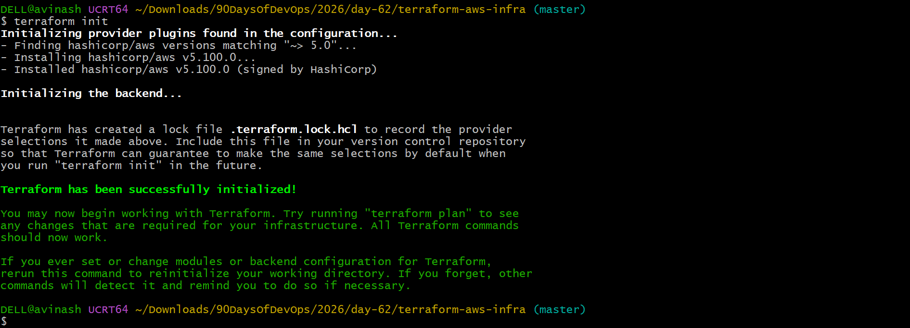
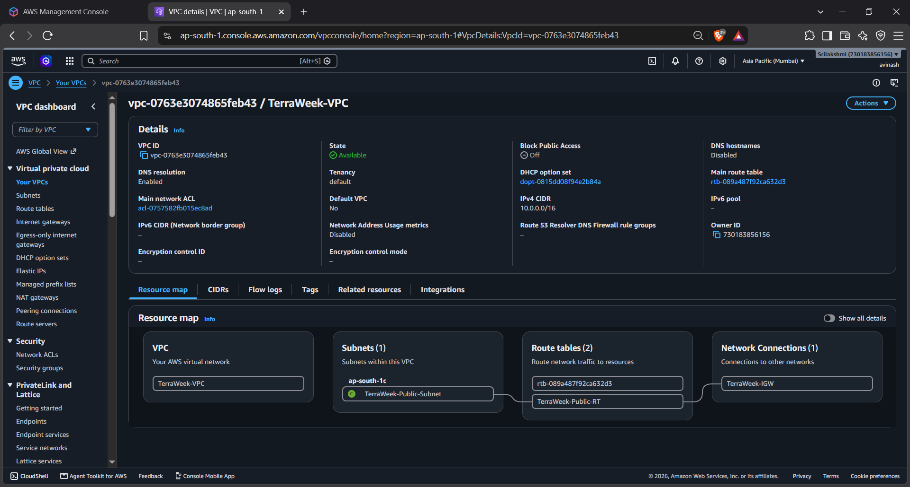
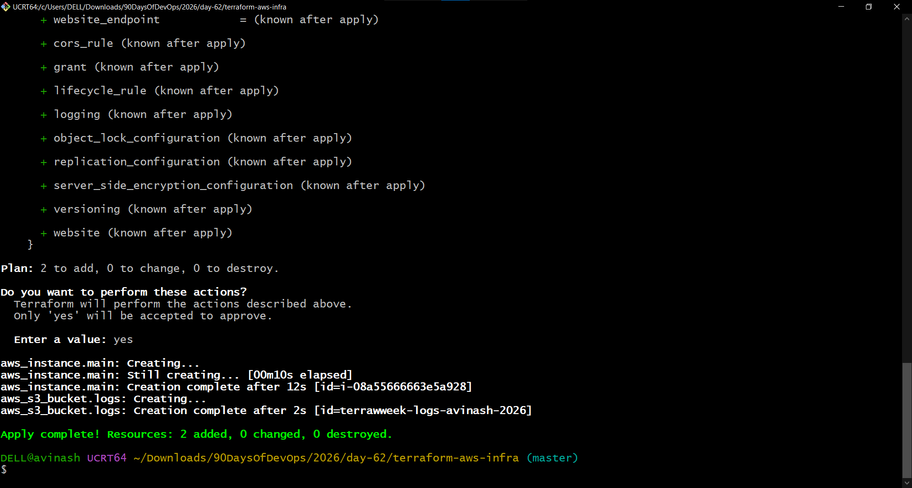
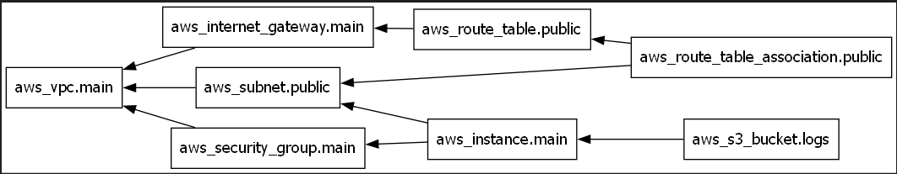
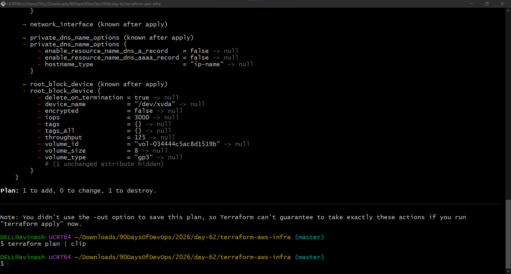
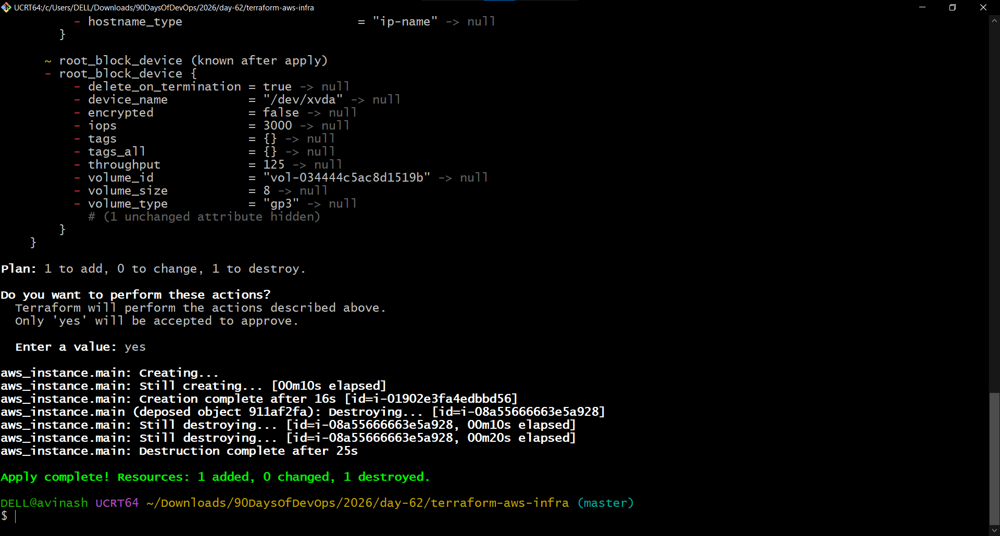
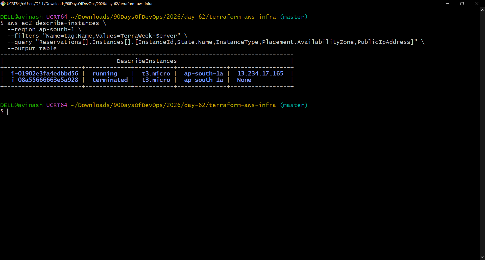
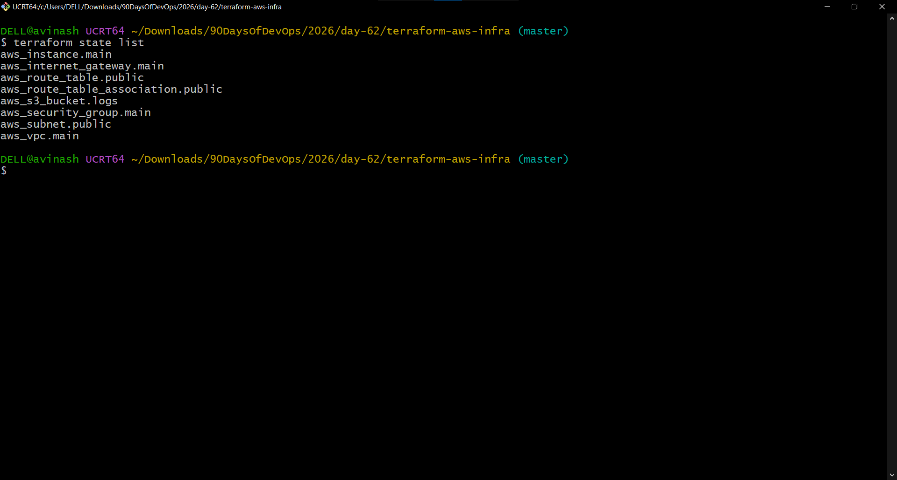
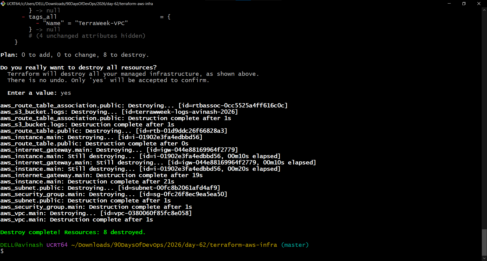
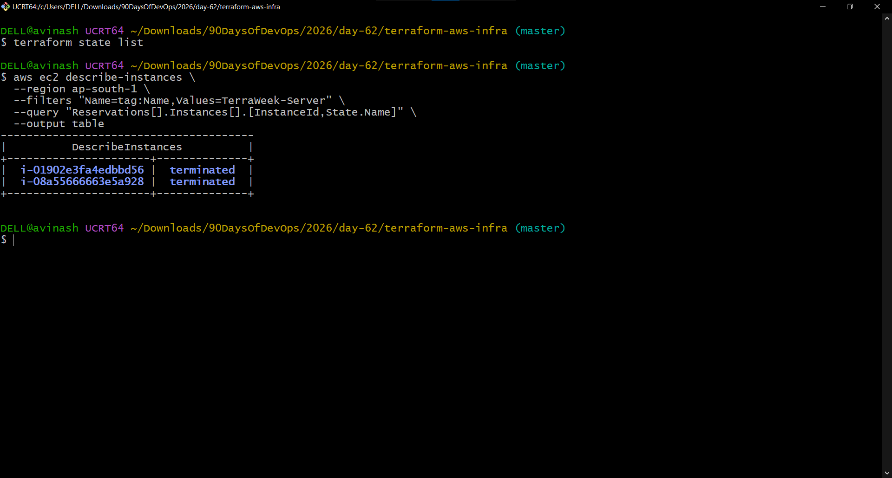

# Day 62 – Providers, Resources and Dependencies

## Overview

Today I built a complete AWS networking stack using Terraform and learned how Terraform handles implicit and explicit resource dependencies.

### Infrastructure Created

- AWS VPC
- Public subnet
- Internet Gateway
- Public route table
- Route table association
- Security Group
- EC2 instance
- S3 bucket for application logs

### Terraform Concepts Practiced

- AWS provider configuration
- `terraform init`
- `terraform validate`
- `terraform plan`
- `terraform apply`
- Implicit dependencies
- Explicit dependencies with `depends_on`
- `terraform graph`
- `lifecycle` rules
- `create_before_destroy`
- Terraform state
- `terraform destroy`

---

## Task 1 – AWS Provider

Configured the AWS provider with the `~> 5.0` version constraint and initialized Terraform.

The `.terraform.lock.hcl` file records the selected provider version and checksums to help keep provider installations reproducible.

### Screenshot



---

## Task 2 – Build the AWS VPC Network

Created the following resources:

1. VPC – `10.0.0.0/16`
2. Public subnet – `10.0.1.0/24`
3. Internet Gateway
4. Public route table
5. Route table association

The public subnet was configured in `ap-south-1a`.

### AWS VPC Verification



### Terraform Apply

The infrastructure was successfully created using Terraform.



---

## Task 3 – Implicit Dependencies

Terraform automatically detects dependencies when one resource references another.

For example:

```hcl
vpc_id = aws_vpc.main.id
```

This creates an implicit dependency:

```text
VPC
 ↓
Subnet
```

Another example:

```hcl
gateway_id = aws_internet_gateway.main.id
```

This creates:

```text
Internet Gateway
 ↓
Route Table
```

The route table association references both the subnet and route table:

```hcl
subnet_id      = aws_subnet.public.id
route_table_id = aws_route_table.public.id
```

Therefore Terraform knows that both resources must exist before creating the association.

---

## Task 4 – Security Group and EC2

Created a Security Group allowing:

- SSH – TCP port 22
- HTTP – TCP port 80
- All outbound traffic

Provisioned an EC2 instance in the public subnet.

For the current AWS environment, the lab used:

- Amazon Linux 2023
- `t3.micro`
- Availability Zone `ap-south-1a`

The original exercise specified `t2.micro`; `t3.micro` was used because the `t2.micro` launch remained pending in the selected environment.

---

## Task 5 – Explicit Dependency with `depends_on`

Created an S3 bucket for application logs.

The bucket includes:

```hcl
depends_on = [
  aws_instance.main
]
```

This creates an explicit dependency:

```text
EC2 Instance
     ↓
S3 Bucket
```

The S3 bucket is therefore created only after the EC2 instance.

### Dependency Graph

Generated the Terraform dependency graph using Graphviz.



The DOT-format graph was also saved as:

```text
dependency-graph.txt
```

### When to Use `depends_on`

`depends_on` should be used when Terraform cannot automatically determine a dependency but a resource still needs another resource to exist first.

---

## Task 6 – Lifecycle Rules

Configured the EC2 instance with:

```hcl
lifecycle {
  create_before_destroy = true
}
```

Changed the AMI to force an EC2 replacement.

Terraform planned:

```text
Plan: 1 to add, 0 to change, 1 to destroy.
```

The `+/-` action confirmed that Terraform would create the replacement before destroying the existing instance.



### Create Before Destroy

Terraform successfully:

1. Created the new EC2 instance.
2. Confirmed the new instance was created.
3. Destroyed the old EC2 instance.



### Verification

The new EC2 instance was verified as running while the old instance was terminated.



---

## Terraform Lifecycle Arguments

### `create_before_destroy`

Creates the replacement resource before destroying the existing resource.

```hcl
lifecycle {
  create_before_destroy = true
}
```

Useful when replacement should minimize downtime.

### `prevent_destroy`

Prevents Terraform from destroying a resource.

```hcl
lifecycle {
  prevent_destroy = true
}
```

Useful for critical infrastructure where accidental destruction must be prevented.

### `ignore_changes`

Tells Terraform to ignore changes to selected resource attributes.

```hcl
lifecycle {
  ignore_changes = [
    tags
  ]
}
```

Useful when another system or process manages a specific attribute.

---

## Terraform State

Verified the resources tracked by Terraform using:

```bash
terraform state list
```



After completing the lab, the Terraform state was verified again and was empty after destruction.

---

## Destroy and Cleanup

After completing all tasks, the infrastructure was destroyed using:

```bash
terraform destroy
```

Terraform successfully removed the remaining infrastructure.



Final verification confirmed that the Terraform state was empty and the test EC2 instances were terminated.



---

## Key Terraform Commands

```bash
terraform init
terraform validate
terraform plan
terraform apply
terraform graph
terraform state list
terraform destroy
```

---

## Key Learnings

- Terraform providers connect Terraform to infrastructure platforms such as AWS.
- Terraform resources represent infrastructure components.
- Resource references create implicit dependencies.
- `depends_on` creates explicit dependencies when Terraform cannot infer them.
- Terraform uses a dependency graph to determine resource creation and destruction order.
- Terraform normally destroys resources in reverse dependency order.
- `create_before_destroy` creates a replacement before destroying the old resource.
- Terraform state tracks resources managed by the configuration.
- Infrastructure should be destroyed after temporary labs to avoid unnecessary AWS charges.

---

## Final Result

Day 62 was completed successfully.

The AWS infrastructure was:

1. Provisioned using Terraform.
2. Verified in AWS.
3. Visualized using the Terraform dependency graph.
4. Replaced using `create_before_destroy`.
5. Verified using AWS CLI.
6. Completely destroyed after the lab.

---

# Learn in Public – LinkedIn

Built a complete AWS networking stack with Terraform today 🚀

📚 **What I Implemented**

✅ Configured the AWS Terraform provider
✅ Created a VPC and public subnet
✅ Configured an Internet Gateway
✅ Created route tables and route table associations
✅ Configured a Security Group
✅ Provisioned an EC2 instance
✅ Created an S3 bucket for application logs
✅ Visualized Terraform dependencies using `terraform graph`
✅ Used `depends_on` for an explicit dependency
✅ Used `create_before_destroy` for EC2 replacement
✅ Verified Terraform state and AWS resources
✅ Destroyed the infrastructure after completing the lab

💡 **Key Takeaways**

✔️ Terraform manages infrastructure through a desired-state model
✔️ Terraform automatically detects implicit dependencies
✔️ `depends_on` can define dependencies Terraform cannot infer automatically
✔️ The dependency graph helps visualize infrastructure relationships
✔️ `create_before_destroy` can reduce downtime during resource replacement
✔️ Terraform state tracks infrastructure managed by Terraform


#90DaysOfDevOps #TerraWeek #DevOpsKaJosh #TrainWithShubham #Terraform #AWS #DevOps #InfrastructureAsCode #CloudComputing #UAEJobs #DubaiJobs


