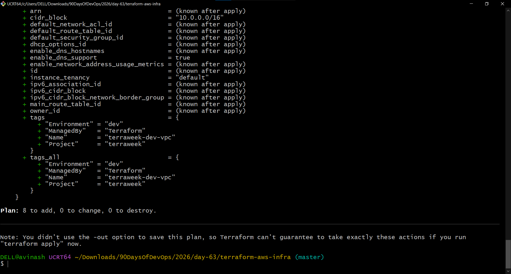
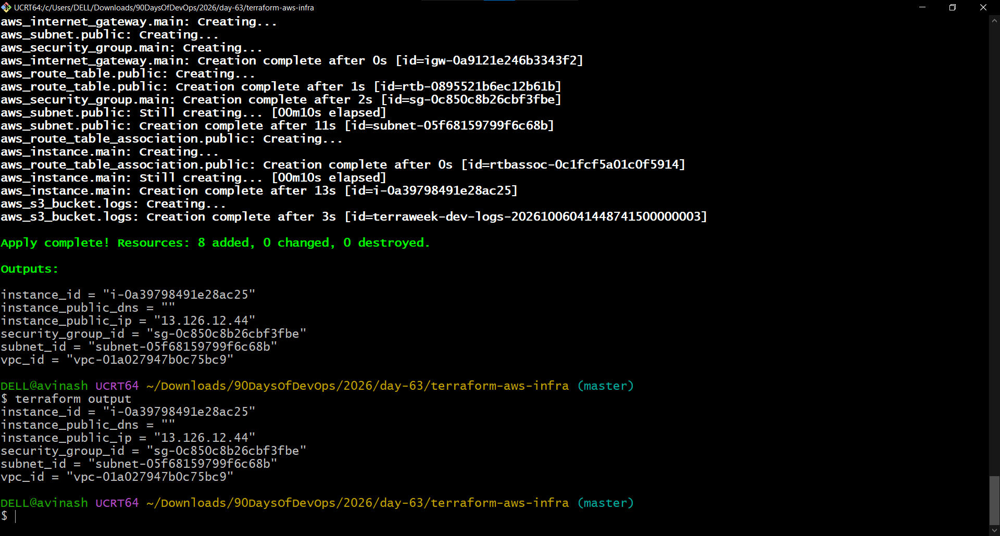
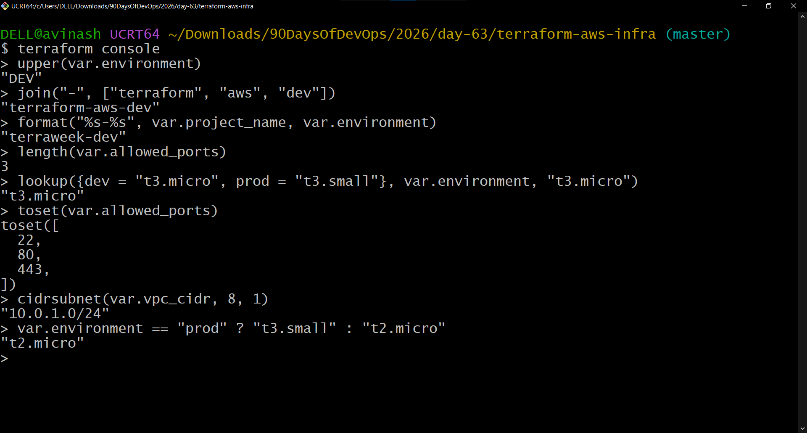

# Day 63 – Terraform Variables, Outputs, Data Sources and Expressions

## Overview

In Day 63, the Day 62 Terraform infrastructure was improved by replacing hardcoded configuration values with variables, adding outputs, using AWS data sources, creating reusable local values, and practicing Terraform functions and expressions.

The infrastructure was deployed in AWS `ap-south-1`.

---

## Task 1 – Terraform Variables

The Terraform configuration was parameterized using variables.

### Variables Used

| Variable | Type | Default / Value |
|---|---|---|
| `region` | `string` | `ap-south-1` |
| `vpc_cidr` | `string` | `10.0.0.0/16` |
| `subnet_cidr` | `string` | `10.0.1.0/24` |
| `instance_type` | `string` | `t3.micro` |
| `project_name` | `string` | Required |
| `environment` | `string` | `dev` |
| `allowed_ports` | `list(number)` | `[22, 80, 443]` |
| `extra_tags` | `map(string)` | `{}` |
| `allowed_cidr_blocks` | `list(string)` | `["0.0.0.0/0"]` |

> Note: `t3.micro` was used as the default instance type because the `t2.micro` instance type from the original exercise was not suitable in the lab environment.

### `terraform.tfvars`

```hcl
project_name  = "terraweek"
environment   = "dev"
instance_type = "t2.micro"
```

### `prod.tfvars`

```hcl
project_name  = "terraweek"
environment   = "prod"
instance_type  = "t3.small"
vpc_cidr      = "10.1.0.0/16"
subnet_cidr   = "10.1.1.0/24"
```

### Variable Precedence Testing

The following commands were tested:

```bash
terraform plan
terraform plan -var-file="prod.tfvars"
terraform plan -var="instance_type=t3.micro"
export TF_VAR_environment="staging"
terraform plan
unset TF_VAR_environment
```

The production variable file correctly changed the environment, instance type, and network CIDRs.

### Screenshot



---

## Task 2 – Terraform Outputs

The following outputs were added:

- VPC ID
- Subnet ID
- EC2 Instance ID
- EC2 Public IP
- EC2 Public DNS
- Security Group ID

### Commands Used

```bash
terraform apply
terraform output
terraform output -json
```

The infrastructure was successfully created:

```text
Apply complete! Resources: 8 added, 0 changed, 0 destroyed.
```

The outputs returned the VPC, subnet, EC2 instance, public IP, and security group information.

The public DNS output was defined correctly, although the value returned by AWS was empty in this lab environment.

### Screenshot



---

## Task 3 – Data Sources

Two AWS data sources were used.

### Availability Zones

```hcl
data "aws_availability_zones" "available" {
  state = "available"
}
```

The available zones returned were:

```text
ap-south-1a
ap-south-1b
ap-south-1c
```

The first Availability Zone was:

```text
ap-south-1a
```

### Amazon Linux AMI

The `aws_ami` data source was used to dynamically find an Amazon Linux AMI instead of hardcoding an AMI ID.

The data source successfully returned:

```text
ami-0b540059284041f9a
```

### Resource vs Data Source

**Resource:** creates or manages infrastructure.

```hcl
resource "aws_vpc" "main" {
  ...
}
```

**Data Source:** reads existing information from a provider.

```hcl
data "aws_ami" "amazon_linux" {
  ...
}
```

---

## Task 4 – Terraform Locals

A separate `locals.tf` file was created:

```hcl
locals {
  name_prefix = "${var.project_name}-${var.environment}"

  common_tags = merge(
    {
      Project     = var.project_name
      Environment = var.environment
      ManagedBy   = "Terraform"
    },
    var.extra_tags
  )

  effective_instance_type = var.environment == "prod" ? "t3.small" : var.instance_type
}
```

### Locals Used

`name_prefix` creates consistent names such as:

```text
terraweek-dev-vpc
```

`common_tags` provides:

```text
Project     = terraweek
Environment = dev
ManagedBy   = Terraform
```

`effective_instance_type` selects `t3.small` for production and the configured instance type for non-production environments.

The development infrastructure uses:

```text
t3.micro
```

The final plan confirmed:

```text
No changes. Your infrastructure matches the configuration.
```

---

## Task 5 – Terraform Functions and Expressions

The following were tested using:

```bash
terraform console
```

### `upper`

```hcl
upper(var.environment)
```

Result:

```text
"DEV"
```

### `join`

```hcl
join("-", ["terraform", "aws", "dev"])
```

Result:

```text
"terraform-aws-dev"
```

### `format`

```hcl
format("%s-%s", var.project_name, var.environment)
```

Result:

```text
"terraweek-dev"
```

### `length`

```hcl
length(var.allowed_ports)
```

Result:

```text
3
```

### `lookup`

```hcl
lookup({dev = "t3.micro", prod = "t3.small"}, var.environment, "t3.micro")
```

Result:

```text
"t3.micro"
```

### `toset`

```hcl
toset(var.allowed_ports)
```

Result:

```text
toset([
  22,
  80,
  443,
])
```

### `cidrsubnet`

```hcl
cidrsubnet(var.vpc_cidr, 8, 1)
```

Result:

```text
"10.0.1.0/24"
```

### Conditional Expression

```hcl
var.environment == "prod" ? "t3.small" : "t2.micro"
```

Result for the `dev` environment:

```text
"t2.micro"
```

The conditional expression was demonstrated as required. The actual development infrastructure uses the compatible `t3.micro` configuration.

### Screenshot



---

## Final Validation

The configuration was validated successfully:

```bash
terraform validate
```

Result:

```text
Success! The configuration is valid.
```

A final plan confirmed:

```text
No changes. Your infrastructure matches the configuration.
```

---

## What I Learned

- How to parameterize Terraform configurations using variables.
- How `.tfvars` files provide environment-specific values.
- How Terraform outputs expose infrastructure information.
- How to use AWS data sources instead of hardcoding provider information.
- The difference between resources and data sources.
- How locals improve reusable naming and tagging.
- How Terraform functions transform strings, lists, sets, and CIDR blocks.
- How conditional expressions select values based on an environment.
- How Terraform compares desired configuration with existing infrastructure.

---

## Screenshots

All screenshots are stored in the same directory as this Markdown file:

```text
2026/day-63/
├── 01-variable-precedence.png
├── 02-terraform-outputs.png
└── 03-terraform-console.png
```

---

## Day 63 Completion Status

| Task | Status |
|---|---|
| Variables | Completed |
| Variable files | Completed |
| Variable precedence testing | Completed |
| Outputs | Completed |
| Data sources | Completed |
| Locals | Completed |
| Terraform functions | Completed |
| Conditional expressions | Completed |
| Terraform validation | Completed |
| Final plan verification | Completed |
| Documentation | Completed |
