# Day 64 – Terraform State Management and Remote Backends

## Objective

The goal of Day 64 was to understand and practice Terraform state management, remote state backends, state locking, resource import, state surgery, and drift detection.

### Tasks Completed

- Inspected the Terraform state and individual resources.
- Migrated Terraform state to an Amazon S3 remote backend.
- Enabled S3 versioning for state-file recovery.
- Configured state locking using DynamoDB.
- Demonstrated a real Terraform state-lock error.
- Imported an existing AWS S3 bucket into Terraform state.
- Practiced `terraform state mv`.
- Practiced `terraform state rm` and re-imported the resource.
- Simulated infrastructure drift by manually changing an EC2 tag.
- Detected the drift with `terraform plan`.
- Reconciled the drift with `terraform apply`.
- Verified the final configuration with `terraform plan` showing no changes.

---

## 1. Terraform State Inspection

The Terraform project was located at:

```text
2026/day-64/terraform-aws-infra/
```

The state was inspected using:

```bash
terraform show
terraform state list
terraform state show aws_instance.main
terraform state show aws_vpc.main
terraform state pull
```

### Resources in State

The state contained 10 entries:

```text
data.aws_ami.amazon_linux
data.aws_availability_zones.available
aws_instance.main
aws_internet_gateway.main
aws_route_table.public
aws_route_table_association.public
aws_s3_bucket.logs
aws_security_group.main
aws_subnet.public
aws_vpc.main
```

There were:

- 2 data sources
- 8 managed resources

### EC2 Resource

Important EC2 attributes observed in state:

```text
Instance ID : i-0e8ac5c45cc894b59
Instance Type: t3.micro
Availability Zone: ap-south-1a
Private IP: 10.0.1.7
Public IP: 35.154.133.44
AMI: ami-0b540059284041f9a
```

The EC2 instance was managed by Terraform and had tags including:

```text
Environment = dev
LockTest    = true
ManagedBy   = Terraform
Name        = terraweek-dev-server
Project     = terraweek
```

### VPC

```text
VPC ID : vpc-0d4e1dae2c4240408
CIDR   : 10.0.0.0/16
```

### Terraform State Metadata

The state inspection showed:

```text
Terraform Version: 1.15.6
Serial: 8
```

The `serial` number is Terraform's state revision counter. It changes when Terraform writes a new state version. It helps Terraform identify the latest state revision and coordinate state updates.

---

## 2. Remote Backend – Amazon S3

Terraform state was migrated from local state management to an Amazon S3 remote backend.

The backend configuration used:

```hcl
terraform {
  backend "s3" {
    bucket         = "terraweek-state-avinash-2026"
    key            = "dev/terraform.tfstate"
    region         = "ap-south-1"
    dynamodb_table = "YOUR_DYNAMODB_LOCK_TABLE"
    encrypt        = true
  }
}
```

> Replace `YOUR_DYNAMODB_LOCK_TABLE` above with the actual DynamoDB table name used in the lab if this code is reused.

### Backend Components

| Setting | Value |
|---|---|
| S3 bucket | `terraweek-state-avinash-2026` |
| State key | `dev/terraform.tfstate` |
| AWS Region | `ap-south-1` |
| Encryption | Enabled |
| State locking | DynamoDB |

The S3 state bucket had versioning enabled.

Terraform was initialized with the remote backend and the remote state was verified using:

```bash
terraform state pull
```

The state was also verified in the S3 backend.

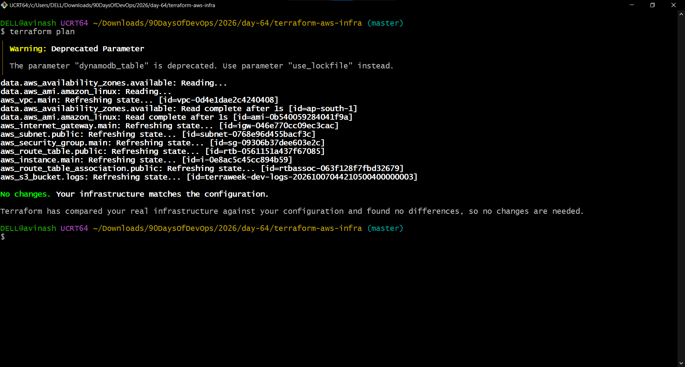

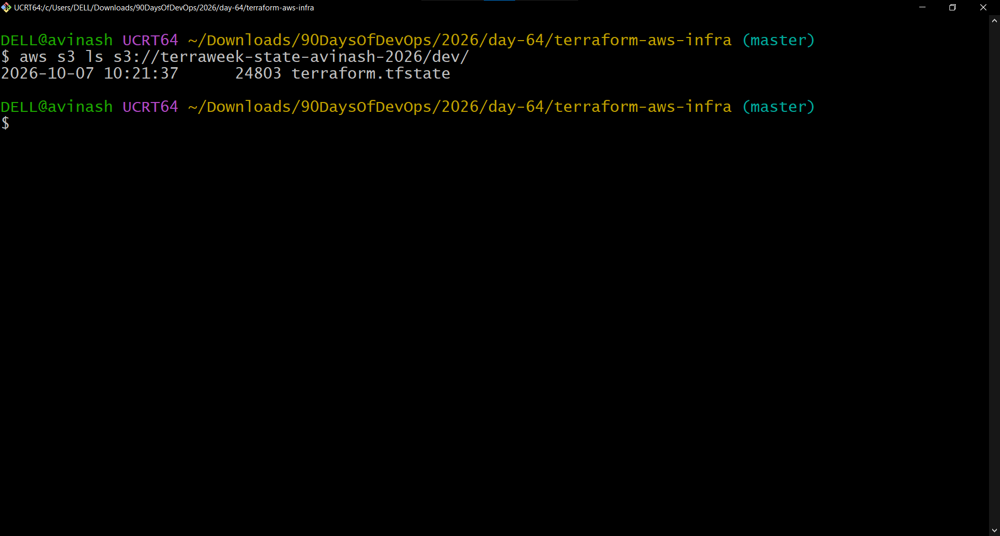

### Important Note

Terraform displayed this warning:

```text
Warning: Deprecated Parameter

The parameter "dynamodb_table" is deprecated.
Use parameter "use_lockfile" instead.
```

This is a deprecation warning, not an error. The lab successfully demonstrated DynamoDB-based state locking.

---

## 3. Terraform State Locking

Remote state locking prevents multiple Terraform operations from modifying the same state simultaneously.

A real state-locking test was performed using two terminal sessions.

One Terraform operation held the state lock while another Terraform operation attempted to access the same state.

The second operation returned:

```text
Error: Error acquiring the state lock

Lock Info:

ID: d9caa68e-4e86-78df-ff2a-f600be7d29ce
Path: terraweek-state-avinash-2026/dev/terraform.tfstate
Operation: OperationTypeApply
```

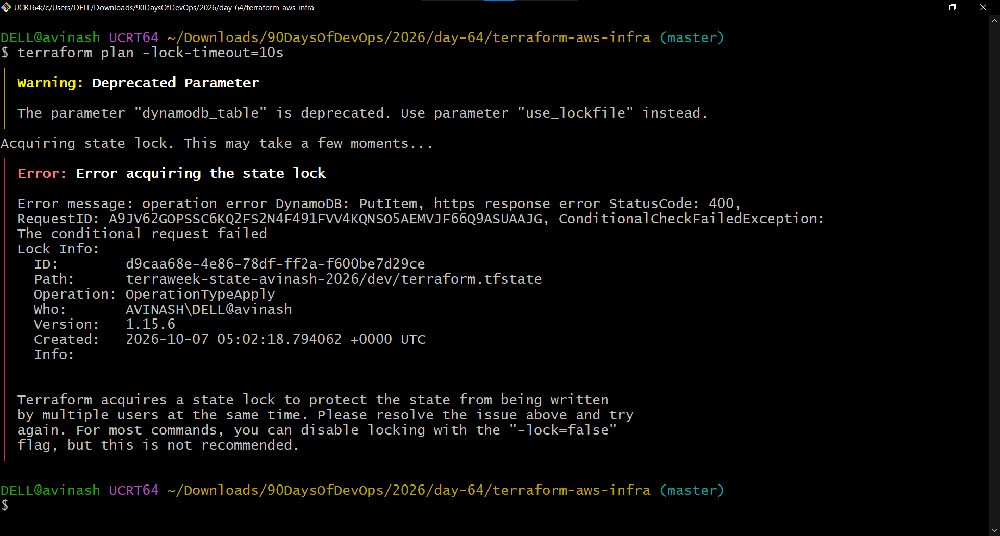

### Why State Locking Is Important

Without state locking, two users or CI/CD jobs could modify the same Terraform state at the same time. This can result in:

- State corruption
- Conflicting infrastructure changes
- Lost state updates
- Incorrect resource tracking

### Stale Lock

If a lock remains after an interrupted operation and is confirmed to be stale, Terraform provides:

```bash
terraform force-unlock <LOCK_ID>
```

`force-unlock` should only be used after confirming that no active Terraform operation is using the state.

---

## 4. Import an Existing AWS Resource

An S3 bucket was manually created outside Terraform:

```text
terraweek-import-test-avinash-2026
```

The Terraform resource definition was added:

```hcl
resource "aws_s3_bucket" "imported" {
  bucket = "terraweek-import-test-avinash-2026"
}
```

Validation:

```bash
terraform validate
```

Import:

```bash
terraform import aws_s3_bucket.imported terraweek-import-test-avinash-2026
```

The resource was successfully added to Terraform state.

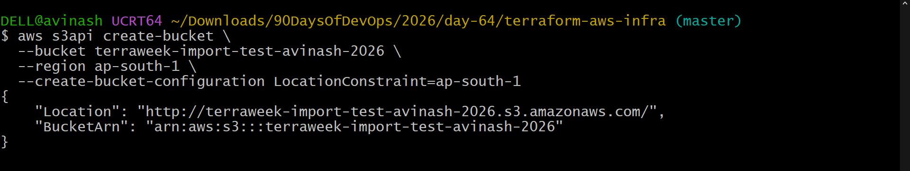

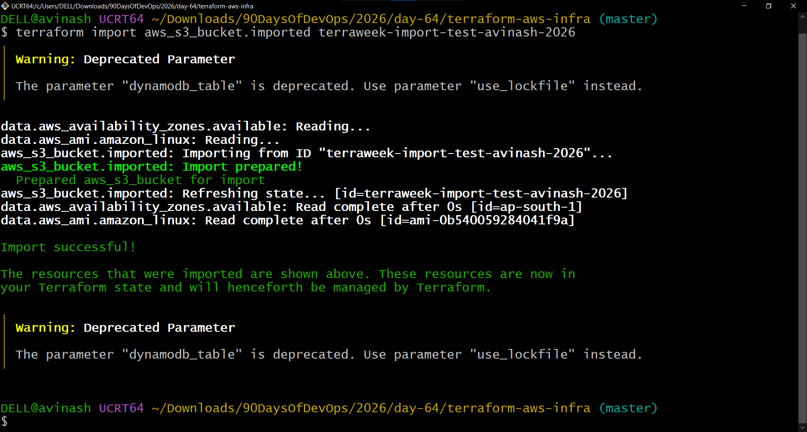

The configuration was then checked with:

```bash
terraform plan
```

Result:

```text
No changes.
```

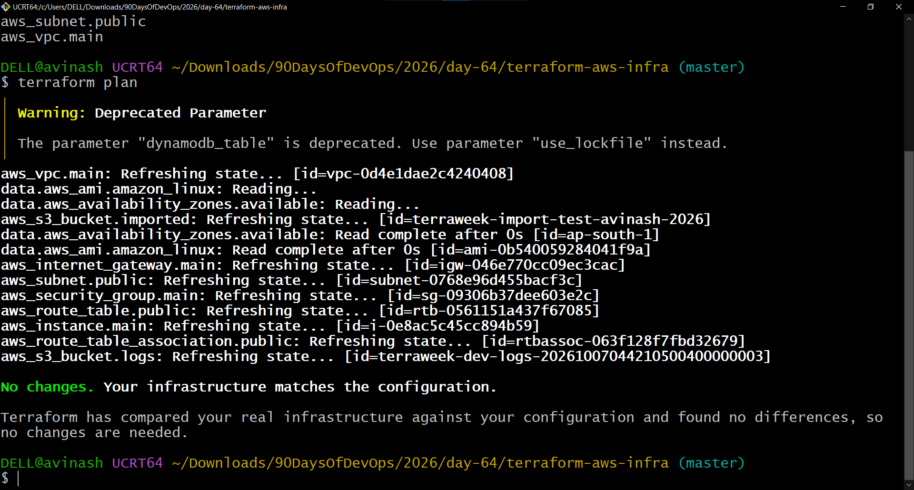

### Why Import Is Used

`terraform import` is useful when infrastructure already exists in AWS but needs to be brought under Terraform management without recreating the resource.

---

## 5. Terraform State Surgery

Terraform provides state commands that allow resource addresses to be changed or removed without directly modifying the real AWS resource.

### 5.1 `terraform state mv`

The resource address was changed using:

```bash
terraform state mv aws_s3_bucket.imported aws_s3_bucket.logs_bucket
```

Terraform reported:

```text
Successfully moved 1 object(s).
```

After updating the Terraform configuration, the state was verified with:

```bash
terraform plan
```

Result:

```text
No changes.
```

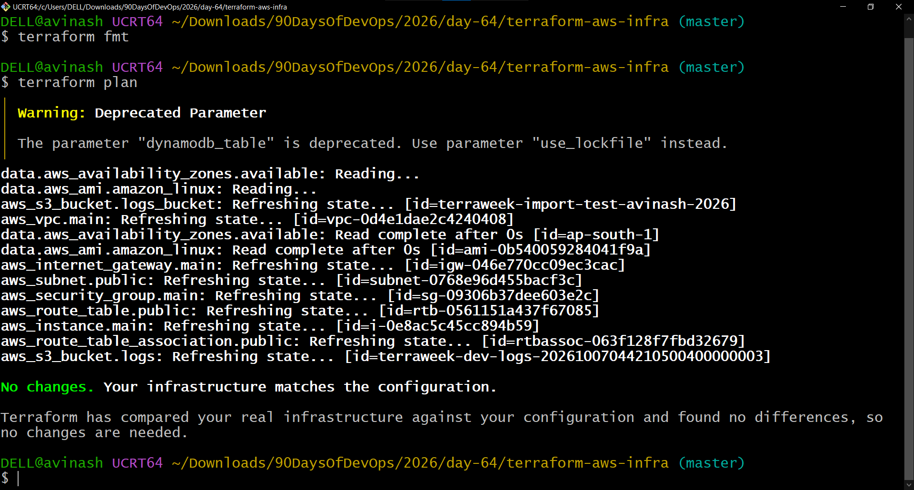

### 5.2 `terraform state rm`

The resource was removed from Terraform state using:

```bash
terraform state rm aws_s3_bucket.logs_bucket
```

This removes the resource from Terraform's state tracking; it does **not** delete the actual AWS resource.

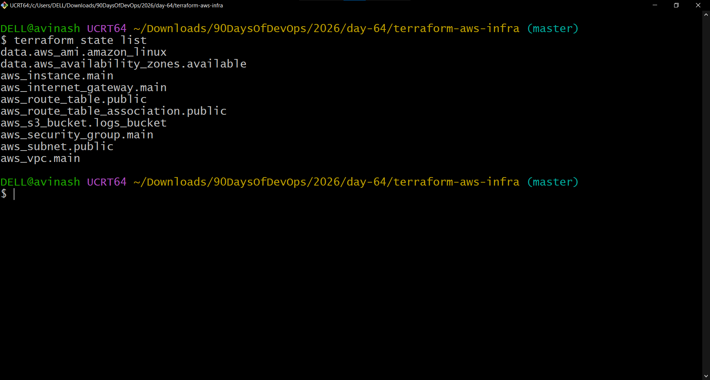

The existing AWS bucket was then re-imported into the correct Terraform resource address and verified.

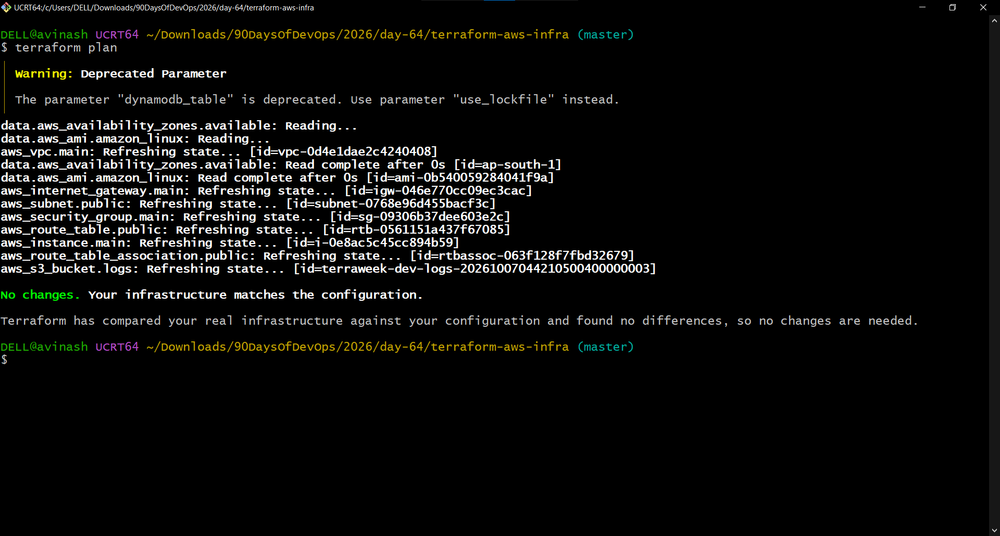

### When to Use State Commands

| Command | Purpose |
|---|---|
| `terraform state mv` | Change a resource's state address without recreating the real resource |
| `terraform state rm` | Stop Terraform from tracking a resource without deleting the real resource |
| `terraform import` | Add an existing real resource to Terraform state |
| `terraform force-unlock` | Remove a confirmed stale state lock |
| `terraform refresh` / refresh during plan | Reconcile Terraform's knowledge of real infrastructure with the remote object |

---

## 6. Verify Terraform State

The final Terraform state was checked using:

```bash
terraform state list
```

The state contained the expected Terraform-managed resources and data sources.

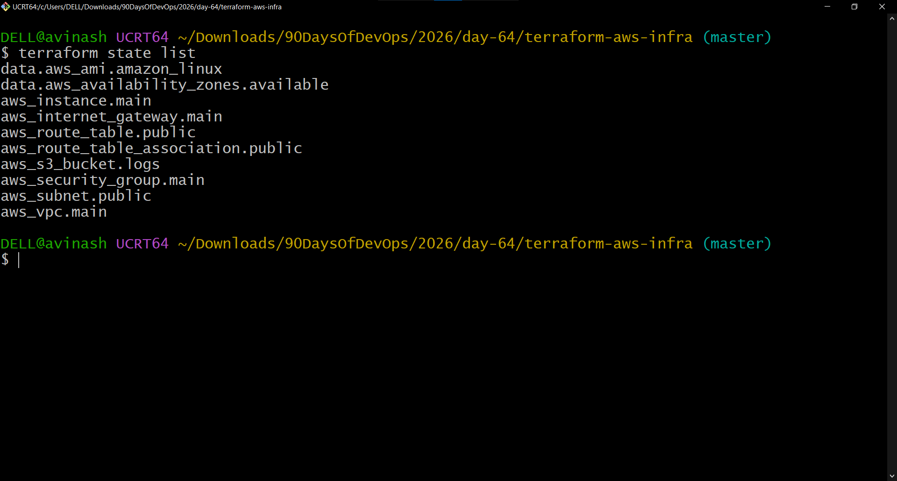

Terraform outputs were also verified:

```text
instance_id       = "i-0e8ac5c45cc894b59"
instance_public_ip = "35.154.133.44"
security_group_id = "sg-09306b37dee603e2c"
subnet_id         = "subnet-0768e96d455bacf3c"
vpc_id             = "vpc-0d4e1dae2c4240408"
```

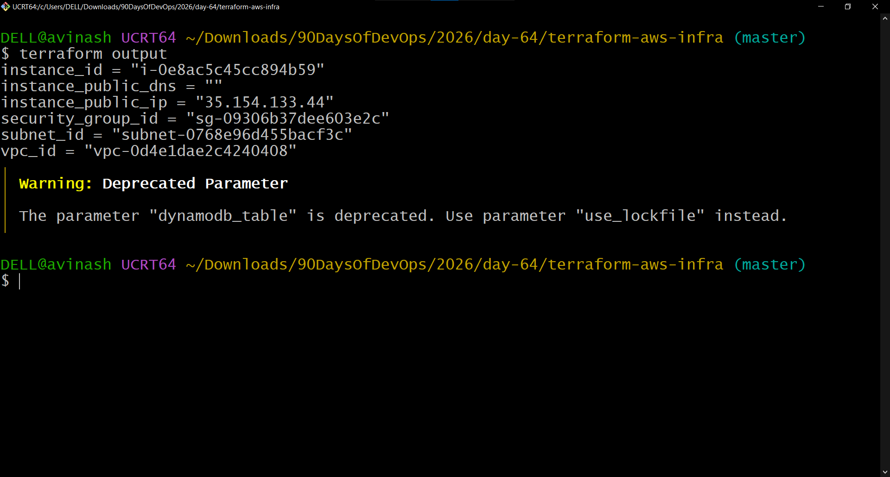

---

## 7. Simulate Infrastructure Drift

Terraform drift occurs when infrastructure is changed outside Terraform.

The EC2 instance Name tag was manually changed in AWS:

```text
Before:
Name = terraweek-dev-server

Manual AWS change:
Name = ManuallyChanged
```

Then Terraform was run:

```bash
terraform plan
```

Terraform detected the difference:

```text
"Name" = "ManuallyChanged" -> "terraweek-dev-server"
```

The plan reported:

```text
Plan: 0 to add, 1 to change, 0 to destroy.
```

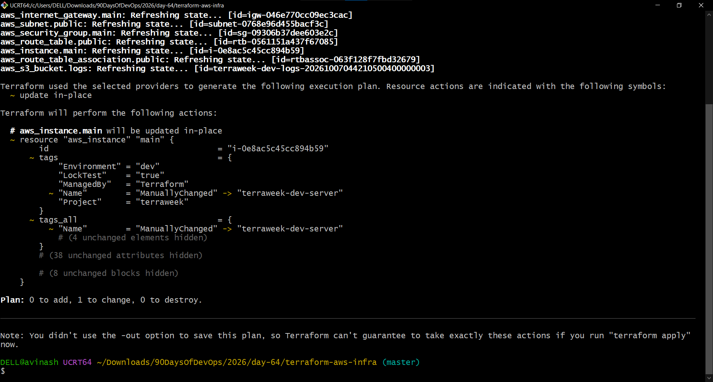

### What This Demonstrates

Terraform compared:

```text
Terraform configuration
        ↓
Terraform state
        ↓
Actual AWS infrastructure
```

The manual AWS modification created a difference between the desired configuration and the real infrastructure.

---

## 8. Reconcile the Drift

The detected drift was reconciled using:

```bash
terraform apply -auto-approve
```

Terraform changed the EC2 Name tag back to:

```text
terraweek-dev-server
```

The apply result was:

```text
Apply complete! Resources: 0 added, 1 changed, 0 destroyed.
```

A final verification was performed:

```bash
terraform plan
```

Result:

```text
No changes. Your infrastructure matches the configuration.
```

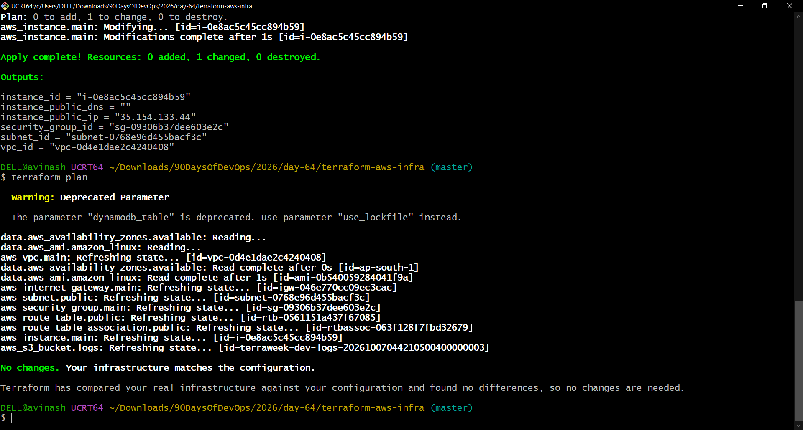

This confirms that the manually introduced drift was successfully reconciled with the Terraform configuration.

---

## 9. Local State vs Remote State

### Local State

```text
Developer / CI
     |
     v
Terraform
     |
     v
terraform.tfstate
     |
     v
Local Machine
```

Problems with a local state file in a team environment:

- Difficult to share safely
- Concurrent operations can conflict
- State can be lost with the workstation
- No centralized locking

### Remote State

```text
              ┌─────────────────────┐
              │     Terraform       │
              └──────────┬──────────┘
                         │
                         v
              ┌─────────────────────┐
              │     Amazon S3       │
              │  terraform.tfstate  │
              │    Versioning       │
              │    Encryption       │
              └──────────┬──────────┘
                         │
                         │ Lock coordination
                         v
              ┌─────────────────────┐
              │      DynamoDB       │
              │   State Locking     │
              └─────────────────────┘
```

Remote state is better suited for teams and CI/CD because the state is centralized and can be protected with versioning, encryption, and locking.

---

## 10. Important Terraform State Commands

### Inspect state

```bash
terraform show
terraform state list
terraform state show <resource>
terraform state pull
```

### Import an existing resource

```bash
terraform import <resource_address> <resource_id>
```

### Move a resource address

```bash
terraform state mv <source> <destination>
```

### Remove a resource from state

```bash
terraform state rm <resource_address>
```

### Refresh state information

```bash
terraform plan
```

Terraform refreshes remote resource information as part of normal planning.

A refresh-only operation can also be used:

```bash
terraform apply -refresh-only
```

### Force-unlock

```bash
terraform force-unlock <LOCK_ID>
```

Use this only for a confirmed stale lock.

---

## 11. Key Learnings

- Terraform state is the mapping between Terraform configuration and real infrastructure.
- Remote state is important for team-based Terraform workflows.
- Amazon S3 provides centralized state storage.
- S3 versioning helps recover previous state versions.
- State locking prevents concurrent Terraform operations from corrupting or overwriting state.
- `terraform import` brings existing infrastructure under Terraform management.
- `terraform state mv` changes a resource's Terraform address without recreating the real infrastructure.
- `terraform state rm` removes Terraform tracking without deleting the real resource.
- Drift occurs when infrastructure is changed outside Terraform.
- `terraform plan` detects configuration drift.
- `terraform apply` can reconcile detected drift with the desired configuration.
- `terraform force-unlock` must be used carefully because removing an active lock can cause concurrent state operations.

---

## 12. Day 64 Result

Day 64 successfully demonstrated:

```text
Terraform State
      ↓
Remote S3 Backend
      ↓
State Locking
      ↓
Resource Import
      ↓
State Surgery
      ↓
Drift Detection
      ↓
Drift Reconciliation
      ↓
Final No-Changes Verification
```

All practical tasks for Day 64 were completed successfully.
