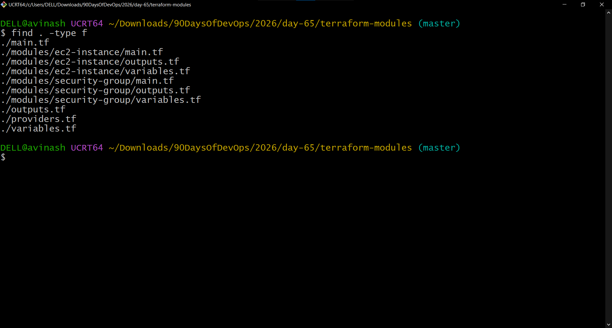
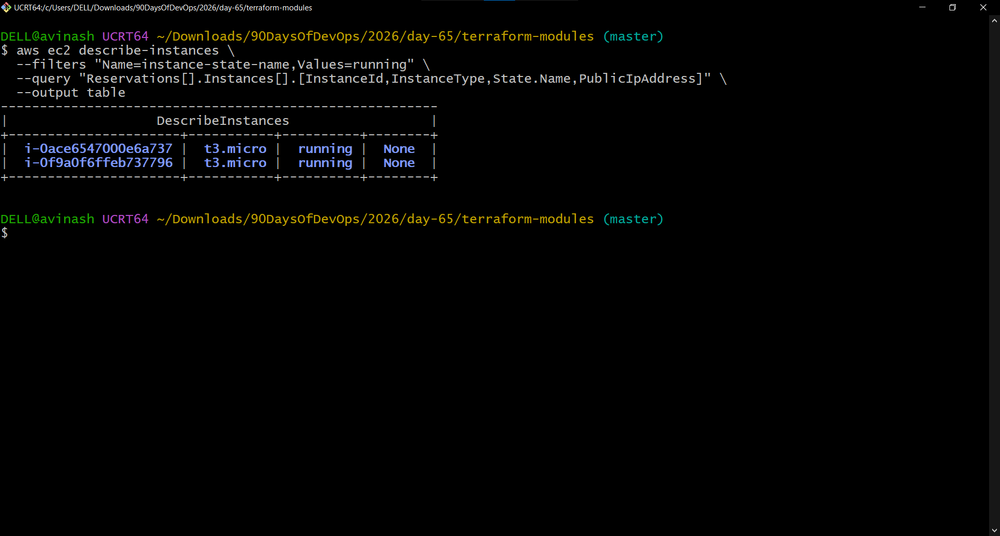
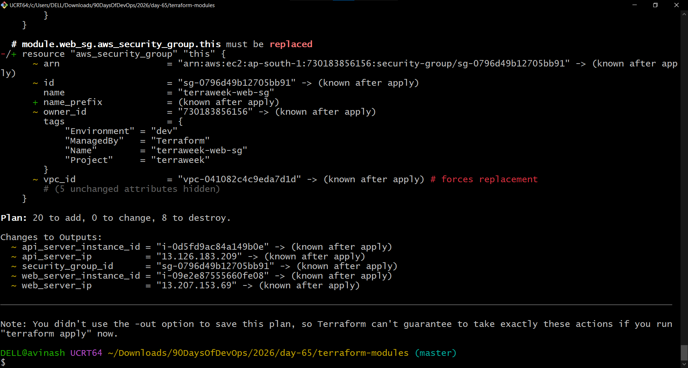
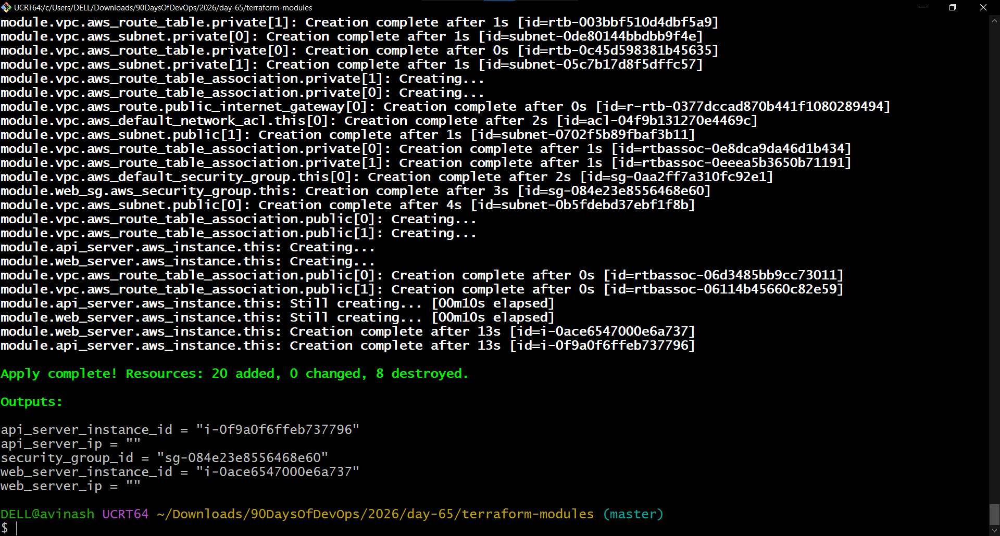
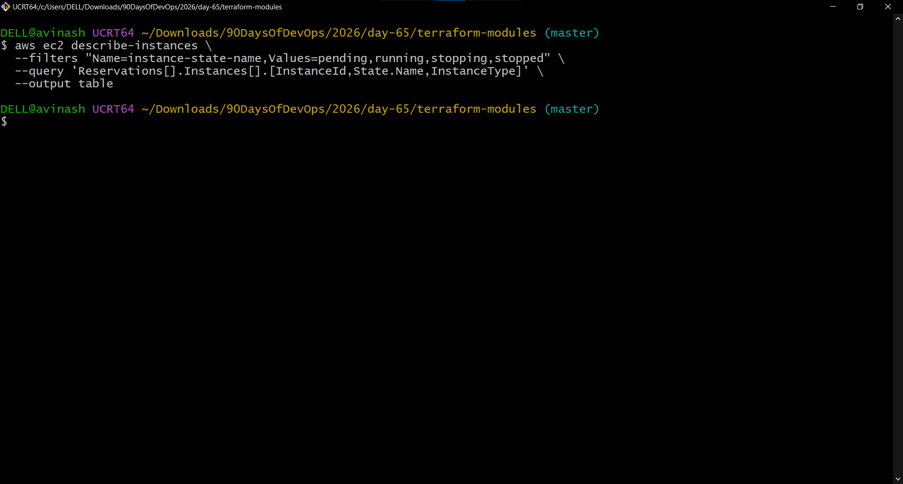

# Day 65 – Terraform Modules: Build Reusable Infrastructure

## Objective

Day 65 focused on Terraform modules and reusable infrastructure.

Completed:
- Custom EC2 module
- Custom Security Group module
- Reuse of the EC2 module for two servers
- Official Terraform Registry VPC module
- Module version pinning
- Terraform state verification
- Complete AWS cleanup

---

## Task 1 – Terraform Module Structure

The project was organized as:

```text
terraform-modules/
├── main.tf
├── variables.tf
├── outputs.tf
├── providers.tf
└── modules/
    ├── ec2-instance/
    │   ├── main.tf
    │   ├── variables.tf
    │   └── outputs.tf
    └── security-group/
        ├── main.tf
        ├── variables.tf
        └── outputs.tf
```

The root module is the main configuration. The child modules contain reusable infrastructure components.

### Screenshot



---

## Task 2 – Custom EC2 Module

A reusable EC2 module was created under:

```text
modules/ec2-instance/
```

The module accepts:

- `ami_id`
- `instance_type`
- `subnet_id`
- `security_group_ids`
- `instance_name`
- `tags`

The working environment used `t3.micro` for the EC2 instances.

```hcl
variable "instance_type" {
  description = "EC2 instance type"
  type        = string
  default     = "t3.micro"
}
```

The exercise originally specified `t2.micro`, but `t3.micro` was used in the working configuration.

The module creates an `aws_instance` resource and merges the instance Name tag with additional tags.

### EC2 Module Outputs

The module exposes:

```text
instance_id
public_ip
private_ip
```

---

## Task 3 – Custom Security Group Module

A reusable Security Group module was created under:

```text
modules/security-group/
```

The module accepts:

- `vpc_id`
- `sg_name`
- `ingress_ports`
- `tags`

Dynamic ingress rules were used for:

```text
22
80
443
```

The module also allows all outbound traffic.

### Security Group Output

```text
sg_id
```

---

## Task 4 – Reuse the Custom Modules

The Security Group module was called as:

```hcl
module "web_sg" {
  source        = "./modules/security-group"
  vpc_id        = aws_vpc.main.id
  sg_name       = "terraweek-web-sg"
  ingress_ports = [22, 80, 443]
  tags          = local.common_tags
}
```

The same EC2 module was called twice:

```text
module.web_server
module.api_server
```

The two instances were successfully created.

### EC2 Results

```text
Web Server
Instance ID: i-09e2e87555660fe08

API Server
Instance ID: i-0d5fd9ac84a149b0e
```

The working environment used:

```text
Region: ap-south-1
Instance type: t3.micro
```

Terraform reported:

```text
Apply complete! Resources: 2 added, 0 changed, 0 destroyed.
```

### Screenshot



---

## Task 5 – Official Terraform Registry VPC Module

The hand-written VPC was replaced with the official Terraform Registry VPC module.

```hcl
module "vpc" {
  source  = "terraform-aws-modules/vpc/aws"
  version = "5.1.0"

  name = "terraweek-vpc"
  cidr = "10.0.0.0/16"

  azs             = ["ap-south-1a", "ap-south-1b"]
  public_subnets  = ["10.0.1.0/24", "10.0.2.0/24"]
  private_subnets = ["10.0.3.0/24", "10.0.4.0/24"]

  enable_nat_gateway   = false
  enable_dns_hostnames = true

  tags = local.common_tags
}
```

The custom modules were connected to the Registry VPC module through:

```text
module.vpc.vpc_id
module.vpc.public_subnets[0]
```

Terraform successfully downloaded the module to:

```text
.terraform/modules/vpc
```

### Registry VPC Plan



### Registry VPC Apply

The final apply reported:

```text
Apply complete! Resources: 20 added, 0 changed, 8 destroyed.
```

The 8 destroyed resources were the previous hand-written VPC/network resources being replaced by the Registry module implementation.



---

## Task 6 – Version Pinning and State Verification

The VPC module was explicitly pinned to:

```hcl
version = "5.1.0"
```

Terraform was reinitialized with:

```bash
terraform init -upgrade
```

Initialization successfully downloaded:

```text
terraform-aws-modules/vpc/aws 5.1.0
```

### Terraform State

The state confirmed module-based resource addresses including:

```text
module.api_server.aws_instance.this
module.web_server.aws_instance.this
module.web_sg.aws_security_group.this
module.vpc.aws_vpc.this
```

The VPC module also contained resources such as:

```text
module.vpc.aws_internet_gateway.this[0]
module.vpc.aws_subnet.public[0]
module.vpc.aws_subnet.public[1]
module.vpc.aws_subnet.private[0]
module.vpc.aws_subnet.private[1]
module.vpc.aws_route_table.public[0]
module.vpc.aws_route_table.private[0]
module.vpc.aws_route_table.private[1]
```

This demonstrates how Terraform tracks resources inside modules.

---

## Terraform Validation

Terraform validation completed successfully:

```text
Success! The configuration is valid.
```

---

## VPC Resource Comparison

### Hand-Written VPC

The earlier implementation manually defined resources such as:

- VPC
- Subnet
- Internet Gateway
- Route Table
- Route Table Association
- Security Group

### Registry VPC Module

The official module packages the networking implementation into a reusable module.

The Day 65 replacement apply reported:

```text
20 resources added
8 previous resources destroyed
```

The exact resource count depends on the module features and configuration selected.

The main benefit is that VPC networking logic can be reused without manually defining every component each time.

---

## Five Terraform Module Best Practices

### 1. Pin Module Versions

Use an explicit version:

```hcl
version = "5.1.0"
```

This helps prevent unexpected module upgrades.

### 2. Keep Modules Focused

Each module should have a clear responsibility.

Examples:

```text
ec2-instance
security-group
vpc
```

### 3. Use Variables for Inputs

Variables make modules reusable across environments.

Examples:

```text
ami_id
instance_type
subnet_id
security_group_ids
```

### 4. Use Outputs for Important Values

Outputs allow parent modules to consume child-module values.

Examples:

```text
instance_id
public_ip
private_ip
sg_id
```

### 5. Document Custom Modules

A production-ready custom module should contain a README explaining:

- Purpose
- Inputs
- Outputs
- Usage
- Example configuration
- Dependencies

---

## Final Cleanup

All Day 65 AWS resources were destroyed to avoid ongoing lab charges.

Terraform reported:

```text
Destroy complete! Resources: 20 destroyed.
```

A final EC2 verification command returned no instances in:

```text
pending
running
stopping
stopped
```

### Cleanup Verification



---

## Key Learnings

By completing Day 65, I learned:

- How Terraform modules improve reusability
- How to create custom child modules
- How to pass variables into modules
- How to expose values through module outputs
- How the same module can create multiple EC2 instances
- How to use official Terraform Registry modules
- How to pin module versions
- How Terraform represents module resources in state
- Why focused modules are important for infrastructure as code
- Why temporary AWS infrastructure should be destroyed after lab work

---

# Day 65 Result

**Status: Completed ✅**

Final module architecture:

```text
Custom EC2 Module
        |
        +-- module.web_server
        |
        +-- module.api_server


Custom Security Group Module
        |
        +-- module.web_sg


Terraform Registry VPC Module
        |
        +-- module.vpc


Terraform State
        |
        +-- module.web_server.*
        +-- module.api_server.*
        +-- module.web_sg.*
        +-- module.vpc.*
```

All temporary AWS resources were destroyed after completing the lab.
